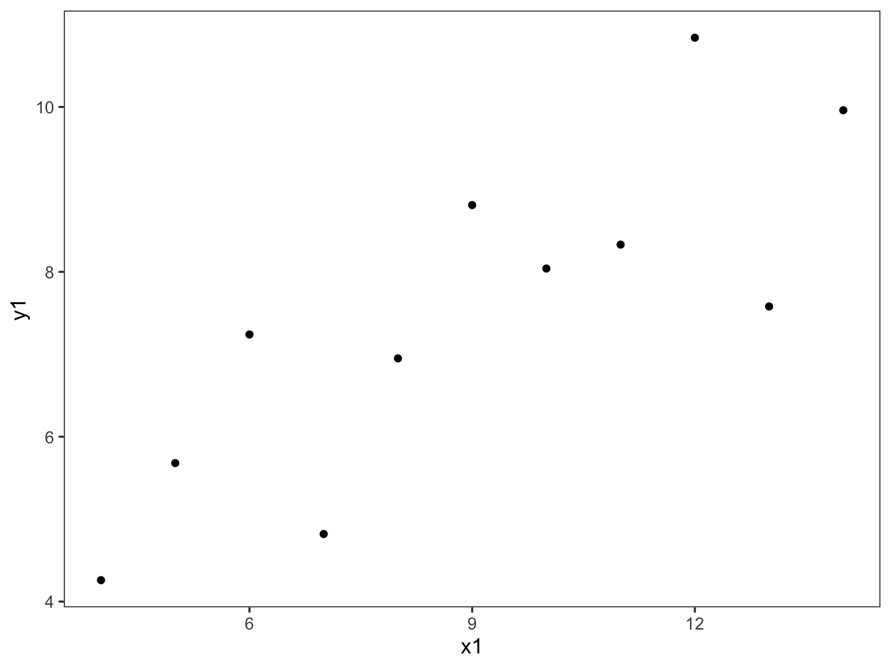
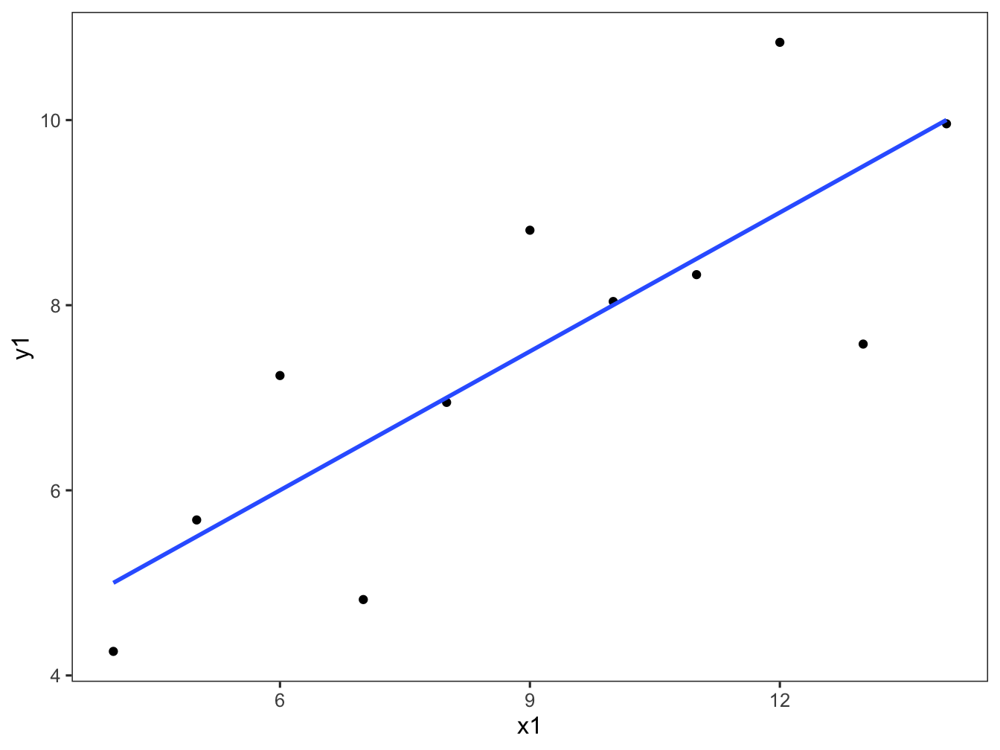
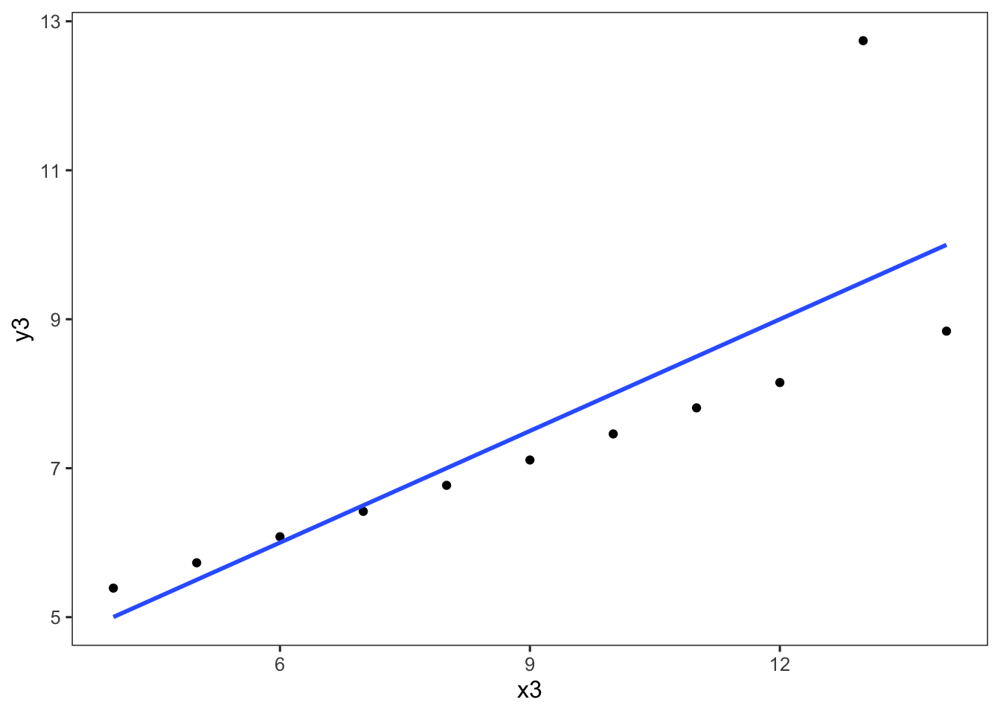

# Introduction {#intro}

Statistics  
  - allows us to reason from data
  - need a mathematical framework
  
## Things to come:
  - simple linear regression
  - identify a line that 'best' fits the data


```r
library(stfspack)
library(tidyverse)
```

```
## ── Attaching packages ─────────────────────────────────────────────────────────────────────────────────── tidyverse 1.2.1 ──
```

```
## ✓ ggplot2 3.2.1     ✓ purrr   0.3.3
## ✓ tibble  2.1.3     ✓ dplyr   0.8.3
## ✓ tidyr   0.8.1     ✓ stringr 1.4.0
## ✓ readr   1.3.1     ✓ forcats 0.3.0
```

```
## ── Conflicts ────────────────────────────────────────────────────────────────────────────────────── tidyverse_conflicts() ──
## x dplyr::filter() masks stats::filter()
## x dplyr::lag()    masks stats::lag()
```

```r
theme_set(theme_bw(base_size = 12) + 
            theme(strip.background = element_blank(), 
                  panel.grid = element_blank())) 
```


```r
mod.fit <- lm(y1 ~ x1, data = anscombe)
anscombe %>% 
  ggplot(aes(x1, y1)) + 
  geom_point() 
```

<div class="figure" style="text-align: center">

<p class="caption">(\#fig:m1)Fertilizer consumption and cereal yield in 11 sub-Saharan African countries</p>
</div>


```r
mod.fit <- lm(y1 ~ x1, data = anscombe)
anscombe %>% 
  ggplot(aes(x1, y1)) + 
  geom_point() + 
  geom_smooth(method = "lm", se = FALSE)
```

<div class="figure" style="text-align: center">

<p class="caption">(\#fig:m2)The agriculture data with a line of best fit from the simple linear regression</p>
</div>
  

```r
summary(mod.fit)
```

```
## 
## Call:
## lm(formula = y1 ~ x1, data = anscombe)
## 
## Residuals:
##      Min       1Q   Median       3Q      Max 
## -1.92127 -0.45577 -0.04136  0.70941  1.83882 
## 
## Coefficients:
##             Estimate Std. Error t value Pr(>|t|)   
## (Intercept)   3.0001     1.1247   2.667  0.02573 * 
## x1            0.5001     0.1179   4.241  0.00217 **
## ---
## Signif. codes:  0 '***' 0.001 '**' 0.01 '*' 0.05 '.' 0.1 ' ' 1
## 
## Residual standard error: 1.237 on 9 degrees of freedom
## Multiple R-squared:  0.6665,	Adjusted R-squared:  0.6295 
## F-statistic: 17.99 on 1 and 9 DF,  p-value: 0.00217
```


```r
mod.fit2 <- lm(y3 ~ x3, data = anscombe)
anscombe %>% 
  ggplot(aes(x3, y3)) + 
  geom_point() + 
  geom_smooth(method = "lm", se = FALSE)
```

<div class="figure">

<p class="caption">(\#fig:m3)The data underlying the analysis of the variables y3 and x3 in the anscombe data set</p>
</div>


```r
summary(mod.fit2)
```

```
## 
## Call:
## lm(formula = y3 ~ x3, data = anscombe)
## 
## Residuals:
##     Min      1Q  Median      3Q     Max 
## -1.1586 -0.6146 -0.2303  0.1540  3.2411 
## 
## Coefficients:
##             Estimate Std. Error t value Pr(>|t|)   
## (Intercept)   3.0025     1.1245   2.670  0.02562 * 
## x3            0.4997     0.1179   4.239  0.00218 **
## ---
## Signif. codes:  0 '***' 0.001 '**' 0.01 '*' 0.05 '.' 0.1 ' ' 1
## 
## Residual standard error: 1.236 on 9 degrees of freedom
## Multiple R-squared:  0.6663,	Adjusted R-squared:  0.6292 
## F-statistic: 17.97 on 1 and 9 DF,  p-value: 0.002176
```

You can label chapter and section titles using `{#label}` after them, e.g., we can reference Chapter \@ref(intro). If you do not manually label them, there will be automatic labels anyway, e.g., Chapter \@ref(methods).

Figures and tables with captions will be placed in `figure` and `table` environments, respectively.


```r
par(mar = c(4, 4, .1, .1))
plot(pressure, type = 'b', pch = 19)
```

<div class="figure" style="text-align: center">

<p class="caption">(\#fig:nice-fig)Here is a nice figure!</p>
</div>

Reference a figure by its code chunk label with the `fig:` prefix, e.g., see Figure \@ref(fig:nice-fig). Similarly, you can reference tables generated from `knitr::kable()`, e.g., see Table \@ref(tab:nice-tab).


```r
knitr::kable(
  head(iris, 20), caption = 'Here is a nice table!',
  booktabs = TRUE
)
```


Table: (\#tab:nice-tab)Here is a nice table!

 Sepal.Length   Sepal.Width   Petal.Length   Petal.Width  Species 
-------------  ------------  -------------  ------------  --------
          5.1           3.5            1.4           0.2  setosa  
          4.9           3.0            1.4           0.2  setosa  
          4.7           3.2            1.3           0.2  setosa  
          4.6           3.1            1.5           0.2  setosa  
          5.0           3.6            1.4           0.2  setosa  
          5.4           3.9            1.7           0.4  setosa  
          4.6           3.4            1.4           0.3  setosa  
          5.0           3.4            1.5           0.2  setosa  
          4.4           2.9            1.4           0.2  setosa  
          4.9           3.1            1.5           0.1  setosa  
          5.4           3.7            1.5           0.2  setosa  
          4.8           3.4            1.6           0.2  setosa  
          4.8           3.0            1.4           0.1  setosa  
          4.3           3.0            1.1           0.1  setosa  
          5.8           4.0            1.2           0.2  setosa  
          5.7           4.4            1.5           0.4  setosa  
          5.4           3.9            1.3           0.4  setosa  
          5.1           3.5            1.4           0.3  setosa  
          5.7           3.8            1.7           0.3  setosa  
          5.1           3.8            1.5           0.3  setosa  
