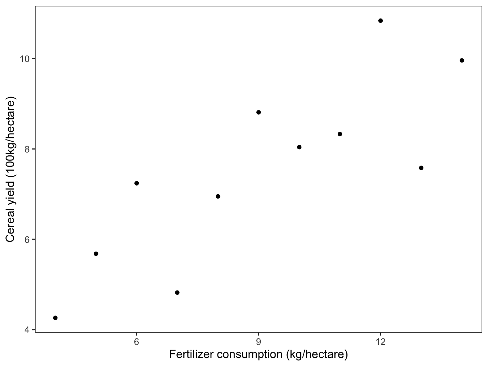

# Introduction {#intro}


```r
library(stfspack)
library(tidyverse)
theme_set(theme_bw(base_size = 12) + 
            theme(strip.background = element_blank(), 
                  panel.grid = element_blank())) 
```

Figure \@ref(fig:fig1) shows data on the amount of fertilizer applied to cropland (x-axis), and the cereal yields (y-axis), for each of 11 countries in Africa. There is a positive relationship, but is it strong? Is it weak? How are we to reason about these data? 


```r
anscombe %>% 
  ggplot(aes(x1, y1)) + 
  geom_point() + 
  labs(x = "Fertilizer consumption (kg/hectare)", y = "Cereal yield (100kg/hectare)")
```

<div class="figure" style="text-align: center">

<p class="caption">(\#fig:fig1)Fertilizer consumption and cereal yield in 11 sub-Saharan African countries</p>
</div>

Statistics, that's how! Statistics allows us to reason from data, and rests on a mathematical framework. It is worth understanding, even minimally, this framework. That's why we are reading this book. Chapter 1 provides an overview of simple linear regression, which allows us to identify a line that 'best' fits the data. 

We can use the `lm()` function in R to fit a simple linear regression: 


```r
mod.fit <- lm(y1 ~ x1, data = anscombe)
anscombe %>% 
  ggplot(aes(x1, y1)) + 
  geom_point() + 
  geom_smooth(method = "lm", se = FALSE) + 
  labs(x = "Fertilizer consumption (kg/hectare)", y = "Cereal yield (100kg/hectare)")
```

<div class="figure" style="text-align: center">

<p class="caption">(\#fig:m1)The agriculture data with a line of best fit from the simple linear regression</p>
</div>
  

```r
summary(mod.fit)
```

```
## 
## Call:
## lm(formula = y1 ~ x1, data = anscombe)
## 
## Residuals:
##      Min       1Q   Median       3Q      Max 
## -1.92127 -0.45577 -0.04136  0.70941  1.83882 
## 
## Coefficients:
##             Estimate Std. Error t value Pr(>|t|)   
## (Intercept)   3.0001     1.1247   2.667  0.02573 * 
## x1            0.5001     0.1179   4.241  0.00217 **
## ---
## Signif. codes:  0 '***' 0.001 '**' 0.01 '*' 0.05 '.' 0.1 ' ' 1
## 
## Residual standard error: 1.237 on 9 degrees of freedom
## Multiple R-squared:  0.6665,	Adjusted R-squared:  0.6295 
## F-statistic: 17.99 on 1 and 9 DF,  p-value: 0.00217
```

What do the following columns in the 'Coefficients' table refer to?

  - the *Estimates*: (Intercept) and x1
  - *Std. Error*  
  - *Pr(>|t|)*
  - How do each of these relate to the ideas of *estimation* and *inference*?

### A cautionary tale {-}

Next we fit a different set of (fake) data, that give the exact same regression results: 


```r
mod.fit2 <- lm(y3 ~ x3, data = anscombe)
anscombe %>% 
  ggplot(aes(x3, y3)) + 
  geom_point() + 
  geom_smooth(method = "lm", se = FALSE) + 
  labs(x = "Fertilizer consumption (kg/hectare)", y = "Cereal yield (100kg/hectare)")
```

<div class="figure">

<p class="caption">(\#fig:m2)The data underlying the analysis of the variables y3 and x3 in the anscombe data set</p>
</div>

Yes, you can run another regression model, but you should treat the results of the table with suspicion, given the figure above. 


```r
summary(mod.fit2)
```

```
## 
## Call:
## lm(formula = y3 ~ x3, data = anscombe)
## 
## Residuals:
##     Min      1Q  Median      3Q     Max 
## -1.1586 -0.6146 -0.2303  0.1540  3.2411 
## 
## Coefficients:
##             Estimate Std. Error t value Pr(>|t|)   
## (Intercept)   3.0025     1.1245   2.670  0.02562 * 
## x3            0.4997     0.1179   4.239  0.00218 **
## ---
## Signif. codes:  0 '***' 0.001 '**' 0.01 '*' 0.05 '.' 0.1 ' ' 1
## 
## Residual standard error: 1.236 on 9 degrees of freedom
## Multiple R-squared:  0.6663,	Adjusted R-squared:  0.6292 
## F-statistic: 17.97 on 1 and 9 DF,  p-value: 0.002176
```

The rest of the book will give us the foundation to interpret all of the values in the regression table, and the underlying assumptions of the linear model. 


<!-- You can label chapter and section titles using `{#label}` after them, e.g., we can reference Chapter \@ref(intro). If you do not manually label them, there will be automatic labels anyway, e.g., Chapter \@ref(methods). -->

<!-- Figures and tables with captions will be placed in `figure` and `table` environments, respectively. -->

<!-- ```{r nice-fig, fig.cap='Here is a nice figure!', out.width='80%', fig.asp=.75, fig.align='center'} -->
<!-- par(mar = c(4, 4, .1, .1)) -->
<!-- plot(pressure, type = 'b', pch = 19) -->
<!-- ``` -->

<!-- Reference a figure by its code chunk label with the `fig:` prefix, e.g., see Figure \@ref(fig:nice-fig). Similarly, you can reference tables generated from `knitr::kable()`, e.g., see Table \@ref(tab:nice-tab). -->

<!-- ```{r nice-tab, tidy=FALSE} -->
<!-- knitr::kable( -->
<!--   head(iris, 20), caption = 'Here is a nice table!', -->
<!--   booktabs = TRUE -->
<!-- ) -->
<!-- ``` -->
