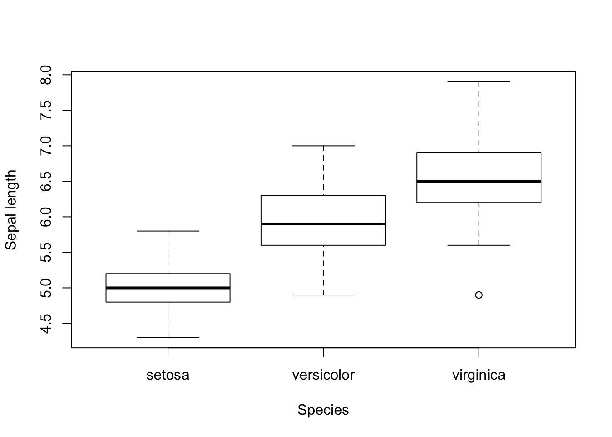

# R and exploratory data analysis {#r_eda}


This chapter is about getting comfortable with R. Edge uses base R for data wrangling and plotting, but here I'll also recreate the chapter exercises using the `tidyverse`. For a deeper dive into R and the `tidyverse`:

[Data carpentry's ecology lesson](https://datacarpentry.org/R-ecology-lesson/index.html)  
[R for data science](https://r4ds.had.co.nz/)  

## Inspecting the dataframe


```r
head(iris)
```

```
##   Sepal.Length Sepal.Width Petal.Length Petal.Width Species
## 1          5.1         3.5          1.4         0.2  setosa
## 2          4.9         3.0          1.4         0.2  setosa
## 3          4.7         3.2          1.3         0.2  setosa
## 4          4.6         3.1          1.5         0.2  setosa
## 5          5.0         3.6          1.4         0.2  setosa
## 6          5.4         3.9          1.7         0.4  setosa
```

```r
glimpse(iris)
```

```
## Observations: 150
## Variables: 5
## $ Sepal.Length <dbl> 5.1, 4.9, 4.7, 4.6, 5.0, 5.4, 4.6, 5.0, 4.4, 4.9, 5.4, 4…
## $ Sepal.Width  <dbl> 3.5, 3.0, 3.2, 3.1, 3.6, 3.9, 3.4, 3.4, 2.9, 3.1, 3.7, 3…
## $ Petal.Length <dbl> 1.4, 1.4, 1.3, 1.5, 1.4, 1.7, 1.4, 1.5, 1.4, 1.5, 1.5, 1…
## $ Petal.Width  <dbl> 0.2, 0.2, 0.2, 0.2, 0.2, 0.4, 0.3, 0.2, 0.2, 0.1, 0.2, 0…
## $ Species      <fct> setosa, setosa, setosa, setosa, setosa, setosa, setosa, …
```

```r
summary(iris)
```

```
##   Sepal.Length    Sepal.Width     Petal.Length    Petal.Width   
##  Min.   :4.300   Min.   :2.000   Min.   :1.000   Min.   :0.100  
##  1st Qu.:5.100   1st Qu.:2.800   1st Qu.:1.600   1st Qu.:0.300  
##  Median :5.800   Median :3.000   Median :4.350   Median :1.300  
##  Mean   :5.843   Mean   :3.057   Mean   :3.758   Mean   :1.199  
##  3rd Qu.:6.400   3rd Qu.:3.300   3rd Qu.:5.100   3rd Qu.:1.800  
##  Max.   :7.900   Max.   :4.400   Max.   :6.900   Max.   :2.500  
##        Species  
##  setosa    :50  
##  versicolor:50  
##  virginica :50  
##                 
##                 
## 
```

## Histograms


```r
# Base
hist(iris$Sepal.Length, xlab = "Sepal Length", main = "")
```


```r
# Tidyverse
iris %>% 
  ggplot(aes(Sepal.Length)) + 
  geom_histogram(bins = 8, col = "white") + 
  labs(x = "Sepal Length")
```


## Summarising data


```r
# Base
tapply(iris$Sepal.Length, iris$Species, mean)
```

```
##     setosa versicolor  virginica 
##      5.006      5.936      6.588
```

```r
# Tidyverse
iris %>% 
  group_by(Species) %>% 
  summarise(mean = mean(Sepal.Length))
```

```
## # A tibble: 3 x 2
##   Species     mean
##   <fct>      <dbl>
## 1 setosa      5.01
## 2 versicolor  5.94
## 3 virginica   6.59
```

Note that the tidyverse output is a tibble (essentially a dataframe), which is a consistent feature of the tidy approach to data wrangling. Not that you can't do this in base R with the `aggregate` function - which is how I used to do it BT (*before tidyverse*):


```r
# Base option 2
aggregate(iris$Sepal.Length, list(iris$Species), mean) 
```

```
##      Group.1     x
## 1     setosa 5.006
## 2 versicolor 5.936
## 3  virginica 6.588
```

```r
# You can check the output using str()
aggregate(iris$Sepal.Length, list(iris$Species), mean) %>% str()
```

```
## 'data.frame':	3 obs. of  2 variables:
##  $ Group.1: Factor w/ 3 levels "setosa","versicolor",..: 1 2 3
##  $ x      : num  5.01 5.94 6.59
```


## Loops


```r
for(i in 1:3){
  print(i)
}
```

```
## [1] 1
## [1] 2
## [1] 3
```


```r
i <- 1
print(i)
```

```
## [1] 1
```


```r
unique(iris$Species)
```

```
## [1] setosa     versicolor virginica 
## Levels: setosa versicolor virginica
```

```r
for(i in unique(iris$Species)){
  print(mean(iris$Sepal.Length[iris$Species == i]))
}
```

```
## [1] 5.006
## [1] 5.936
## [1] 6.588
```

## Functions


```r
conditional.mean <- function(x, y){
  for(i in unique(y)){
    print(mean(x[y == i]))
  }
}
```


```r
conditional.mean(x = iris$Sepal.Length, y = iris$Species)
```

```
## [1] 5.006
## [1] 5.936
## [1] 6.588
```

```r
conditional.mean(x = iris$Sepal.Width, y = iris$Species)
```

```
## [1] 3.428
## [1] 2.77
## [1] 2.974
```

## Boxplots


```r
# Base
boxplot(iris$Sepal.Length ~ iris$Species, 
        xlab = "Species", ylab = "Sepal length")
```



```r
# Tidyverse
iris %>% 
  ggplot(aes(Species, Sepal.Length)) + 
  geom_boxplot() + 
  labs(x = "Species", y = "Sepal length")
```


## Scatterplots


```r
# Base
plot(iris$Sepal.Length, iris$Sepal.Width, 
        xlab = "Sepal length", ylab = "Sepal width")
```


```r
# Tidyverse
iris %>% 
  ggplot(aes(Sepal.Length, Sepal.Width)) + 
  geom_point() + 
  labs(x = "Sepal length", y = "Sepal width")
```


With unique symbols for species:


```r
# Base
plot(iris$Sepal.Length, iris$Sepal.Width, 
     xlab = "Sepal length", ylab = "Sepal width", 
     pch = as.numeric(iris$Species))
legend("topright", pch = c(1,2,3), 
       legend = c("setosa", "versicolor", "virginica"))
```


```r
# Tidyverse
iris %>% 
  ggplot(aes(Sepal.Length, Sepal.Width, shape = Species)) + 
  geom_point() + 
  labs(x = "Sepal length", y = "Sepal width")
```


## Exercise set 2-2

1. Repeat the above analyses (histogram, summarising data, boxplots) for `Petal.Width`. 

2. Install and load a new package `gpairs`. Run the following line of code. What do you see?


```r
gpairs(iris, scatter.pars = list(col = as.numeric(iris$Species)))
```

3. Install and load the package `stfspack` if you have not already done so. 


```r
install.packages("devtools")
library(devtools) 
install_github("mdedge/stfspack")
library(stfspack)
```
