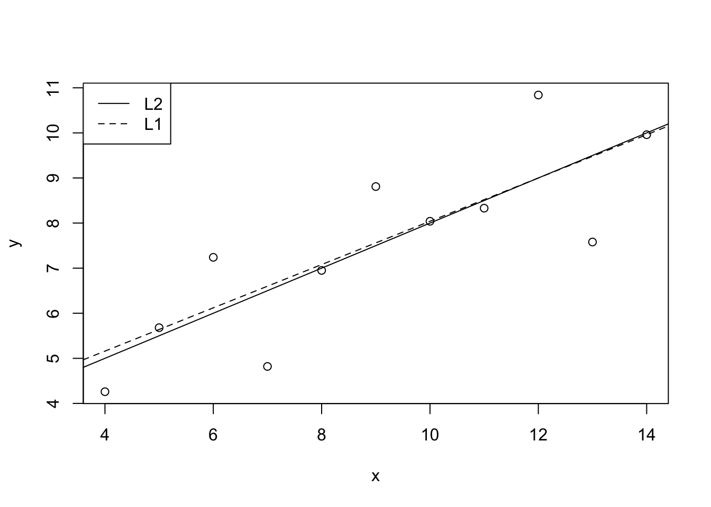
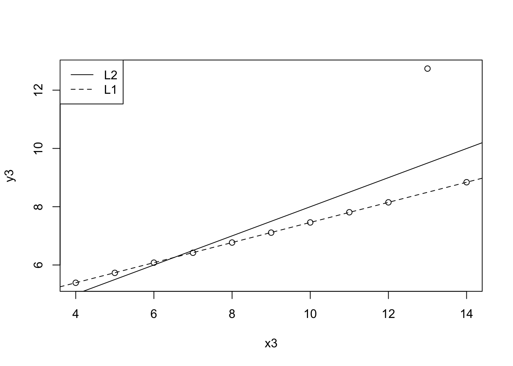

# Line of best fit {#best-fit-line}


## Exercise set 3-1

1. Calculate least-squares intercept *a* and least-squares slope *b* for the `anscombe` data. 

I will use equations 3.8 and 3.9. 


```r
x <- anscombe$x1
y <- anscombe$y1

xbar <- mean(x)
ybar <- mean(y)

b <- sum((x - xbar)*(y - ybar)) / sum((x - xbar)^2)
b
```

```
## [1] 0.5000909
```

```r
a <- ybar - b*xbar
a
```

```
## [1] 3.000091
```

```r
# Check using lm
m1 <- lm(y ~ x)
summary(m1)
```

```
## 
## Call:
## lm(formula = y ~ x)
## 
## Residuals:
##      Min       1Q   Median       3Q      Max 
## -1.92127 -0.45577 -0.04136  0.70941  1.83882 
## 
## Coefficients:
##             Estimate Std. Error t value Pr(>|t|)   
## (Intercept)   3.0001     1.1247   2.667  0.02573 * 
## x             0.5001     0.1179   4.241  0.00217 **
## ---
## Signif. codes:  0 '***' 0.001 '**' 0.01 '*' 0.05 '.' 0.1 ' ' 1
## 
## Residual standard error: 1.237 on 9 degrees of freedom
## Multiple R-squared:  0.6665,	Adjusted R-squared:  0.6295 
## F-statistic: 17.99 on 1 and 9 DF,  p-value: 0.00217
```

## Exercise set 3-2

1. On paper

2. On paper

3. On paper

4. Comparing L1 and L2 lines. 


```r
library(quantreg)
x <- anscombe$x1
y <- anscombe$y1

mL1 <- rq(y ~ x, tau = 0.5)
mL2 <- lm(y ~ x)

plot(x, y)
abline(mL2, lty = 1)
abline(mL1, lty = 2)
legend("topleft", legend = c("L2", "L1"), lty = c(1, 2))
```



Dataset with outlier. 


```r
mL1 <- rq(y3 ~ x3, tau = 0.5, data = anscombe)
mL2 <- lm(y3 ~ x3, data = anscombe)

plot(y3 ~ x3, data = anscombe)
abline(mL2, lty = 1)
abline(mL1, lty = 2)
legend("topleft", legend = c("L2", "L1"), lty = c(1, 2))
```


