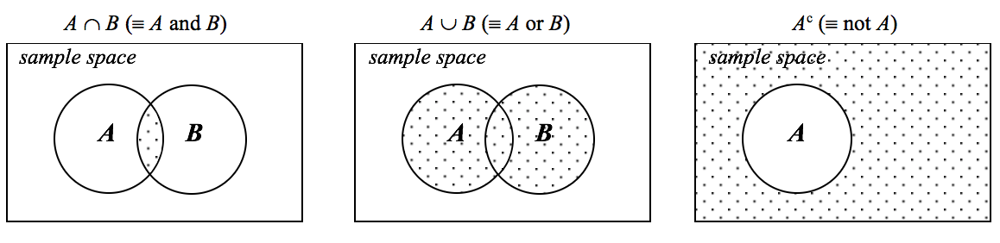

# Probability and random variables {#probability}


```r
library(tidyverse)
theme_set(theme_bw(base_size = 12) + 
            theme(strip.background = element_blank(), 
                  panel.grid = element_blank())) 
```

### Probability vs estimation

Here are two quotes from *STFS* that encapsulate the distinction between probability and estimation:

> *In probability theory, we think about processes that generate data, and we ask "what can we say about the data generated by such a process?*

> *In statistical estimation and inference, we work in the opposite direction. We start with data, and we ask "what can we say about the process that generated these data?*

So, we can define probability as the *study of data generated by specified processes* - and that's the focus of this chapter. Later on, when we get to data - we'll be assuming probabilistic models - but we have to accept the fact that the data we observed were not likely to be generated by the assumed model! But we do the best we can. 

### What is a probability?

Frequency view  

  - the probability of a given event is simply the proportion of times it occurs over many trials
  - difficult to apply to statements like "*what is the probability that it will rain tomorrow*" and "*what is the probability that a meteor will hit the earth tomorrow*" (i.e., one-shot events)

Degrees-of-belief view  

  - what is the degree of belief in the occurrence of an event that a rational person would have?

An aside: is the universe fundamentally probabilistic or deterministic?

### Set notation

A **set** ($\Omega$, in *STFS*) is an unordered collection of objects (*elements*). 

**Intersection** ($\cap$) of two sets is the set of elements that appear in both sets. 

**Union** ($\cup$) of two sets is the set that has every element that appears in *either* of the two original sets. 

The **complement** of a set ($S^C$) includes all of the elements *not* in the original set but present in the **sample space** ($\Omega$) (which contains all possible elements). Subsets are referred to as *S*, and have the following properties:

$$
\begin{aligned}
S \cup S^C = \Omega  \\
S \cap S^C = \emptyset
\end{aligned}
$$

where $\emptyset$ is used to denote the empty set, or the set with no elements. 

A Venn diagram is useful here:



The notation for the probability of an event is typically denoted using either $P()$ or $[]$: 

$$
\begin{aligned}
P(event) = [event] \\
\end{aligned}
$$

## Kolmogorov's three axioms of probability

1. Probabilities of any event *i* ($E_i$) cannot be negative:

$$
\begin{aligned}
\ [E_i] \geq 0 \\
\end{aligned}
$$

2. The probability of the event that includes every outcome is 1:

$$
\begin{aligned}
\ [\Omega] = 1 \\
\end{aligned}
$$

3. The probability of observing either of two mutually exclusive events is the sum of their individual probabilities:

$$
\begin{aligned}
\text{If } E_1 \cap E_2 = \emptyset,  \\
\text{then } [E_1 \cup E_2] = [E_1] + [E_2] 
\end{aligned}
$$

### Exercise set 4-1

1. Given P($A$), we would like to know P($A^C$). We already learned the following properties of complements:

$$
\begin{aligned}
A \cup A^C = \Omega  \\
A \cap A^C = \emptyset
\end{aligned}
$$
The intersection between $A$ and $A^C$ is zero, meaning they don't share any elements. The union of $A$ and $A^C$ is $[\Omega]$. We also learned the 2nd axiom of probability, $[\Omega] = 1$. Therefore:

$$
\begin{aligned}
\ [A] + [A^C] = 1 \\ 
\ [A^C] = 1 - [A]
\end{aligned}
$$

2. On paper

3. See book github page for solution. 

## Conditional probability and independence

### Exercise set 4-2

## Bayes' Theorem

## Discrete random variables and distributions

**Random variable**: e.g., the process of rolling a die, $X$

  - $X$ is random, can take integer values 1-6
  - $X$ is not a number yet - it is the unrealized outcome of a random process
  - The realization of that process is an **instance** - which is a number
  - Capital $X$: random variable
  - Lower case $x$: instance

All the probability information is contained in its distribution. 

In our case, $X$ is a **discrete** random variable, meaning that the number of outcomes is countable, in principle. 

Two ways to represent the distribution:

  1. Probability mass function (pmf), $f_X(x) = P(X = x)$
  2. Cumulative distribution function (cdf), $F_X(x) = P(X \leq x)$
  
The cdf is a series of partial sums of the pmf,
  
$$
\begin{aligned}
F_X(x) = P(X \leq x) = \sum_{x_i \leq x} f_X(x_i)
\end{aligned}
$$
and increases monotonically in $x$. 

### Exercise set 4-3

## Continuous random variables and distributions

What about values that are not countable - anything with a decimal? Impossible to get a specific number, or instance, and thus we cannot use the pmf. But we can still use the cdf!

### Exercise set 4-4

1. $X$ is a random variable that takes values in the interval [0, 1], and the probability distribution is uniform. Draw the cumulative distribution function $F_X(x)$ for $x \in [-1, 2]$. 


```r
x <- c(0,1)
Fx <- x
plot(x, Fx, type = "l", xlim = c(-1,2))
lines(c(-1, 0), c(0, 0))
lines(c(1,2), c(1, 1))
```


2. If $X$ were more likely to land in [0.4, 0.6] than in any other region of length 0.2, the line between 0.4 and 0.6 would be steeper. 


```r
x1 <- c(0,0.4)
x2 <- c(0.4, 0.6)
x3 <- c(0.6, 1)
Fx1 <- c(0,0.3)
Fx2 <- c(0.3, 0.7)
Fx3 <- c(0.7, 1)
plot(x1, Fx1, type = "l", xlim = c(-1,2), ylim = c(0,1), xlab =
"x", ylab = "Fx")
lines(x2, Fx2)
lines(x3, Fx3)
lines(c(-1, 0), c(0, 0))
lines(c(1,2), c(1, 1))
```


## Probability density functions

## Families of distributions


