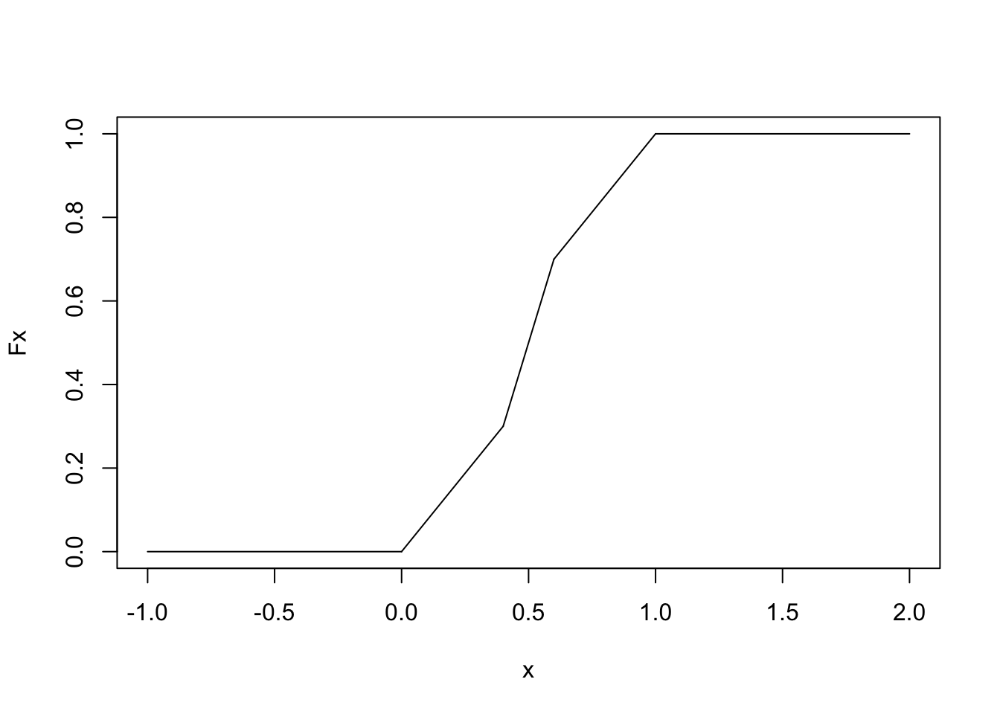
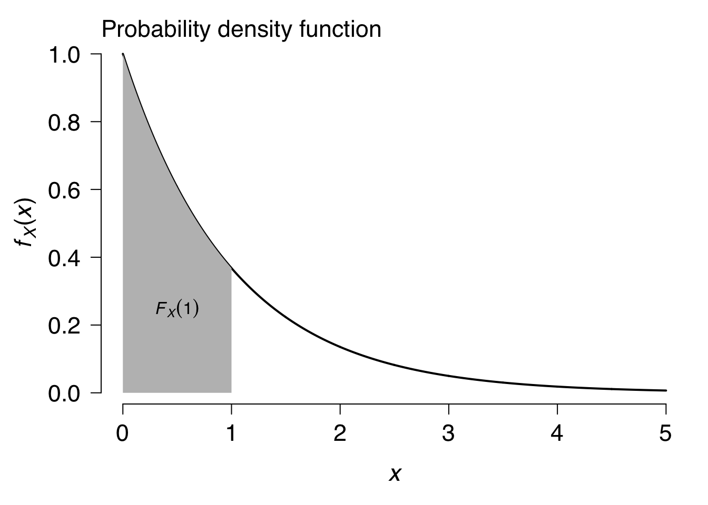
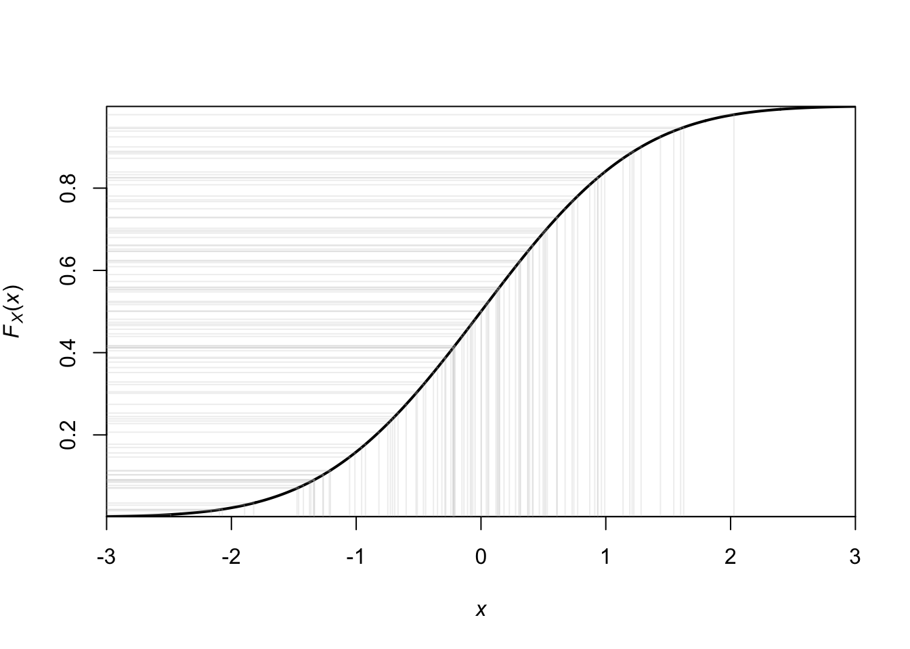

# Probability and random variables {#probability}


```r
library(tidyverse)
theme_set(theme_bw(base_size = 12) + 
            theme(strip.background = element_blank(), 
                  panel.grid = element_blank())) 
```

### Probability vs estimation

Here are two quotes from *STFS* that encapsulate the distinction between probability and estimation:

> *In probability theory, we think about processes that generate data, and we ask "what can we say about the data generated by such a process?*

> *In statistical estimation and inference, we work in the opposite direction. We start with data, and we ask "what can we say about the process that generated these data?*

So, we can define probability as the *study of data generated by specified processes* - and that's the focus of this chapter. Later on, when we get to data - we'll be assuming probabilistic models - but we have to accept the fact that the data we observed were not likely to be generated by the assumed model! But we do the best we can. 

### What is a probability?

Frequency view  

  - the probability of a given event is simply the proportion of times it occurs over many trials
  - difficult to apply to statements like "*what is the probability that it will rain tomorrow*" and "*what is the probability that a meteor will hit the earth tomorrow*" (i.e., one-shot events)

Degrees-of-belief view  

  - what is the degree of belief in the occurrence of an event that a rational person would have?

An aside: is the universe fundamentally probabilistic or deterministic?

### Set notation

A **set** ($\Omega$, in *STFS*) is an unordered collection of objects (*elements*). 

**Intersection** ($\cap$) of two sets is the set of elements that appear in both sets. 

**Union** ($\cup$) of two sets is the set that has every element that appears in *either* of the two original sets. 

The **complement** of a set ($S^C$) includes all of the elements *not* in the original set but present in the **sample space** ($\Omega$) (which contains all possible elements). Subsets are referred to as *S*, and have the following properties:

$$
\begin{aligned}
S \cup S^C = \Omega  \\
S \cap S^C = \emptyset
\end{aligned}
$$

where $\emptyset$ is used to denote the empty set, or the set with no elements. 

A Venn diagram is useful here:


The notation for the probability of an event is typically denoted using either $P()$ or $[]$: 

$$
\begin{aligned}
P(event) = [event] \\
\end{aligned}
$$

## Kolmogorov's three axioms of probability

1. Probabilities of any event *i* ($E_i$) cannot be negative:

$$
\begin{aligned}
\ [E_i] \geq 0 \\
\end{aligned}
$$

2. The probability of the event that includes every outcome is 1:

$$
\begin{aligned}
\ [\Omega] = 1 \\
\end{aligned}
$$

3. The probability of observing either of two mutually exclusive events is the sum of their individual probabilities:

$$
\begin{aligned}
\text{If } E_1 \cap E_2 = \emptyset,  \\
\text{then } [E_1 \cup E_2] = [E_1] + [E_2] 
\end{aligned}
$$

### Exercise set 4-1

1. Given P($A$), we would like to know P($A^C$). We already learned the following properties of complements:

$$
\begin{aligned}
A \cup A^C = \Omega  \\
A \cap A^C = \emptyset
\end{aligned}
$$
The intersection between $A$ and $A^C$ is zero, meaning they don't share any elements. The union of $A$ and $A^C$ is $[\Omega]$. We also learned the 2nd axiom of probability, $[\Omega] = 1$. Therefore:

$$
\begin{aligned}
\ [A] + [A^C] = 1 \\ 
\ [A^C] = 1 - [A]
\end{aligned}
$$

2. On paper. 

3. Below I've pasted an image of my handwritten version of Edge's solution - I found it easier to think about once I visualized it using a Venn diagram. 


## Conditional probability and independence

The law of conditional probability states that: 

$$
\begin{aligned}
\ [A \mid B] = \frac{[A \cap B]}{[B]} \\ 
\end{aligned}
$$

If A and B are independent, then: 

$$
\begin{aligned}
\ [A \mid B] = [A] \\ 
\end{aligned}
$$

### Exercise set 4-2

1. If we rearrange the law of probability, we get:

$$
\begin{aligned}
\ [A \mid B] [B] = [A \cap B] \\ 
\end{aligned}
$$

By definition, if A and B are independent, then we can replace $[A \mid B]$ with $[A]$ and get:

$$
\begin{aligned}
\ [A \cap B] = [A] [B] \\ 
\end{aligned}
$$

If we divide both sides by $[A]$, we get:

$$
\begin{aligned}
\ [B] = \frac{[A \cap B]}{[A]} \\ 
\end{aligned}
$$

The right-hand side of the above equation is, by the law of conditional probability, equal to $[B \mid A]$ and thus:

$$
\begin{aligned}
\ [B] = [B \mid A]\\ 
\end{aligned}
$$

2. Suppose you know $[A \mid B]$, $[A]$, and $[B]$. Calculate $[B \mid A]$. 

$$
\begin{aligned}
\ [A \mid B] = \frac{[A \cap B]}{[B]} \\ 
\end{aligned}
$$

$$
\begin{aligned}
\ [A \mid B] [B] = [A \cap B] \\ 
\end{aligned}
$$

$$
\begin{aligned}
\ [B \mid A] = \frac{[A \cap B]}{[A]} \\ 
\end{aligned}
$$

$$
\begin{aligned}
\ [B \mid A] = \frac{[A \mid B] [B]}{[A]} \\ 
\end{aligned}
$$

## Bayes' Theorem

## Discrete random variables and distributions

**Random variable**: e.g., the process of rolling a die, $X$

  - $X$ is random, can take integer values 1-6
  - $X$ is not a number yet - it is the unrealized outcome of a random process
  - The realization of that process is an **instance** - which is a number
  - Capital $X$: random variable
  - Lower case $x$: instance

All the probability information is contained in its distribution. 

In our case, $X$ is a **discrete** random variable, meaning that the number of outcomes is countable, in principle. 

Two ways to represent the distribution:

  1. Probability mass function (pmf), $f_X(x) = P(X = x)$
  2. Cumulative distribution function (cdf), $F_X(x) = P(X \leq x)$
  
The cdf is a series of partial sums of the pmf,
  
$$
\begin{aligned}
F_X(x) = P(X \leq x) = \sum_{x_i \leq x} f_X(x_i)
\end{aligned}
$$
and increases monotonically in $x$. 

### Exercise set 4-3

1. Flipping a fair coin 3 times. X is a random variable that represents the number of heads observed, and the sample space $\Omega$ contains the elements {0, 1, 2, 3}. Here are all of the ways we can observe these elements:

> x = 0: (T, T, T)
> x = 1: (H, T, T); (T, H, T); (T, T, H)
> x = 2: (H, H, T); (H, T, H); (T, H, H)
> x = 3: (H, H, H)

There are 8 possible instances. Thus, the probability mass function is:

$$
\begin{aligned}
f_X(0) =& f_X(3) = 1/8 \\
f_X(1) =& f_X(2) = 3/8 \\
f_X(x) =& 0 \text{ for all other } x \\
\end{aligned}
$$

2. 


## Continuous random variables and distributions

What about values that are not countable - anything with a decimal? Impossible to get a specific number, or instance, and thus we cannot use the pmf. But we can still use the cdf!

### Exercise set 4-4

1. $X$ is a random variable that takes values in the interval [0, 1], and the probability distribution is uniform. Draw the cumulative distribution function $F_X(x)$ for $x \in [-1, 2]$. 


```r
x <- c(0,1)
Fx <- x
plot(x, Fx, type = "l", xlim = c(-1,2))
lines(c(-1, 0), c(0, 0))
lines(c(1,2), c(1, 1))
```


2. If $X$ were more likely to land in [0.4, 0.6] than in any other region of length 0.2, the line between 0.4 and 0.6 would be steeper. 


```r
x1 <- c(0,0.4)
x2 <- c(0.4, 0.6)
x3 <- c(0.6, 1)
Fx1 <- c(0,0.3)
Fx2 <- c(0.3, 0.7)
Fx3 <- c(0.7, 1)
plot(x1, Fx1, type = "l", xlim = c(-1,2), ylim = c(0,1), xlab =
"x", ylab = "Fx")
lines(x2, Fx2)
lines(x3, Fx3)
lines(c(-1, 0), c(0, 0))
lines(c(1,2), c(1, 1))
```



## Probability density functions

**For a continuous random variable, the pdf is the derivative of the cdf**

Below I have re-created Fig 4-4, with a pdf in the upper panel and a cdf in the lower panel - for an *exponential* random variable with rate 1. 





### Exercise set 4-6

1. On paper

2. On paper


## Families of distributions

Two requirements for mass or density functions:

1. Must be non-negative

2. Sum of all values is 1 (mass), or area under curve is 1 (density)

Distribution family

  - similarly shaped distributions
  - summaries of their behavior can be computed from the same functions
  - but **parameter** values differ

### Exercise set 4-6

1. On paper

2. On paper

3. Consider a Poisson distribution with parameter $\lambda$ = 5. If we want to know the value of the probability mass function for x = 2, $f_X(2)$, we use the `dpois()` function:


```r
dpois(2, lambda = 5)
```

```
## [1] 0.08422434
```

To get the value of the cumulative distribution function $F_X(2)$, we use `ppois()`:


```r
ppois(2, lambda = 5)
```

```
## [1] 0.124652
```

If we want to know the *inverse* of the cumulative distribution function. That is, we want to know the value of $q$ that solves the equation $F_X(q) = p$. What is the number $q$ such that the probability tha the random variable is less than or equal to $q$ is $p$; $q$ is the $pth$ percentile of the distribution. We can get this using `qpois()`:


```r
qpois(0.124652, lambda = 5)
```

```
## [1] 2
```

The inverse of the cdf is also called the quantile function. 

Using the standard normal distribution (mean = 0, sd = 1):

Plot the probability density function for x $\in$ [-3, 3]. 

```r
x <- seq(-3, 3, by = 0.1)
x
```

```
##  [1] -3.0 -2.9 -2.8 -2.7 -2.6 -2.5 -2.4 -2.3 -2.2 -2.1 -2.0 -1.9 -1.8 -1.7 -1.6
## [16] -1.5 -1.4 -1.3 -1.2 -1.1 -1.0 -0.9 -0.8 -0.7 -0.6 -0.5 -0.4 -0.3 -0.2 -0.1
## [31]  0.0  0.1  0.2  0.3  0.4  0.5  0.6  0.7  0.8  0.9  1.0  1.1  1.2  1.3  1.4
## [46]  1.5  1.6  1.7  1.8  1.9  2.0  2.1  2.2  2.3  2.4  2.5  2.6  2.7  2.8  2.9
## [61]  3.0
```

```r
fx <- dnorm(x = x)
plot(x, fx, type = "l", main = "PDF", col = "red")
```


Plot the cdf for x $\in$ [-3, 3].

```r
x <- seq(-3, 3, by = 0.1)
x
```

```
##  [1] -3.0 -2.9 -2.8 -2.7 -2.6 -2.5 -2.4 -2.3 -2.2 -2.1 -2.0 -1.9 -1.8 -1.7 -1.6
## [16] -1.5 -1.4 -1.3 -1.2 -1.1 -1.0 -0.9 -0.8 -0.7 -0.6 -0.5 -0.4 -0.3 -0.2 -0.1
## [31]  0.0  0.1  0.2  0.3  0.4  0.5  0.6  0.7  0.8  0.9  1.0  1.1  1.2  1.3  1.4
## [46]  1.5  1.6  1.7  1.8  1.9  2.0  2.1  2.2  2.3  2.4  2.5  2.6  2.7  2.8  2.9
## [61]  3.0
```

```r
fx <- pnorm(q = x)
plot(x, fx, type = "l", main = "CDF", col = "red")
```


What value of $x$ is at the 97.5th percentile of the standard normal?

```r
qnorm(p = 0.975)
```

```
## [1] 1.959964
```

4. Simulating from a normal distribution. 


```r
n <- 1000
x <- rnorm(n)
hist(x)
```


Simulating from a uniform distribution. 


```r
n <- 1000
x <- runif(n, min = 0, max = 1)
hist(x)
```


Now take those values between 0 and 1, and feed them into the `qnorm` function to get the values at which we see those quantiles:


```r
y <- qnorm(p = x, mean = 0, sd = 1)
hist(y)
```


These values are normally distributed around 0. This plot is saying that most of the probability (in fact ~95%) lies between -2 < y < 2 (2 standard deviations). 


```r
r <- seq(-3, 3, length.out = 1000)
cdf <- pnorm(r)
#Draw the normal cumulative distribution function.
plot(r, cdf, type = "l", xaxs = "i", yaxs = "i", xlim = c(-3,
3), xlab = expression(italic(x)), ylab =
expression(paste(italic(F[X]), "(", italic(x), ")", sep = "")),
lwd = 2)
#Draw light grey lines representing random samples from the
#standard normal distribution.
x <- rnorm(100)
for(i in x){
  lines(c(i,i), c(min(x), pnorm(i)), col = rgb(190, 190, 190,
     alpha = 60, max = 255))
  lines(c(min(x)-1,i), c(pnorm(i), pnorm(i)), col = rgb(190,
     190, 190, alpha = 60, max = 255))
}
```



### Additional exercise 

(Courtesy Blondin & Goodman)  

Assume that destructive earthquakes occur in California every 20 years. You’d like to know how probable an earthquake is between now and some future date.

1. What distribution family describes the waiting time until California’s next earthquake? What value should we use for this distribution’s parameter? [Hint: convert 20 years to a rate]

Use the exponential distribution, where $\lambda = 1/20$:

$$
\begin{aligned}
f_X(x) = \lambda e ^{-\lambda x} \\
\end{aligned}
$$

2. What is the probability that an earthquake will happen in the next 10 years? [Hint: You need to find a cumulative distribution function for the distribution you chose, either online or by integration].

Rules for integrating "e raised to the x power":

$$
\begin{aligned}
\int e^xdx =& e^x + c \\
\int e^{ax}dx =& \frac{1}{a} e^{ax} + c \\
\int be^{ax}dx =& \frac{b}{a} e^{ax} + c \\
\end{aligned}
$$

With these rules in hand, we can get the cdf by integrating the pdf for the exponential distribution:

$$
\begin{aligned}
f_X(x) =& \lambda e ^{-\lambda x} \\
F_X(X = x) =& \int_{0}^{x} \lambda e^{-\lambda x} dx \\
=& \frac{1}{- \lambda} \lambda e^{-\lambda x} \bigg\rvert_{0}^{x} \\ 
=& -e^{-\lambda x} \rvert_{0}^{x} \\ 
=& -e^{-\lambda x} \rvert_{0}^{x} \\ 
=& -e^{-\lambda x} - (-e^{-\lambda 0}) \\
=& -e^{-\lambda x} - (-1) \\
=& 1 -e^{-\lambda x}  \\
\end{aligned}
$$

Then, plug in $x = 10$ and $\lambda = 1/20$: 


```r
1 - exp(-(1/20) * (10))
```

```
## [1] 0.3934693
```

Check to make sure we've done this right using the `pexp` function in R:


```r
pexp(q = 10, rate = 1/20)
```

```
## [1] 0.3934693
```


3. What is the probability that an earthquake will occur between 10 and 20 years from now?


```r
pexp(q = 20, rate = 1/20) - pexp(q = 10, rate = 1/20)
```

```
## [1] 0.2386512
```

4. If you have time, write the CDF of your chosen distribution as an R function. It should take a value x and a parameter, and return a probability P(X ≤ x). Use your function to plot the cumulative distribution as a function of x. 


```r
exp_cdf <- function(x, lambda) 1 - exp(-lambda * x)
x <- seq(0, 80, by = 0.1)
p <- exp_cdf(x = x, lambda = 1/20)
plot(p ~ x, type = "l", xlab = "x", ylab = "FX(x)")
```


