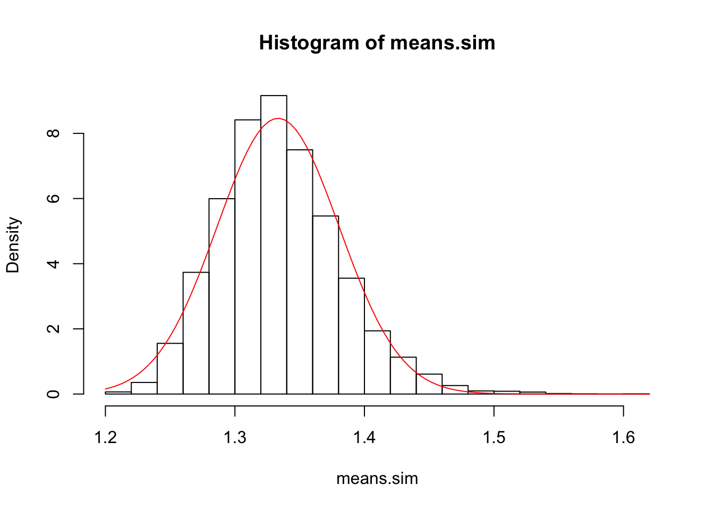
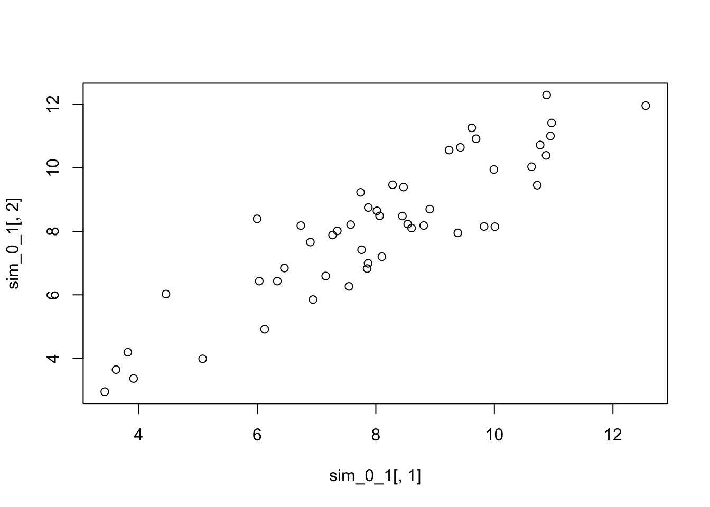
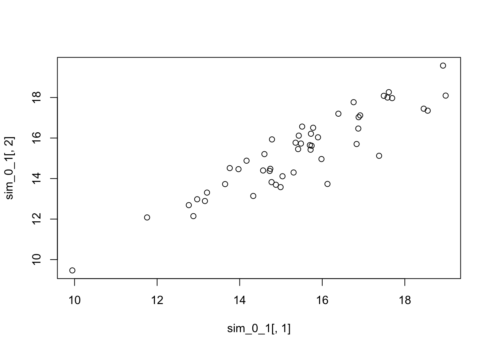

# Properties of random variables {#randomvars}


```r
library(tidyverse)
theme_set(theme_bw(base_size = 12) + 
            theme(strip.background = element_blank(), 
                  panel.grid = element_blank())) 
```

## Expected values and the law of large numbers

### Exercise set 5-1

1. On paper

2.


```r
samp.size <- 1
n.samps <- 1000
samps <- rnorm(samp.size * n.samps, mean = 0, sd = 1)
samp.mat <- matrix(samps, ncol = n.samps)
samp.means <- colMeans(samp.mat)
hist(samp.means)
```


```r
samp.size <- 100
n.samps <- 1000
samps <-matrix(rexp(samp.size*n.samps, rate = 1), ncol = n.samps)
samp.means <- colMeans(samps)
hist(samp.means)
```


## Variance and standard deviation

## Joint distributions, covariance, and correlation

## Conditional distribution, expectation, variance

## The central limit theorem

### Exercise set 5-4

1. Bean machine in action!


```r
library(animation)
nball <- 500 #change the number of balls
nlayer <- 10 #change the number of rows of pegs on the board
rate <- 10 #change the speed at which the balls fall 
ani.options(nmax = nball + nlayer - 2, interval = 1/rate) 
quincunx(balls = nball, layers = nlayer)
```

2. Exploring the beta distribution

To see what the beta distribution looks like for a given set of shape parameters, set the sample size to 1. For example: 


```r
library(stfspack)
# dosm.beta.hist(n = 1, nsim = 10000, shape1 = 1, shape2 = 1)
```

will give you a histogram of 10,000 observations from a beta distribution with parameters 1 and 1. If you increase the sample size, then the distribution of the sample mean gets closer to normality. Try this — starting with samples of size 1 and increasing the sample size — with the following sets of parameter values: (1, 1), (0.2, 0.2), (2, 0.5), (0.5, 2), (3, 3). Feel free to try other parameter sets — it’s fun. What do you notice?


```r
sims <- 1000
s1 <- 0.2 # change this
s2 <- 0.2 # change this
par(mfrow = c(2,3))
dosm.beta.hist(n = 1, nsim = sims, shape1 = s1, shape2 = s2)
```

```
## mean of DOSM   SD of DOSM  var of DOSM 
##    0.5100520    0.4243966    0.1801125
```

```r
dosm.beta.hist(n = 4, nsim = sims, shape1 = s1, shape2 = s2)
```

```
## mean of DOSM   SD of DOSM  var of DOSM 
##   0.50319716   0.21751683   0.04731357
```

```r
dosm.beta.hist(n = 8, nsim = sims, shape1 = s1, shape2 = s2)
```

```
## mean of DOSM   SD of DOSM  var of DOSM 
##   0.49872078   0.15084669   0.02275472
```

```r
dosm.beta.hist(n = 16, nsim = sims, shape1 = s1, shape2 = s2)
```

```
## mean of DOSM   SD of DOSM  var of DOSM 
##   0.50290870   0.10529962   0.01108801
```

```r
dosm.beta.hist(n = 32, nsim = sims, shape1 = s1, shape2 = s2)
```

```
## mean of DOSM   SD of DOSM  var of DOSM 
##   0.50447446   0.07454308   0.00555667
```

```r
dosm.beta.hist(n = 64, nsim = sims, shape1 = s1, shape2 = s2)
```


```
## mean of DOSM   SD of DOSM  var of DOSM 
##  0.498934648  0.050912703  0.002592103
```

Let's deconstruct what is going on with this function, where n = 1 (we simulate 10000 observations from a single set of parameter values). 


```r
dosm.beta.hist
```

```
## function (n, nsim, shape1 = 1, shape2 = 1, ...) 
## {
##     samps <- rbeta(n * nsim, shape1, shape2)
##     sim.mat <- matrix(samps, nrow = nsim)
##     dosm <- rowMeans(sim.mat)
##     hist(dosm, freq = FALSE, ...)
##     x <- seq(0, 1, length.out = 1000)
##     lines(x, dnorm(x, mean = mean(dosm), sd = sd(dosm)))
##     c(`mean of DOSM` = mean(dosm), `SD of DOSM` = sd(dosm), `var of DOSM` = var(dosm))
## }
## <bytecode: 0x7fd5e6b5bd58>
## <environment: namespace:stfspack>
```

```r
nsim <- 10000
n <- 1
s1 <- 0.2 # change this
s2 <- 0.2 # change this
samps <- rbeta(n * nsim, shape1 = s1, shape2 = s2)
str(samps) # here are 10,000
```

```
##  num [1:10000] 0.1939 0.9668 0.0882 1 0.859 ...
```

```r
# We are converting the vector into a matrix
# So that we can easily calculate the mean of each row
sim.mat <- matrix(samps, nrow = nsim)
dim(sim.mat)
```

```
## [1] 10000     1
```

```r
head(sim.mat) 
```

```
##            [,1]
## [1,] 0.19391831
## [2,] 0.96680424
## [3,] 0.08824953
## [4,] 0.99999999
## [5,] 0.85896948
## [6,] 0.67504700
```

```r
# Calculate rowmeans - with n=1, this doesn't change anything
# But change n to anything bigger and inspect the dimensions of the objects
dosm <- rowMeans(sim.mat)
str(dosm)
```

```
##  num [1:10000] 0.1939 0.9668 0.0882 1 0.859 ...
```

```r
head(dosm) # compare these values to sim.mat
```

```
## [1] 0.19391831 0.96680424 0.08824953 0.99999999 0.85896948 0.67504700
```

```r
par(mfrow = c(1,1))
hist(dosm, freq = FALSE) # plotting the simulated values
# Set up a vector that goes from 0 to 1 to overlay a normal distribution on the histogram
x <- seq(0, 1, length.out = 1000) 
# Now plot a normal distribution, using the mean and sd of the simulated values
lines(x, dnorm(x, mean = mean(dosm), sd = sd(dosm)), col = "red")
```


3. The Pareto distribution is a skewed, heavy-tailed, power-law distribution used in description of social, scientific, geophysical, actuarial, and many other types of observable phenomena. It was applied originally to the distribution of wealth in a society, fitting the observation that a large portion of wealth is held by a small fraction of the population. Named after the Italian civil engineer, economist, and sociologist Vilfredo Pareto. 

Parameters of the `rpareto` function:

  - a: shape (on the web as $\alpha$)
  - b: scale (on the web as $x_m$)
  
If the shape parameter is $\leq$ 1, $E(X)$ is $\infty$. 
If the shape parameter is $\leq$ 2, $Var(X)$ is $\infty$. 

First we simulate many sampes of size 1000 from a Pareto distribution with shape = 4. 


```r
# experiment with n and the parameters a and b
n <- 100     
n_sims <- 10000
a <- 1
b <- 4

x <- rpareto(n = n, a = a, b = b)
summary(x)
```

```
##    Min. 1st Qu.  Median    Mean 3rd Qu.    Max. 
##   4.009   5.853   7.842  17.168  14.367 227.799
```

```r
# Calculate mean and sd
mu <- mean(x)
stdev <- sd(x)

hist(x, freq = FALSE)
# Set up a vector that goes from 0 to 1 to overlay a normal distribution on the histogram
x_vals <- seq(min(x), max(x), length.out = 1000) 
# Now plot a normal distribution, using the mean and sd of the simulated values
lines(x_vals, dnorm(x_vals, mean = mu, sd = stdev), col = "red")
```


```r
# Compare tail to normal
compare.tail.to.normal
```

```
## function (x, k, mu, sigma) 
## {
##     mean(x < (mu - k * sigma) | x > (mu + k * sigma))/(1 - (pnorm(k) - 
##         pnorm(-k)))
## }
## <bytecode: 0x7fd5e63dca18>
## <environment: namespace:stfspack>
```

```r
k <- 2 # sds
compare.tail.to.normal(x = x, k = k, mu = mu, sigma = stdev)
```

```
## [1] 0.6593368
```

```r
summary(x)
```

```
##    Min. 1st Qu.  Median    Mean 3rd Qu.    Max. 
##   4.009   5.853   7.842  17.168  14.367 227.799
```

```r
mu
```

```
## [1] 17.16811
```

```r
stdev
```

```
## [1] 29.47463
```

```r
# This gives the value of the mean, minus the value k*stdev 
# (i.e., an extreme negative value)
# Below I will use my object stdev in place of sigma (the parameter from Edge's function)
(mu - k * stdev)
```

```
## [1] -41.78115
```

```r
# Extreme positive value
(mu + k * stdev)
```

```
## [1] 76.11737
```

```r
# This statement asks whether the value in x is an extreme value
# The operator '|' is 'OR'
# Is x extreme negative OR extreme positive?
x < (mu - k * stdev) | x > (mu + k * stdev)
```

```
##   [1] FALSE FALSE FALSE FALSE FALSE FALSE FALSE FALSE FALSE FALSE FALSE FALSE
##  [13] FALSE FALSE FALSE FALSE FALSE FALSE FALSE FALSE FALSE FALSE FALSE FALSE
##  [25] FALSE FALSE FALSE  TRUE  TRUE FALSE FALSE FALSE FALSE FALSE FALSE FALSE
##  [37] FALSE FALSE FALSE FALSE FALSE FALSE FALSE FALSE FALSE FALSE FALSE FALSE
##  [49] FALSE FALSE FALSE FALSE FALSE FALSE FALSE FALSE FALSE FALSE FALSE FALSE
##  [61] FALSE FALSE FALSE FALSE FALSE FALSE FALSE FALSE FALSE FALSE FALSE FALSE
##  [73] FALSE FALSE FALSE FALSE FALSE FALSE FALSE FALSE FALSE FALSE FALSE FALSE
##  [85] FALSE FALSE FALSE FALSE FALSE FALSE FALSE FALSE FALSE FALSE FALSE FALSE
##  [97] FALSE FALSE FALSE  TRUE
```

```r
# We can get the frequencies of this logical vector using table
table(x < (mu - k * stdev) | x > (mu + k * stdev))
```

```
## 
## FALSE  TRUE 
##    97     3
```

```r
# Or, as Edge, does, calculate the average of TRUEs - which is simply the proportion of TRUEs
mean(x < (mu - k * stdev) | x > (mu + k * stdev))
```

```
## [1] 0.03
```

```r
# What proportion/probability of TRUEs would we expect under a normal probability distribution?
pnorm(k) # probability of observing a value less than k standard deviations above the mean
```

```
## [1] 0.9772499
```

```r
pnorm(-k) # probability of observing a value less than k standard deviations below the mean
```

```
## [1] 0.02275013
```

```r
(1 - (pnorm(k) - pnorm(-k))) # probability of observing an extreme value
```

```
## [1] 0.04550026
```

```r
# So putting it all together, we have the ratio of:
# the probability of observing an extreme value in the data, over the
# the probability of observing an extreme value in a normal distribution:
mean(x < (mu - k * stdev) | x > (mu + k * stdev))/(1 - (pnorm(k) - pnorm(-k)))
```

```
## [1] 0.6593368
```

```r
compare.tail.to.normal(x = x, k = k, mu = mu, sigma = stdev)
```

```
## [1] 0.6593368
```

```r
# If this ratio is < 1, then the data have fewer extreme values than suggested by a normal
# If this ratio is > 1, then the data have more extreme values than suggested by a normal
```

Above, I haven't computed the means of many simulations - which is the crux of the question! So here I just paste Edge's solution. In it, he calculates $E(X)$ and $Var(X)$ using the Pareto probability distribution. I have changed `n` and `n.sim` to match my values above. 


```r
#Sample size per simulation (n) and number of simulations.
n <- 100
n.sim <- 10000
#Pareto parameters. Variance is finite, and so
#CLT applies, if a > 2. For large a, convergence to
#normal is better. With small a, convergence is slow,
#especially in the tails.
a <- 4
b <- 1
#Compute the expectation and variance of the distribution
#of the sample mean. a must be above 2 for these expressions
#to hold.
expec.par <- a*b/(a-1)
var.par <- a*b^2 / ((a-1)^2 * (a-2))
sd.mean <- sqrt(var.par / n)
#Simulate data
sim <- matrix(rpareto(n*n.sim, a, b), nrow = n.sim)
# Each column represents ith sample taken per simulation
# Each row represents a different simulation
sim[1:3, 1:10]
```

```
##          [,1]     [,2]     [,3]     [,4]     [,5]     [,6]     [,7]     [,8]
## [1,] 1.020980 2.256865 1.097602 1.390036 1.004845 1.188772 1.673925 1.151197
## [2,] 1.137380 1.181952 1.101579 1.076421 1.133138 1.103452 1.372299 1.076058
## [3,] 1.144218 1.021020 1.153482 1.076443 1.168448 1.164245 1.033774 1.379783
##          [,9]    [,10]
## [1,] 1.700126 1.062628
## [2,] 1.087723 1.178737
## [3,] 1.163065 1.247889
```

```r
# Compute sample means.
means.sim <- rowMeans(sim)
str(means.sim)
```

```
##  num [1:10000] 1.38 1.31 1.31 1.31 1.23 ...
```

```r
#Draw a histogram of the sample means along with the approximate
#normal pdf that follows from the CLT.
hist(means.sim, prob = TRUE)
curve(dnorm(x, expec.par, sd.mean), add = TRUE, col = 'red')
```


```r
compare.tail.to.normal(means.sim, 1/2, expec.par, sd.mean)
```

```
## [1] 0.9891827
```

```r
compare.tail.to.normal(means.sim, 1, expec.par, sd.mean)
```

```
## [1] 0.9378826
```

```r
compare.tail.to.normal(means.sim, 2, expec.par, sd.mean)
```

```
## [1] 0.9098848
```

```r
compare.tail.to.normal(means.sim, 3, expec.par, sd.mean)
```

```
## [1] 2.815027
```

```r
compare.tail.to.normal(means.sim, 4, expec.par, sd.mean)
```

```
## [1] 25.25951
```

```r
compare.tail.to.normal(means.sim, 5, expec.par, sd.mean)
```

```
## [1] 872.1389
```

```r
compare.tail.to.normal(means.sim, 6, expec.par, sd.mean)
```

```
## [1] 202718.9
```


## A probabilistic model for simple linear regression

### Exercise set 5-5

1. Write the square of the correlation coefficient (eq. 5.30) in terms of the variance of Y (eq. 5.32) and the conditional variance of Y given X (eq. 5.31). 

$$
\begin{aligned}
\text{eq. 5.30: } \rho_{X,Y} = \beta \frac{\sigma_X}{\sigma_Y} \\
\text{eq. 5.31: } Var(Y) = \beta^2 \sigma_X^2 + \sigma_{\epsilon}^2 \\
\text{eq. 5.32: } Var(Y \mid X = x) = \sigma_{\epsilon}^2  \\
\end{aligned}
$$

Squaring $\rho_{X,Y}$, and expressing $Var(Y)$ using the definition from above:

$$
\begin{aligned}
\rho_{X,Y}^2 = \beta^2 \frac{\sigma_X^2}{\sigma_Y^2} = \beta^2 \frac{\sigma_X^2}{Var(Y)} \\
\end{aligned}
$$

$$
\begin{aligned}
\rho_{X,Y}^2 =  \beta^2 \frac{\sigma_X^2}{\beta^2 \sigma_X^2 + \sigma_{\epsilon}^2} \\
\end{aligned}
$$

Some algebra...

$$
\begin{aligned}
\rho_{X,Y}^2 = 1 - \frac{\sigma_{\epsilon}^2}{\beta^2 \sigma_X^2 + \sigma_{\epsilon}^2} \\
\end{aligned}
$$

And we use the formulas from above again to restate as:

$$
\begin{aligned}
\rho_{X,Y}^2 = 1 - \frac{Var(Y \mid X = x)}{Var(Y)} \\
\end{aligned}
$$

which gives us the 'proportion of variance explained'. So if there isn't much variance left in $Y$ after conditioning on $X$ (i.e., the numerator is small relative to the denominator), if we subtract it from 1, we get a high $r^2$. And vice versa. 

2. Simulating a regression. 


```r
library(stfspack)
sim.lm
```

```
## function (n, a, b, sigma.disturb = 1, mu.x = 8, sigma.x = 2, 
##     rdisturb = rnorm, rx = rnorm, het.coef = 0) 
## {
##     x <- sort(rx(n, mu.x, sigma.x))
##     disturbs <- rdisturb(n, 0, sapply(sigma.disturb + scale(x) * 
##         het.coef, max, 0))
##     y <- a + b * x + disturbs
##     cbind(x, y)
## }
## <bytecode: 0x7fd5e5d1c3a0>
## <environment: namespace:stfspack>
```

```r
sim_0_1 <- sim.lm(n = 50, a = 0, b = 1)
head(sim_0_1)
```

```
##             x        y
## [1,] 5.343529 6.164700
## [2,] 5.350238 5.605923
## [3,] 5.534549 5.220183
## [4,] 5.914306 5.660254
## [5,] 6.117602 6.031751
## [6,] 6.416627 7.596970
```

```r
plot(sim_0_1[,1], sim_0_1[,2])
```



Still using all the default values for parameters:


```r
sim_0_1 <- sim.lm(n = 50, a = 0, b = 1, 
                  sigma.disturb = 1, mu.x = 8, sigma.x = 2, 
                  rdisturb = rnorm, rx = rnorm, het.coef = 0)
plot(sim_0_1[,1], sim_0_1[,2])
```


Now I'll change one at a time:


```r
sim_0_1 <- sim.lm(n = 50, a = 0, b = 1, 
                  sigma.disturb = 2, mu.x = 8, sigma.x = 2, 
                  rdisturb = rnorm, rx = rnorm, het.coef = 0)
plot(sim_0_1[,1], sim_0_1[,2])
```




```r
sim_0_1 <- sim.lm(n = 50, a = 0, b = 1, 
                  sigma.disturb = 1, mu.x = 16, sigma.x = 2, 
                  rdisturb = rnorm, rx = rnorm, het.coef = 0)
plot(sim_0_1[,1], sim_0_1[,2])
```


```r
sim_0_1 <- sim.lm(n = 50, a = 0, b = 1, 
                  sigma.disturb = 1, mu.x = 8, sigma.x = 4, 
                  rdisturb = rnorm, rx = rnorm, het.coef = 0)
plot(sim_0_1[,1], sim_0_1[,2])
```


```r
sim_0_1 <- sim.lm(n = 50, a = 0, b = 1, 
                  sigma.disturb = 1, mu.x = 8, sigma.x = 2, 
                  rdisturb = rlaplace, rx = rnorm, het.coef = 0)
plot(sim_0_1[,1], sim_0_1[,2])
```


