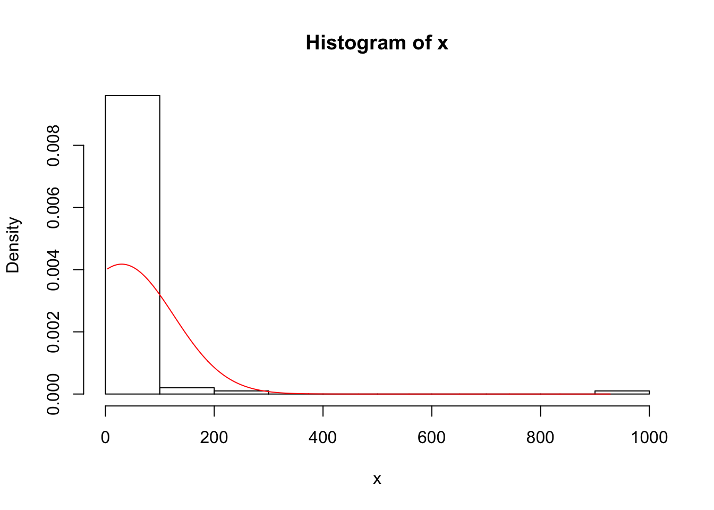
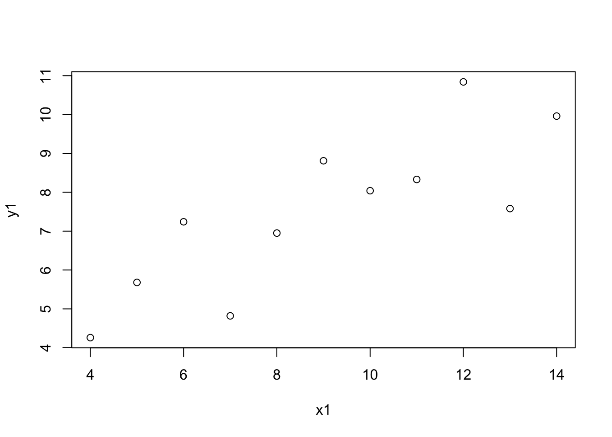
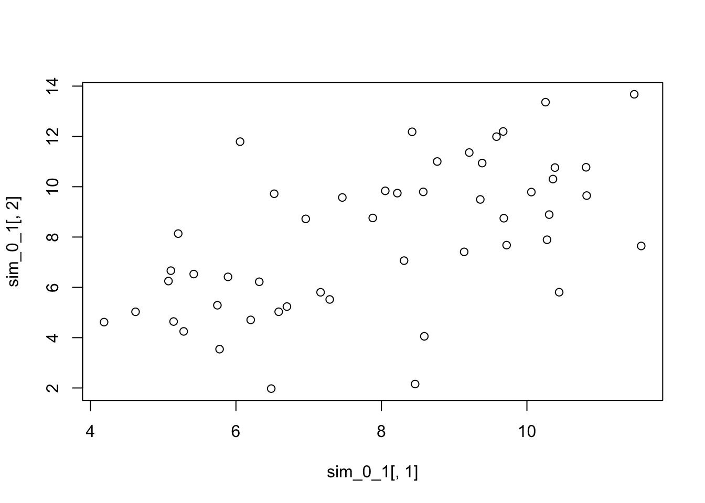
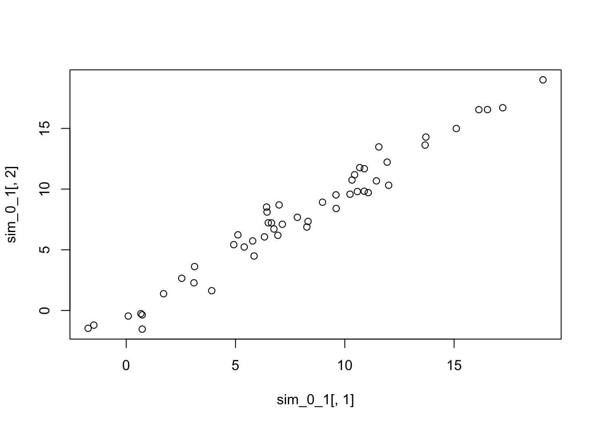

# Properties of random variables {#randomvars}


```r
library(tidyverse)
theme_set(theme_bw(base_size = 12) + 
            theme(strip.background = element_blank(), 
                  panel.grid = element_blank())) 
```

## Expected values and the law of large numbers

When summarizing a probability distribution, it is useful to have a measure of:

  - Location (*Expectation*; E($X$))
  - Dispersal (*Variance*; Var($X$))

In this section, we're focusing on the expectation. 
  
The expectation of a discrete random variable is the average:

$$
\begin{aligned}
\text{E}(X) =& \sum_{i = 1}^{k}x_i P(X = x_i) \\
=& \sum_{i = 1}^{k}x_i f_X(x_i) \\
\end{aligned}
$$

If $Y$ represents a six-sided die, then:

$$
\begin{aligned}
\text{E}(Y) =& \sum_{i = 1}^{k}y_i f_Y(y_i) \\
=& 1(1/6) + 2(1/6) + 3(1/6) + 4(1/6) + 5(1/6) + 6(1/6) \\
=& 21/6 \\ 
=& 7/2 \\
\end{aligned}
$$

If $X$ is continuous:

$$
\begin{aligned}
\text{E}(X) =& \int_{- \infty}^{\infty} x f_X(x) dx \\
\end{aligned}
$$

Here we are integrating over the probability density function, rather than summing over the mass density function. 

### Weak law of large numbers

The expectation is more like a long-term average, rather than an actual instance (7/2 is not a possible instance of a dice roll). 

$X_i$ are i.i.d.

Assume E($X_1$) = E($X_2$) = ... = E($X_n$) = $\mu$

Define $\overline{X}_n$ as the mean of the observations:

$$
\begin{aligned}
\overline{X}_n = \frac{1}{n} (X_1 + X_2 + X_3 + ... + X_n)
\end{aligned}
$$

As $n \rightarrow \infty$, $\overline{X}_n$ "converges in probability" to $\mu$. This means for any positive constant $\delta$, 

$$
\begin{aligned}
lim_{n \rightarrow \infty} \text{P}(|\overline{X}_n - \mu| > \delta) = 0
\end{aligned}
$$

### Handy facts about expectations

The expectation of a constant times a random variable is the constant times the expectation of the random variable:

$$ 
\begin{aligned}
\text{E}(aX) = a \text{E}(X)
\end{aligned}
$$
The expectation of a constant is the constant:

$$ 
\begin{aligned}
\text{E}(c) = c
\end{aligned}
$$

The expectation of a sum of random variables is the sum of the expectations of those random variables: 

$$ 
\begin{aligned}
\text{E}(X + Y) = \text{E}(X) + \text{E}(Y)
\end{aligned}
$$

Putting all these facts together, we can calculate the expectation of two random variables $X$ and $Y$ as:

$$ 
\begin{aligned}
\text{E}(aX + bY + c) = a \text{E}(X) + b \text{E}(Y) + c
\end{aligned}
$$

This is called the **linearity of expectation**, which we will use frequently in the exercises. Linearity does not hold for other measures of location (e.g., median, mode). This fact accounts, in part, for the privileged status of the mean in statistics. 

To calculate the expectation of a function:

$$ 
\begin{aligned}
\text{E}[g(X)] = \sum_{i = 1}^{k} g(x_i)f_X(x_i)
\end{aligned}
$$

$$ 
\begin{aligned}
\text{E}[g(X)] = \int_{-\infty}^{\infty} g(x)f_X(x)dx
\end{aligned}
$$


### Exercise set 5-1

1a. Expected value of a Bernoulli random variable with parameter *p*?

$$ 
\begin{aligned}
f_X(x) = \text{P}(X = x) = p^x(1 - p)^{1-x} \text{ for } x \in \text{{0, 1}} \\
\end{aligned}
$$

Because there are only two outcomes (0 or 1), we can compute the expectation directly:

$$ 
\begin{aligned}
\text{E}(X) =& \sum_0^1 x f_X(x) \\
=& \sum_0^1 x p^x(1 - p)^{1-x} \\ 
=& 0 p^0(1 - p)^{1-0} + 1 p^1(1 - p)^{1-1} \\
=& 0 p^0(1 - p)^{1} + 1 p^1(1 - p)^{0} \\
=& 0 (1) (1-p) + p(1) \\ 
=& 0 + p \\
=& p
\end{aligned}
$$

1b. What is the expected value of a binomial random variable with parameters $n$ and $p$?

Here's the pmf for the binomial distribution:

$$ 
\begin{aligned}
f_X(x) = \text{P}(X = x) = \binom{n}{x} p^x(1 - p)^{n - x} \text{ for } x \in \text{{0, 1, 2, ..., n}} \\
\end{aligned}
$$

If we plug that into the equation for E($X$), we get:

$$ 
\begin{aligned}
\text{E}(X) =& \sum_0^n x f_X(x) \\
=& \sum_0^n x \binom{n}{x} p^x(1 - p)^{n - x} \\ 
\end{aligned}
$$
Well, I don't know how to evaluate this sum directly, considering the upper limit of $n$ is infinite. So we'll use the fact that the binomial is the sum of $n$ independent Bernoulli trials ($X_i$). 

$$ 
\begin{aligned}
\text{E}(X) =& \text{E}(\sum_{i=1}^nX_i)
\end{aligned}
$$

Because the expectation is linear, the expectation of the sum is the sum of the expectations; we can rearrange:

$$ 
\begin{aligned}
\text{E}(X) =& \sum_{i=1}^n \text{E}(X_i)
\end{aligned}
$$

From 1a, we can substitute $p$ for $\text{E}(X_i)$:

$$ 
\begin{aligned}
\text{E}(X) =& \sum_{i=1}^n p \\
=& np
\end{aligned}
$$

1c. What is the expected value of a discrete uniform random variable with parameters $a$ and $b$?

The probability mass function is:

$$ 
\begin{aligned}
\text{P}(X = k) =& \frac{1}{b - a + 1} \\
\end{aligned}
$$
The expectation is:

$$ 
\begin{aligned}
\text{E}(X) =& \sum_{x = a}^b x f_X(x) \\
=& \sum_{x = a}^b x \frac{1}{b - a + 1}  \\
=& \frac{1}{b - a + 1} \sum_{x = a}^b x \\
\end{aligned}
$$

We were given a hint that is useful now: for integers $a$ and $b$ with $b > a$, the sum of all the integers including $a$ and $b$, is:

$$ 
\begin{aligned}
\sum_{k = a}^b k  =& \frac{(a + b)(b - a + 1)}{2} \\
\end{aligned}
$$

So, plugging that hint in we get:

$$ 
\begin{aligned}
=& \frac{1}{b - a + 1} \times \frac{(a + b)(b - a + 1)}{2} \\
=& \frac{a + b}{2} \\
\end{aligned}
$$

1d. What is the expected value of a continuous uniform random variable with parameters $a$ and $b$?

The probability density function is:

$$ 
\begin{aligned}
\text{P}(X) =& \frac{1}{b - a} \\
\end{aligned}
$$

The expectation is:

$$ 
\begin{aligned}
\text{E}(X) =& \int_{a}^b x f_X(x) dx \\
=& \int_{a}^b x \frac{1}{b - a} dx  \\
=& \frac{1}{b - a} \int_{a}^b x  dx  \\
\end{aligned}
$$

Now we have to integrate the 2nd term:

$$ 
\begin{aligned}
=& \frac{1}{b - a} \times (\frac{b^2}{2} - \frac{a^2}{2}) \\
=& \frac{1}{b - a} \times (\frac{b^2 - a^2}{2}) \\
\end{aligned}
$$

We use the hint from earlier, that $b^2 - a^2 = (b-a)(b+a)$:

$$ 
\begin{aligned}
=& \frac{1}{b - a} \times (\frac{(b-a)(b+a)}{2}) \\
=& \frac{a + b}{2} \\
\end{aligned}
$$


2. Exploring the law of large numbers by simulation. In Edge's code block below, `samp.size` represents $n$ in the weak law of large numbers (above); `n.samps` represents independent random variables $X_n$. The expectation for all $X_i$ is $\mu$. 

```r
samp.size <- 20
n.samps <- 1000
samps <- rnorm(samp.size * n.samps, mean = 0, sd = 1)
# Each column represents a random variable, X_i
# Each row represents a sample (instance) drawn from X_i
samp.mat <- matrix(samps, ncol = n.samps) 
str(samp.mat)
```

```
##  num [1:20, 1:1000] 0.539 0.339 -1.548 0.287 0.536 ...
```

```r
# Here we calculate the sample mean for each X_i (column)
samp.means <- colMeans(samp.mat)
str(samp.means)
```

```
##  num [1:1000] 0.171 -0.598 -0.318 0.518 0.286 ...
```

```r
hist(samp.means)
```


2a. What happens if we change `samp.size` (i.e., $n$)? 


```r
n_vector <- c(1, 5, 20, 50, 100, 1000)
samp_means_mat <- matrix(data = NA, nrow = n.samps, ncol = length(n_vector))

calculate_sample_means <- function(samp.size = 20, n.samps = 1000){
  samps <- rnorm(samp.size * n.samps, mean = 0, sd = 1)
  samp.mat <- matrix(samps, ncol = n.samps) 
  samp.means <- colMeans(samp.mat)
  return(samp.means)
}

par(mfrow = c(2,3))
set.seed(21)
for(i in 1:length(n_vector)){
  samp_size_i <- n_vector[i]
  samp_means_i <- calculate_sample_means(samp.size = samp_size_i)
  hist(samp_means_i, xlim = c(-3, 3), ylim = c(0, 250), 
       xlab = "Sample mean", 
       main = paste("n = ", samp_size_i, sep = ""), col = "red")
}
```


2b. Using the exponential distribution. 


```r
n_vector <- c(1, 5, 20, 50, 100, 1000)
samp_means_mat <- matrix(data = NA, nrow = n.samps, ncol = length(n_vector))

calculate_sample_means_exp <- function(samp.size = 20, n.samps = 1000){
  samps <- rexp(samp.size * n.samps, rate = 1)
  samp.mat <- matrix(samps, ncol = n.samps) 
  samp.means <- colMeans(samp.mat)
  return(samp.means)
}

par(mfrow = c(2,3))
set.seed(21)
for(i in 1:length(n_vector)){
  samp_size_i <- n_vector[i]
  samp_means_i <- calculate_sample_means_exp(samp.size = samp_size_i)
  hist(samp_means_i, 
       xlab = "Sample mean", 
       main = paste("n = ", samp_size_i, sep = ""), col = "red")
}
```


## Variance and standard deviation

## Joint distributions, covariance, and correlation

## Conditional distribution, expectation, variance

## The central limit theorem

### Exercise set 5-4

1. Bean machine in action!


```r
library(animation)
nball <- 500 #change the number of balls
nlayer <- 10 #change the number of rows of pegs on the board
rate <- 10 #change the speed at which the balls fall 
ani.options(nmax = nball + nlayer - 2, interval = 1/rate) 
quincunx(balls = nball, layers = nlayer)
```

2. Exploring the beta distribution

To see what the beta distribution looks like for a given set of shape parameters, set the sample size to 1. For example: 


```r
library(stfspack)
# dosm.beta.hist(n = 1, nsim = 10000, shape1 = 1, shape2 = 1)
```

will give you a histogram of 10,000 observations from a beta distribution with parameters 1 and 1. If you increase the sample size, then the distribution of the sample mean gets closer to normality. Try this — starting with samples of size 1 and increasing the sample size — with the following sets of parameter values: (1, 1), (0.2, 0.2), (2, 0.5), (0.5, 2), (3, 3). Feel free to try other parameter sets — it’s fun. What do you notice?


```r
sims <- 1000
s1 <- 0.2 # change this
s2 <- 0.2 # change this
par(mfrow = c(2,3))
dosm.beta.hist(n = 1, nsim = sims, shape1 = s1, shape2 = s2)
```

```
## mean of DOSM   SD of DOSM  var of DOSM 
##    0.4976551    0.4193736    0.1758742
```

```r
dosm.beta.hist(n = 4, nsim = sims, shape1 = s1, shape2 = s2)
```

```
## mean of DOSM   SD of DOSM  var of DOSM 
##   0.51873441   0.21324943   0.04547532
```

```r
dosm.beta.hist(n = 8, nsim = sims, shape1 = s1, shape2 = s2)
```

```
## mean of DOSM   SD of DOSM  var of DOSM 
##   0.50331631   0.14985449   0.02245637
```

```r
dosm.beta.hist(n = 16, nsim = sims, shape1 = s1, shape2 = s2)
```

```
## mean of DOSM   SD of DOSM  var of DOSM 
##   0.49738079   0.10502289   0.01102981
```

```r
dosm.beta.hist(n = 32, nsim = sims, shape1 = s1, shape2 = s2)
```

```
## mean of DOSM   SD of DOSM  var of DOSM 
##  0.500954728  0.075780685  0.005742712
```

```r
dosm.beta.hist(n = 64, nsim = sims, shape1 = s1, shape2 = s2)
```


```
## mean of DOSM   SD of DOSM  var of DOSM 
##  0.500007026  0.053298265  0.002840705
```

Let's deconstruct what is going on with this function, where n = 1 (we simulate 10000 observations from a single set of parameter values). 


```r
dosm.beta.hist
```

```
## function (n, nsim, shape1 = 1, shape2 = 1, ...) 
## {
##     samps <- rbeta(n * nsim, shape1, shape2)
##     sim.mat <- matrix(samps, nrow = nsim)
##     dosm <- rowMeans(sim.mat)
##     hist(dosm, freq = FALSE, ...)
##     x <- seq(0, 1, length.out = 1000)
##     lines(x, dnorm(x, mean = mean(dosm), sd = sd(dosm)))
##     c(`mean of DOSM` = mean(dosm), `SD of DOSM` = sd(dosm), `var of DOSM` = var(dosm))
## }
## <bytecode: 0x7ff300ba32b0>
## <environment: namespace:stfspack>
```

```r
nsim <- 10000
n <- 1
s1 <- 0.2 # change this
s2 <- 0.2 # change this
samps <- rbeta(n * nsim, shape1 = s1, shape2 = s2)
str(samps) # here are 10,000
```

```
##  num [1:10000] 0.13472 0.70805 0.99361 0.00268 0.58459 ...
```

```r
# We are converting the vector into a matrix
# So that we can easily calculate the mean of each row
sim.mat <- matrix(samps, nrow = nsim)
dim(sim.mat)
```

```
## [1] 10000     1
```

```r
head(sim.mat) 
```

```
##            [,1]
## [1,] 0.13471512
## [2,] 0.70804823
## [3,] 0.99361002
## [4,] 0.00268066
## [5,] 0.58459079
## [6,] 0.99641568
```

```r
# Calculate rowmeans - with n=1, this doesn't change anything
# But change n to anything bigger and inspect the dimensions of the objects
dosm <- rowMeans(sim.mat)
str(dosm)
```

```
##  num [1:10000] 0.13472 0.70805 0.99361 0.00268 0.58459 ...
```

```r
head(dosm) # compare these values to sim.mat
```

```
## [1] 0.13471512 0.70804823 0.99361002 0.00268066 0.58459079 0.99641568
```

```r
par(mfrow = c(1,1))
hist(dosm, freq = FALSE) # plotting the simulated values
# Set up a vector that goes from 0 to 1 to overlay a normal distribution on the histogram
x <- seq(0, 1, length.out = 1000) 
# Now plot a normal distribution, using the mean and sd of the simulated values
lines(x, dnorm(x, mean = mean(dosm), sd = sd(dosm)), col = "red")
```


3. The Pareto distribution is a skewed, heavy-tailed, power-law distribution used in description of social, scientific, geophysical, actuarial, and many other types of observable phenomena. It was applied originally to the distribution of wealth in a society, fitting the observation that a large portion of wealth is held by a small fraction of the population. Named after the Italian civil engineer, economist, and sociologist Vilfredo Pareto. 

Parameters of the `rpareto` function:

  - a: shape (on the web as $\alpha$)
  - b: scale (on the web as $x_m$)
  
If the shape parameter is $\leq$ 1, $E(X)$ is $\infty$. 
If the shape parameter is $\leq$ 2, $Var(X)$ is $\infty$. 

First we simulate many sampes of size 1000 from a Pareto distribution with shape = 4. 


```r
# experiment with n and the parameters a and b
n <- 100     
n_sims <- 10000
a <- 1
b <- 4

x <- rpareto(n = n, a = a, b = b)
summary(x)
```

```
##    Min. 1st Qu.  Median    Mean 3rd Qu.    Max. 
##   4.076   6.120   9.899  29.924  20.622 928.145
```

```r
# Calculate mean and sd
mu <- mean(x)
stdev <- sd(x)

hist(x, freq = FALSE)
# Set up a vector that goes from 0 to 1 to overlay a normal distribution on the histogram
x_vals <- seq(min(x), max(x), length.out = 1000) 
# Now plot a normal distribution, using the mean and sd of the simulated values
lines(x_vals, dnorm(x_vals, mean = mu, sd = stdev), col = "red")
```




```r
# Compare tail to normal
compare.tail.to.normal
```

```
## function (x, k, mu, sigma) 
## {
##     mean(x < (mu - k * sigma) | x > (mu + k * sigma))/(1 - (pnorm(k) - 
##         pnorm(-k)))
## }
## <bytecode: 0x7ff3005eb440>
## <environment: namespace:stfspack>
```

```r
k <- 2 # sds
compare.tail.to.normal(x = x, k = k, mu = mu, sigma = stdev)
```

```
## [1] 0.2197789
```

```r
summary(x)
```

```
##    Min. 1st Qu.  Median    Mean 3rd Qu.    Max. 
##   4.076   6.120   9.899  29.924  20.622 928.145
```

```r
mu
```

```
## [1] 29.92446
```

```r
stdev
```

```
## [1] 95.49789
```

```r
# This gives the value of the mean, minus the value k*stdev 
# (i.e., an extreme negative value)
# Below I will use my object stdev in place of sigma (the parameter from Edge's function)
(mu - k * stdev)
```

```
## [1] -161.0713
```

```r
# Extreme positive value
(mu + k * stdev)
```

```
## [1] 220.9202
```

```r
# This statement asks whether the value in x is an extreme value
# The operator '|' is 'OR'
# Is x extreme negative OR extreme positive?
x < (mu - k * stdev) | x > (mu + k * stdev)
```

```
##   [1] FALSE FALSE FALSE FALSE FALSE FALSE FALSE FALSE FALSE FALSE FALSE FALSE
##  [13] FALSE FALSE FALSE FALSE FALSE FALSE FALSE FALSE FALSE FALSE FALSE FALSE
##  [25] FALSE FALSE FALSE FALSE FALSE FALSE FALSE FALSE FALSE FALSE FALSE FALSE
##  [37] FALSE FALSE FALSE FALSE FALSE FALSE FALSE FALSE FALSE FALSE FALSE FALSE
##  [49] FALSE FALSE FALSE FALSE FALSE FALSE FALSE FALSE FALSE FALSE FALSE FALSE
##  [61] FALSE FALSE FALSE FALSE  TRUE FALSE FALSE FALSE FALSE FALSE FALSE FALSE
##  [73] FALSE FALSE FALSE FALSE FALSE FALSE FALSE FALSE FALSE FALSE FALSE FALSE
##  [85] FALSE FALSE FALSE FALSE FALSE FALSE FALSE FALSE FALSE FALSE FALSE FALSE
##  [97] FALSE FALSE FALSE FALSE
```

```r
# We can get the frequencies of this logical vector using table
table(x < (mu - k * stdev) | x > (mu + k * stdev))
```

```
## 
## FALSE  TRUE 
##    99     1
```

```r
# Or, as Edge, does, calculate the average of TRUEs - which is simply the proportion of TRUEs
mean(x < (mu - k * stdev) | x > (mu + k * stdev))
```

```
## [1] 0.01
```

```r
# What proportion/probability of TRUEs would we expect under a normal probability distribution?
pnorm(k) # probability of observing a value less than k standard deviations above the mean
```

```
## [1] 0.9772499
```

```r
pnorm(-k) # probability of observing a value less than k standard deviations below the mean
```

```
## [1] 0.02275013
```

```r
(1 - (pnorm(k) - pnorm(-k))) # probability of observing an extreme value
```

```
## [1] 0.04550026
```

```r
# So putting it all together, we have the ratio of:
# the probability of observing an extreme value in the data, over the
# the probability of observing an extreme value in a normal distribution:
mean(x < (mu - k * stdev) | x > (mu + k * stdev))/(1 - (pnorm(k) - pnorm(-k)))
```

```
## [1] 0.2197789
```

```r
compare.tail.to.normal(x = x, k = k, mu = mu, sigma = stdev)
```

```
## [1] 0.2197789
```

```r
# If this ratio is < 1, then the data have fewer extreme values than suggested by a normal
# If this ratio is > 1, then the data have more extreme values than suggested by a normal
```

Above, I haven't computed the means of many simulations - which is the crux of the question! So here I just paste Edge's solution. In it, he calculates $E(X)$ and $Var(X)$ using the Pareto probability distribution. I have changed `n` and `n.sim` to match my values above. 


```r
#Sample size per simulation (n) and number of simulations.
n <- 100
n.sim <- 10000
#Pareto parameters. Variance is finite, and so
#CLT applies, if a > 2. For large a, convergence to
#normal is better. With small a, convergence is slow,
#especially in the tails.
a <- 4
b <- 1
#Compute the expectation and variance of the distribution
#of the sample mean. a must be above 2 for these expressions
#to hold.
expec.par <- a*b/(a-1)
var.par <- a*b^2 / ((a-1)^2 * (a-2))
sd.mean <- sqrt(var.par / n)
#Simulate data
sim <- matrix(rpareto(n*n.sim, a, b), nrow = n.sim)
# Each column represents ith sample taken per simulation
# Each row represents a different simulation
sim[1:3, 1:10]
```

```
##          [,1]     [,2]     [,3]     [,4]     [,5]     [,6]     [,7]     [,8]
## [1,] 1.146496 1.029705 1.334946 1.060409 1.013868 1.038984 1.804409 1.299151
## [2,] 1.342433 1.205436 1.003869 3.416952 2.248103 1.023516 1.006624 1.044363
## [3,] 1.076866 1.027499 1.061844 1.071026 1.425200 1.069973 1.456830 1.757125
##          [,9]    [,10]
## [1,] 1.153548 1.276303
## [2,] 1.074918 1.304583
## [3,] 1.042708 1.099849
```

```r
# Compute sample means.
means.sim <- rowMeans(sim)
str(means.sim)
```

```
##  num [1:10000] 1.38 1.34 1.33 1.28 1.34 ...
```

```r
#Draw a histogram of the sample means along with the approximate
#normal pdf that follows from the CLT.
hist(means.sim, prob = TRUE)
curve(dnorm(x, expec.par, sd.mean), add = TRUE, col = 'red')
```


```r
compare.tail.to.normal(means.sim, 1/2, expec.par, sd.mean)
```

```
## [1] 0.9639022
```

```r
compare.tail.to.normal(means.sim, 1, expec.par, sd.mean)
```

```
## [1] 0.9407189
```

```r
compare.tail.to.normal(means.sim, 2, expec.par, sd.mean)
```

```
## [1] 0.9384561
```

```r
compare.tail.to.normal(means.sim, 3, expec.par, sd.mean)
```

```
## [1] 2.18535
```

```r
compare.tail.to.normal(means.sim, 4, expec.par, sd.mean)
```

```
## [1] 25.25951
```

```r
compare.tail.to.normal(means.sim, 5, expec.par, sd.mean)
```

```
## [1] 348.8556
```

```r
compare.tail.to.normal(means.sim, 6, expec.par, sd.mean)
```

```
## [1] 0
```


## A probabilistic model for simple linear regression

### Exercise set 5-5

1. Write the square of the correlation coefficient (eq. 5.30) in terms of the variance of Y (eq. 5.32) and the conditional variance of Y given X (eq. 5.31). 

$$
\begin{aligned}
\text{eq. 5.30: } \rho_{X,Y} = \beta \frac{\sigma_X}{\sigma_Y} \\
\text{eq. 5.31: } Var(Y) = \beta^2 \sigma_X^2 + \sigma_{\epsilon}^2 \\
\text{eq. 5.32: } Var(Y \mid X = x) = \sigma_{\epsilon}^2  \\
\end{aligned}
$$

Squaring $\rho_{X,Y}$, and expressing $Var(Y)$ using the definition from above:

$$
\begin{aligned}
\rho_{X,Y}^2 = \beta^2 \frac{\sigma_X^2}{\sigma_Y^2} = \beta^2 \frac{\sigma_X^2}{Var(Y)} \\
\end{aligned}
$$

$$
\begin{aligned}
\rho_{X,Y}^2 =  \beta^2 \frac{\sigma_X^2}{\beta^2 \sigma_X^2 + \sigma_{\epsilon}^2} \\
\end{aligned}
$$

Some algebra...

$$
\begin{aligned}
\rho_{X,Y}^2 = 1 - \frac{\sigma_{\epsilon}^2}{\beta^2 \sigma_X^2 + \sigma_{\epsilon}^2} \\
\end{aligned}
$$

And we use the formulas from above again to restate as:

$$
\begin{aligned}
\rho_{X,Y}^2 = 1 - \frac{Var(Y \mid X = x)}{Var(Y)} \\
\end{aligned}
$$

which gives us the 'proportion of variance explained'. So if there isn't much variance left in $Y$ after conditioning on $X$ (i.e., the numerator is small relative to the denominator), if we subtract it from 1, we get a high $r^2$. And vice versa. 

2. Simulating a regression. 


```r
library(stfspack)
sim.lm
```

```
## function (n, a, b, sigma.disturb = 1, mu.x = 8, sigma.x = 2, 
##     rdisturb = rnorm, rx = rnorm, het.coef = 0) 
## {
##     x <- sort(rx(n, mu.x, sigma.x))
##     disturbs <- rdisturb(n, 0, sapply(sigma.disturb + scale(x) * 
##         het.coef, max, 0))
##     y <- a + b * x + disturbs
##     cbind(x, y)
## }
## <bytecode: 0x7ff3044dddd8>
## <environment: namespace:stfspack>
```

```r
sim_0_1 <- sim.lm(n = 50, a = 0, b = 1)
head(sim_0_1)
```

```
##             x        y
## [1,] 3.427344 2.949380
## [2,] 3.616894 3.644965
## [3,] 3.815677 4.193751
## [4,] 3.912910 3.364430
## [5,] 4.458928 6.025582
## [6,] 5.078764 3.985045
```

```r
plot(sim_0_1[,1], sim_0_1[,2])
```



Still using all the default values for parameters:


```r
sim_0_1 <- sim.lm(n = 50, a = 0, b = 1, 
                  sigma.disturb = 1, mu.x = 8, sigma.x = 2, 
                  rdisturb = rnorm, rx = rnorm, het.coef = 0)
plot(sim_0_1[,1], sim_0_1[,2])
```


Now I'll change one at a time:


```r
sim_0_1 <- sim.lm(n = 50, a = 0, b = 1, 
                  sigma.disturb = 2, mu.x = 8, sigma.x = 2, 
                  rdisturb = rnorm, rx = rnorm, het.coef = 0)
plot(sim_0_1[,1], sim_0_1[,2])
```


```r
sim_0_1 <- sim.lm(n = 50, a = 0, b = 1, 
                  sigma.disturb = 1, mu.x = 16, sigma.x = 2, 
                  rdisturb = rnorm, rx = rnorm, het.coef = 0)
plot(sim_0_1[,1], sim_0_1[,2])
```




```r
sim_0_1 <- sim.lm(n = 50, a = 0, b = 1, 
                  sigma.disturb = 1, mu.x = 8, sigma.x = 4, 
                  rdisturb = rnorm, rx = rnorm, het.coef = 0)
plot(sim_0_1[,1], sim_0_1[,2])
```


```r
sim_0_1 <- sim.lm(n = 50, a = 0, b = 1, 
                  sigma.disturb = 1, mu.x = 8, sigma.x = 2, 
                  rdisturb = rlaplace, rx = rnorm, het.coef = 0)
plot(sim_0_1[,1], sim_0_1[,2])
```


