# Properties of point estimators {#estimators}


Estimator ($\hat{\theta}$): a function that can be applied to data to produce estimates of a true quantity

Estimate ($\theta$): the value of a quantity returned by an estimator applied to data (e.g., a sample mean, a parameter of a probability distribution, a regression coefficient)

Estimand ($\theta$): the quantity we are trying to estimate

Before we see the data, they can be represented as a random variable, $D$. After we see the data, they are no longer random, and represented by $d$. 

If we apply an estimator to $D$, the result is $\hat{\theta}(D)$, which can vary from one dataset to the next. The distribution of an estimator is sometimes called the *sampling distribution*. The sample size of $D$ will affect the estimate, and we use $n$ to denote the sample size in the expression, $\hat{\theta}_n(D)$. 

In the first example, we apply the following estimator to $n$ i.i.d. random variables $X_i$, which are normally distributed with a mean $\theta$ and variance of 1 ($X_i \sim N(\theta, 1)$):

$$
\begin{aligned}
\hat{\theta}_n(D) = \frac{1}{n} \sum_{i = 1}^n X_i \\
\end{aligned}
$$

That is, we would like to estimate the mean of our random variables, $X_i$. We can do this in `R`, for 25 random variables that have a mean of 0 and a variance of 1:


```r
set.seed(12)
d <- rnorm(n = 25, mean = 0, sd = 1)
mean(d)
```

```
## [1] -0.1883626
```

## Bias

The *bias* of an estimator is the difference between the true value of the quantity we're interested in
(e.g., $\theta$), and the expectation of our estimator ($E[\hat{\theta}_n(D)]$). That is, our estimator is unbiased when it does not consistently over- or under- estimate the expectation; that is to say, it is *accurate*. Formally, the bias is:

$$
\begin{aligned}
\text{B}(\hat{\theta}_n) = E[\hat{\theta}_n(D)] - \theta \\
\end{aligned}
$$

We prefer estimators whose bias is 0 (i.e., unbiased).   

### Exercise set 6-1

1. The bias of the sample mean for $X_i \sim N(\theta, 1)$ is 0. See handwritten notes. 

2. Examining estimators for a normal distribution:


```r
library(stfspack)
s.mat <- mat.samps(n = 25, nsim = 10000)
str(s.mat)
```

```
##  num [1:10000, 1:25] 0.435 -1.023 -1.746 1.36 -0.642 ...
```

```r
## Sampling distribution of means
ests.mean <- apply(s.mat, 1, mean)
mean_of_means <- mean(ests.mean)

## Sampling distribution of medians
ests.median <- apply(s.mat, 1, median)
mean_of_medians <- mean(ests.median)

par(mfrow = c(1,2))
hist(ests.mean)
abline(v = mean_of_means, col = "red")
hist(ests.median)
abline(v = mean_of_medians, col = "red")
```


The mean and the median both appear unbiased - that is, their sampling distributions are centered on 0. 

## Variance

An estimator's variance measures the *precision* of the estimator. We define it in the same way that we defined the variance of a random variable:

$$
\begin{aligned}
\text{Var}(\hat{\theta}_n) =& ~ E[(\hat{\theta}_n(D) - E[\hat{\theta}_n(D)])^2] \\
=& ~ E[(\hat{\theta}_n(D)^2] - (E[\hat{\theta}_n(D)])^2 \\
\end{aligned}
$$

### Exercise set 6-2

1. The variance of the sample mean for $X_i \sim N(\theta, 1)$ is $\frac{1}{n}$. If we don't know the distribution from which $X_i$ are drawn, just that it has a finite variance, $\sigma^2$, the variance of the sample means is $\frac{\sigma^2}{n}$. See handwritten notes. 

2. Does the sample median have a larger or smaller variance than the mean, when data are drawn from a normal distribution?


```r
library(stfspack) 
library(tidyverse)
n_sims <- 10000
s.mat <- mat.samps(n = 25, nsim = n_sims)
str(s.mat)
```

```
##  num [1:10000, 1:25] 1.414 0.468 -0.785 -0.257 -0.205 ...
```

```r
## Sampling distribution of means
ests.mean <- apply(s.mat, 1, mean)
var_of_means <- var(ests.mean)

## Sampling distribution of medians
ests.median <- apply(s.mat, 1, median)
var_of_medians <- var(ests.median)
df <- data.frame(estimator = c(rep("mean", n_sims), rep("median", n_sims)), 
                 value = c(ests.mean, ests.median))

df %>% 
  ggplot(aes(value, fill = estimator)) + 
  geom_density(alpha = 0.3)
```


The sample median has a larger variance than the sample mean. 

## Mean squared error

The *mean squared error* is a metric that combines bias (accuracy) and variance (precision) in one metric. It is the expected squared difference between the value of an estimator and the true quantity:

$$
\begin{aligned}
\text{MSE}(\hat{\theta}_n) =& ~ E[(\hat{\theta}_n(D) - \theta)^2] \\
=& ~ \text{B}(\hat{\theta}_n)^2 + \text{Var}(\hat{\theta}_n)
\end{aligned}
$$

### Exercise set 6-3

1. See handwritten notes or Edge solution. 

2. When estimating the first parameter of a normal distribution, the sample mean will have a lower mean squared error. This is because although both are unbiased estimators, the sample median has a higher variance. If bias for both is equal to zero, then the mean square error is simply the variance of the estimator. 

## Consistency

As we collect more data, it would be preferable for the estimator to get closer and closer to the estimand; that is, we wish the estimator to be *consistent*. A consistent estimator is one that converges in probability to the true value, and is defined formally as:

$$
\begin{aligned}
\text{lim}_{n \rightarrow \infty} \text{P}(|\hat{\theta}_n - \theta| > \delta) = 0
\end{aligned}
$$

where $\delta$ is any positive number. 

It turns out (if we complete a proof) that an estimator $\hat{\theta}_n$ is consistent if: 

$$
\begin{aligned}
\text{lim}_{n \rightarrow \infty} \text{MSE}(\hat{\theta}_n) = 0
\end{aligned}
$$

that is, an estimator is consistent if the mean squared error goes to zero as the sample size increases to infinity. Both biased and unbiased estimators can be consistent, Edge's figure 6.2 demonstrates this nicely. 

### Exercise set 6-4

1. Yes, the sample mean is consistent as an estimator of the first parameter (the population mean) of a normal distribution. We know this because the MSE is the sum of the bias squared and the variance. As $n$ increases, variance goes to zero (because $\frac{\sigma^2}{n}$). And we already showed (in ex. 6-1-2) that at large *n*, the bias of the sample mean is zero (this is also true at small *n*). 

- The first parameter of a normal distribution is also its expectation - so can we extend the sample mean as a consistent estimator of any distribution, as long as it has a finite variance? Yes, because the law of large numbers applies to any distribution. See Edge explanation. 

2. Use simulations to show that the sample median is a consistent estimator of the first parameter of a normal distribution. We already know that the sample median is unbiased, so the following simulations focus on the variance. 


```r
library(stfspack)
library(tidyverse)
n_sims <- 1000
n_samps <- 25

get_var_of_median <- function(n_sims, n_samps){
  s.mat <- mat.samps(n = n_samps, nsim = n_sims)
  ests.median <- apply(s.mat, 1, median)
  var_of_medians <- var(ests.median)
  return(var_of_medians)
}

n_samps_vector <- c(5, 10, 25, 50, 100, 200, 500) 
vector_length <- length(n_samps_vector)
var_vector <- rep(NA, vector_length)

for(i in 1:vector_length){
  var_vector[i] <- get_var_of_median(n_sims, n_samps = n_samps_vector[i])
}

plot(n_samps_vector, var_vector, col = "red", pch = 20, 
     xlab = "Number of samples", ylab = "Variance of medians", type = "b") 
abline(h = 0, lty = 2, col = "gray")
```

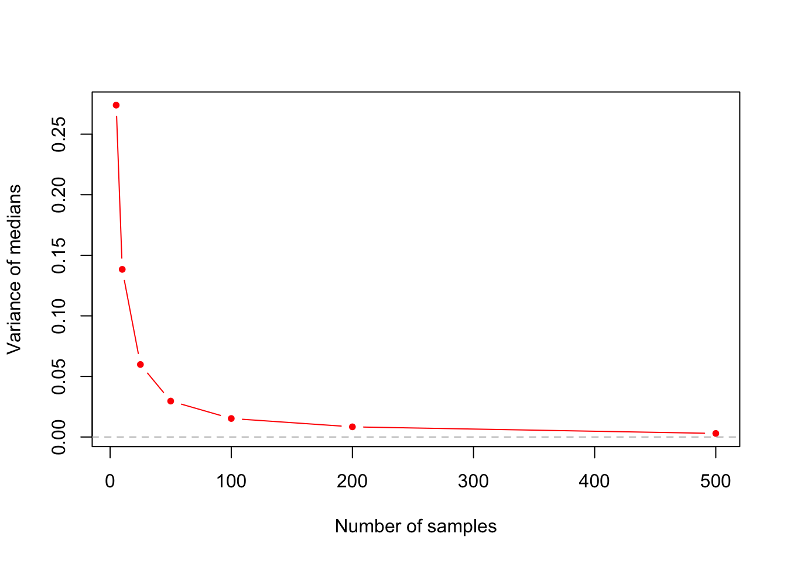

3. Considering $n$ i.i.d. random variables $X_i$, which are normally distributed with a mean $\theta$ and variance of 1 ($X_i \sim N(\theta, 1)$), are the following estimators (i) unbiased; and (ii) consistent?

  a. The sample mean is unbiased and consistent, we have shown these already. 

  b. A shifted sample mean will be biased (e.g., because we are adding a constant to each value prior to taking the average), and will not be consistent because the mean squared error will never approach 0 (because it is biased). Also see Edge's explanation. 

  c. The first observation, $X_1$ will be an unbiased estimator because it has an expectation of $\theta$. It has a variance of 1, and thus it is not consistent (because the variance does not approach zero as the number of samples increases). 

  d. A 'shrunk' sample mean is biased and consistent; see handwritten notes for solution.

4. Prove that if Eq. 6.7 holds, then Eq. 6.6 also holds. SKIPPED; see Edge for solution. 

## Efficiency

In addition to consistency, we'd like it if we our estimator was *efficient* - that is, it takes fewer samples to achieve a desired level of performance. One way to define the relative efficiency of two estimators is:

$$
\begin{aligned}
\text{RE}(\hat{\theta}_n, \tilde{\theta}_n) =& ~ \frac{\text{MSE}(\hat{\theta}_n)} {\text{MSE}(\tilde{\theta}_n)} \\
\end{aligned}
$$

Check out Edge's Figure 6-3 for a visual. 

We can also consider the relative efficiency as the sample size goes to infinity, otherwise known as the *asymptotic relative efficiency*:

$$
\begin{aligned}
\text{ARE}(\hat{\theta}_n, \tilde{\theta}_n) =& ~ \text{lim}_{n \rightarrow \infty} \frac{\text{MSE}(\hat{\theta}_n)} {\text{MSE}(\tilde{\theta}_n)} \\
\end{aligned}
$$

### Exercise set 6-5

1. Exploring the relative efficiency of the mean and median for normal samples of different sizes. Consider a Normal(0, 1) distribution. 

  a. Estimate MSE using 10000 normal samples of size 5.
  

```r
mu <- 0
s.mat <- mat.samps(n = 5, nsim = 10000)
ests.mean <- apply(s.mat, 1, mean)
ests.median <- apply(s.mat, 1, median)

#The relative efficiency is estimated as the quotient of the
#MSEs. The relative efficiency of the sample mean vs. the
#sample median has the MSE of the sample mean in the
#denominator.
re <- mean((ests.median - mu)^2)/mean((ests.mean - mu)^2)
re
```

```
## [1] 1.446713
```

  b. Repeat for different sample sizes:
  

```r
n <- c(2,5,10,20,50,100,200,500)
nsims <- 2000
mu <- 0
sigma <- 1
re <- numeric(length(n))
for(i in 1:length(n)){
  x <- mat.samps(n = n[i], nsim = nsims, mean = mu, sd = sigma)
  ests.median <- apply(x, 1, median)
  ests.mean <- apply(x, 1, mean)
  re[i] <- mean((ests.median - mu)^2)/mean((ests.mean - mu)^2)
}

plot(n, re, xlab = "sample size", 
     ylab = "Relative efficiency", 
     main = "Sample mean vs. median for normal data")
```

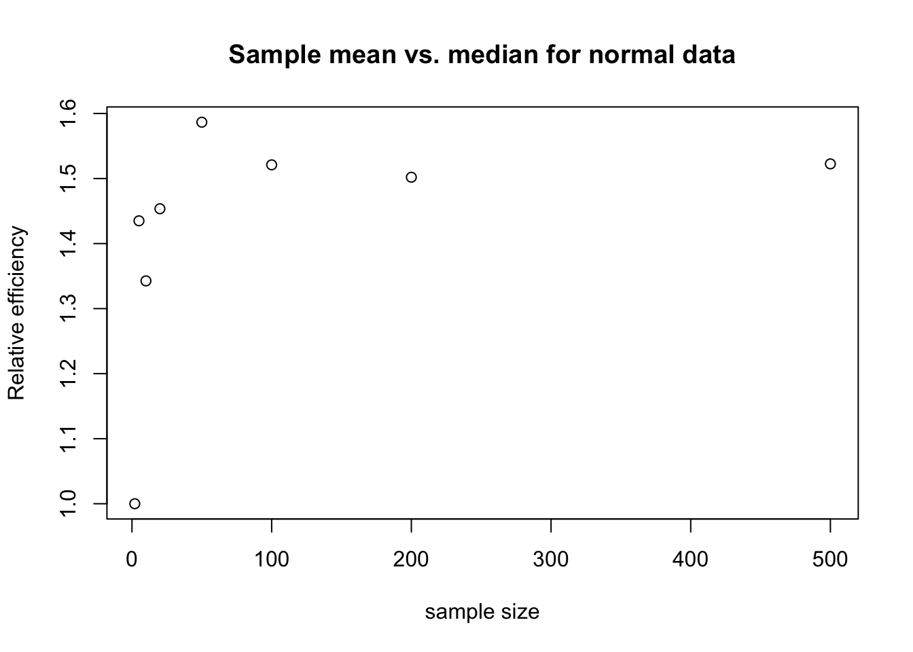

2. Repeat problem 1, but using the Laplace distribution. 


```r
n <- c(2,5,10,20,50,100,200,500)
nsims <- 2000
mu <- 0
sigma <- 1
re <- numeric(length(n))
for(i in 1:length(n)){
  x <- mat.samps(n = n[i], nsim = nsims, mu = mu, sigma = sigma, rx = rlaplace)
  ests.median <- apply(x, 1, median)
  ests.mean <- apply(x, 1, mean)
  re[i] <- mean((ests.median - mu)^2)/mean((ests.mean - mu)^2)
}

plot(n, re, xlab = "sample size", 
     ylab = "Relative efficiency", 
     main = "Sample mean vs. median for heavy tailed data")
```

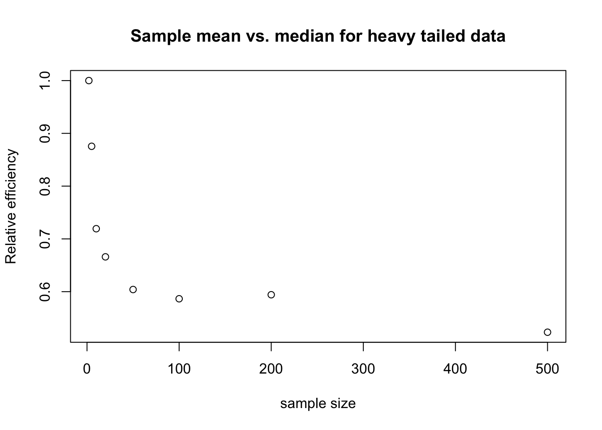

## Statistical decision theory and risk

Skimmed; skipped exercises.

## Robustness

So far, we have implicitly assumed that we are confident in our model - for example, that a normal distribution represents the data generating process. But what if we were wrong? This may be the case, or at least, there are often competing data generating processes for the same set of observed data. In this reality, we value a statistical procedure that is *robust* - that is, it continues to give approximately correct answers even when the underlying assumptions are incorrect. 

*Robust* against what? This needs defining. For example, we might consider an estimator as robust against: 

  - outliers (e.g., the median)
  - misspecification of the probability distribution (e.g., the assumption of normality) 
  
### Exercise set 6-8

1. Estiming $\theta$ using independent samples from a Normal($\theta$, 1) distribution. But our observations might be contaminated by data drawn from a different distribution. 

```r
rnorm.contam
```

```
## function (n, mu = 0, sigma = 1, contam.p = 0.01, contam.mu = -5, 
##     contam.sigma = 0) 
## {
##     ncontam <- rbinom(1, n, contam.p)
##     c(rnorm(n - ncontam, mu, sigma), rnorm(ncontam, contam.mu, 
##         contam.sigma))
## }
## <bytecode: 0x7fb742236748>
## <environment: namespace:stfspack>
```

```r
dat <- mat.samps(n = 100, nsim = 1000, rx = rnorm.contam, 
                 contam.p = 0.1, contam.mu = 300, contam.sigma = 1)
means <- apply(dat,2,mean)
medians <- apply(dat,2,median)
mean(means)
```

```
## [1] 29.99532
```

```r
var(means)
```

```
## [1] 9.049853
```

```r
mean(medians)
```

```
## [1] 0.1431885
```

```r
var(medians)
```

```
## [1] 0.001828098
```

```r
par(mfrow = c(1,2))
hist(means, breaks = 10)
hist(medians, breaks = 10)
```

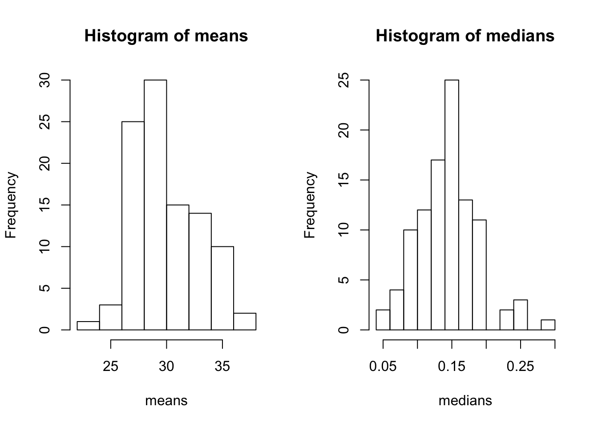

## Estimators for simple linear regression

### Exercise set 6-9

1. Exploring the properties of least-squares and least-absolute-errors lines as estimators of a linear regression model with disturbance terms that are distributed normally (and constant variance). 


```r
sim.lm
```

```
## function (n, a, b, sigma.disturb = 1, mu.x = 8, sigma.x = 2, 
##     rdisturb = rnorm, rx = rnorm, het.coef = 0) 
## {
##     x <- sort(rx(n, mu.x, sigma.x))
##     disturbs <- rdisturb(n, 0, sapply(sigma.disturb + scale(x) * 
##         het.coef, max, 0))
##     y <- a + b * x + disturbs
##     cbind(x, y)
## }
## <bytecode: 0x7fb73f32be80>
## <environment: namespace:stfspack>
```

```r
ests <- sim.lm.ests(n = 50, nsim = 1000, a = 3, b = 0.5)
colMeans(ests)
```

```
## [1] 3.0015118 0.4992189
```

```r
apply(ests, 2, var)
```

```
## [1] 0.39426172 0.00573011
```

```r
# Histogram of slope estimates
hist(ests[,2])
```

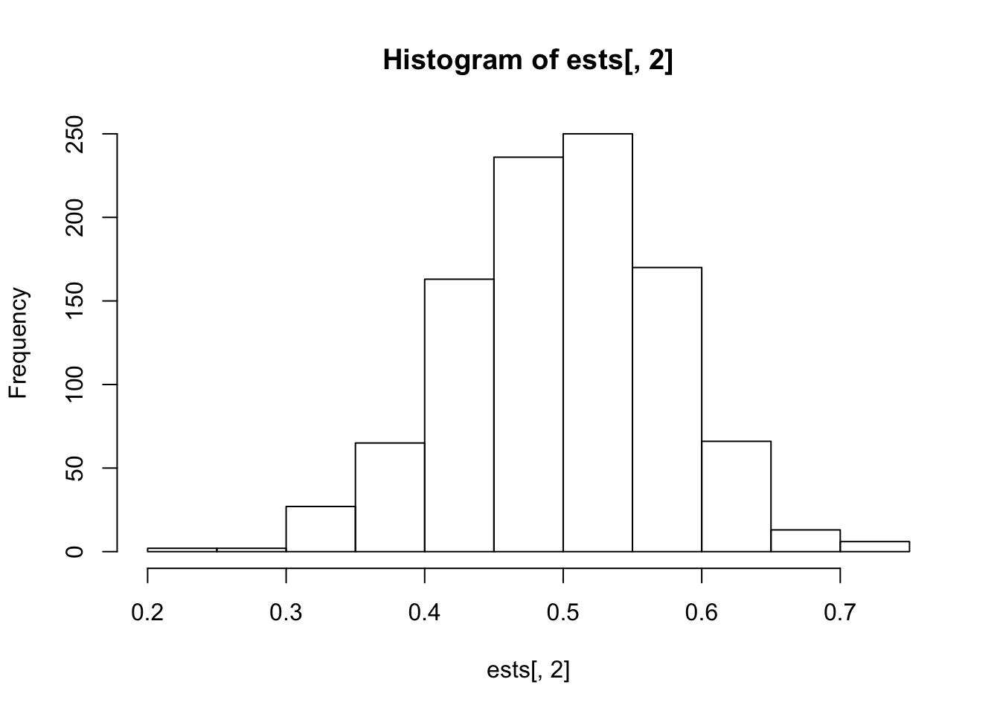

  a. Simulate samples of 10, 50, 100, and 1000. Describe the bias and consistency of these least-squares estimators. 


```r
n_sims <- 1000
n_samps <- c(10, 50, 100, 500, 1000)
matrix_means <- matrix(data = NA, nrow = length(n_samps), ncol = 2)
matrix_var <- matrix(data = NA, nrow = length(n_samps), ncol = 2)

for(i in 1:length(n_samps)){
  ests <- sim.lm.ests(n = n_samps[i], nsim = n_sims, a = 3, b = 0.5)
  matrix_means[i, ] <- colMeans(ests)
  matrix_var[i, ] <- apply(ests, 2, var)
}

par(mfrow = c(2,2))
plot(n_samps, matrix_means[,1], ylab = "a", main = "Mean")
plot(n_samps, matrix_means[,2], ylab = "b", main = "Mean")
plot(n_samps, matrix_var[,1], ylab = "a", main = "Variance")
plot(n_samps, matrix_var[,2], ylab = "b", main = "Variance")
```

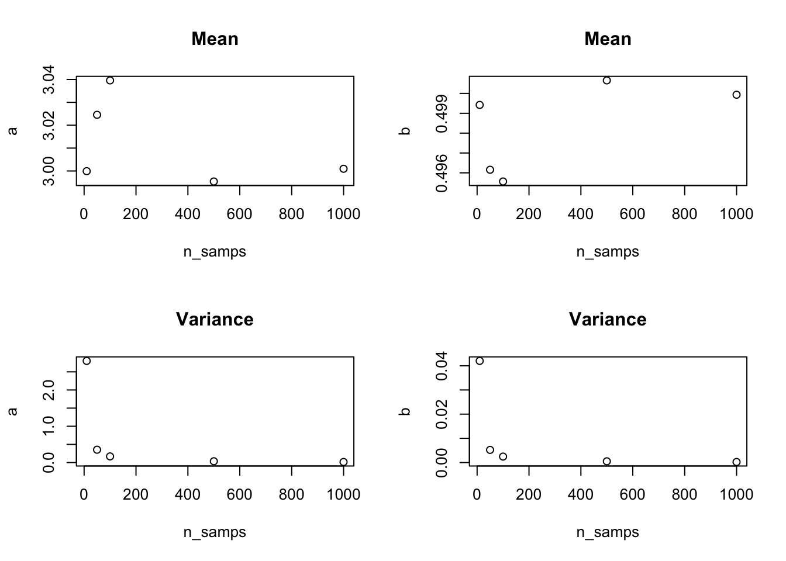

```r
matrix_var_LSE <- matrix_var
```

There appears to be no bias, because the sample means of the coefficients (a and b) are very close to the true values (3 and 0.5). 

The estimators are consistent, because the variance decreases to zero for both a and b (and there is no bias). 

  b. Same exercise, but using quantile regression (i.e., the least-absolute-errors line). 

```r
library(quantreg)
n_sims <- 1000
n_samps <- c(10, 50, 100, 500, 1000)
matrix_means <- matrix(data = NA, nrow = length(n_samps), ncol = 2)
matrix_var <- matrix(data = NA, nrow = length(n_samps), ncol = 2)

set.seed(1201)
for(i in 1:length(n_samps)){
  ests <- sim.lm.ests(n = n_samps[i], nsim = n_sims, a = 3, b = 0.5, estfun = rq)
  matrix_means[i, ] <- colMeans(ests)
  matrix_var[i, ] <- apply(ests, 2, var)
}

par(mfrow = c(2,2))
plot(n_samps, matrix_means[,1], ylab = "a", main = "Mean")
plot(n_samps, matrix_means[,2], ylab = "b", main = "Mean")
plot(n_samps, matrix_var[,1], ylab = "a", main = "Variance")
plot(n_samps, matrix_var[,2], ylab = "b", main = "Variance")
```

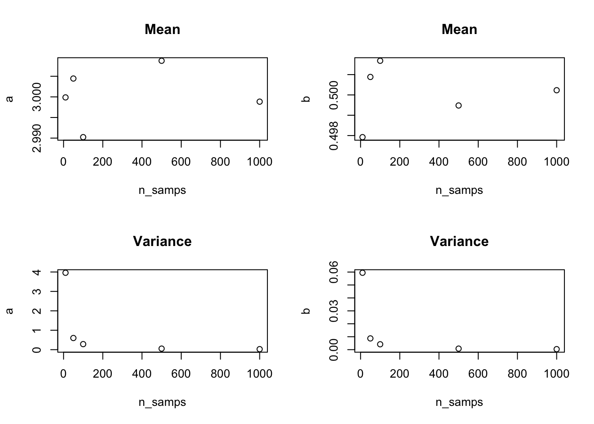

```r
matrix_var_LAE <- matrix_var
```

In some simulations, the least-absolute-errors line appears to be biased at very low sample sizes (e.g., 10). But this is just sampling variation, and I set the seed above to illustrate that there is no bias and this estimator is also consistent. 

  c. Which estimator is more efficient?


```r
n_sims <- 1000
n_samps <- c(10, 50, 100, 500, 1000)
matrix_var <- matrix(data = NA, nrow = length(n_samps), ncol = 2)

set.seed(1201)
for(i in 1:length(n_samps)){
  ests <- sim.lm.ests(n = n_samps[i], nsim = n_sims, a = 3, b = 0.5)
  matrix_var[i, ] <- apply(ests, 2, var)
}
matrix_var_LSE <- matrix_var

set.seed(1201)
for(i in 1:length(n_samps)){
  ests <- sim.lm.ests(n = n_samps[i], nsim = n_sims, a = 3, b = 0.5, estfun = rq)
  matrix_var[i, ] <- apply(ests, 2, var)
}
matrix_var_LAE <- matrix_var

par(mfrow = c(2,2))
plot(n_samps, matrix_var_LSE[,1], ylab = "a", main = "Variance (least-squares)")
plot(n_samps, matrix_var_LSE[,2], ylab = "b", main = "Variance (least-squares)")
plot(n_samps, matrix_var_LAE[,1], ylab = "a", main = "Variance (least-absolute)")
plot(n_samps, matrix_var_LAE[,2], ylab = "b", main = "Variance (least-absolute)")
```

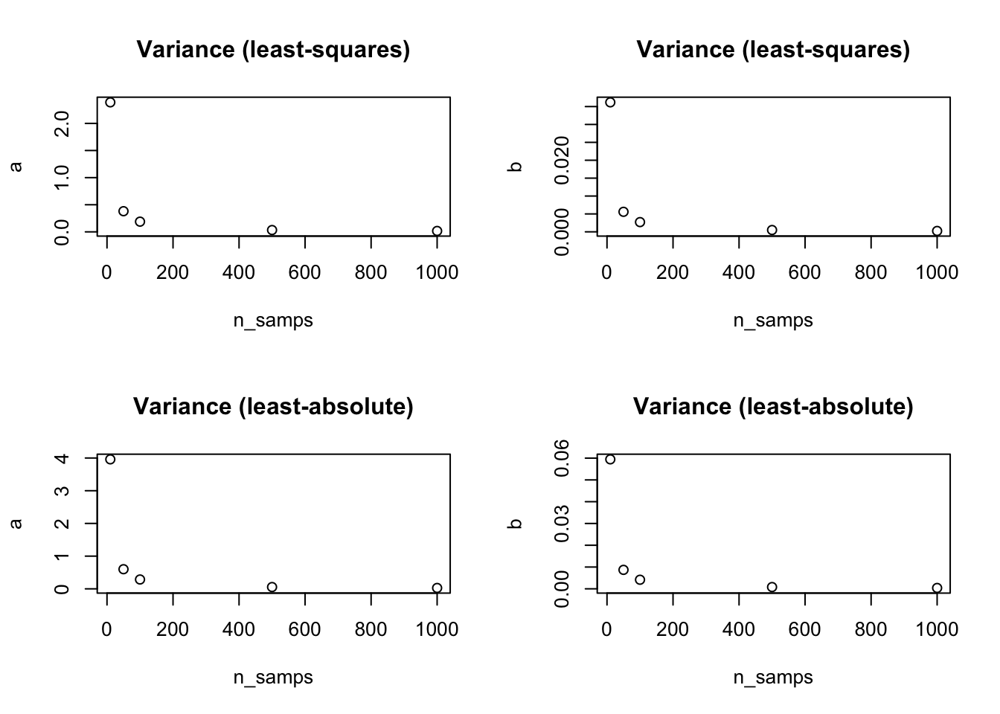

```r
par(mfrow = c(1,2))
plot(n_samps, matrix_var_LSE[,1] / matrix_var_LAE[,1], ylab = "a", main = "RE (least-squares / least-absolute)")
plot(n_samps, matrix_var_LSE[,2] / matrix_var_LAE[,2], ylab = "b", main = "RE (least-squares / least-absolute)")
```

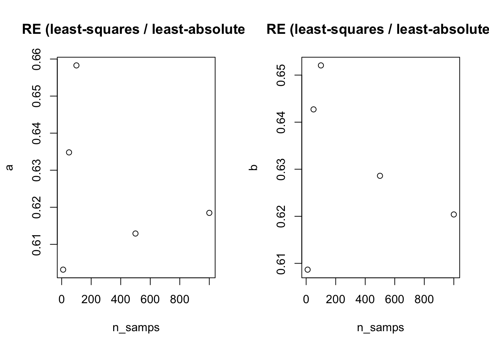

The least-squares estimator is more efficient; that is, it has a lower variance than the least-absolute estimator. 

2. Use a heavy tailed distribution (Laplace) for the disturbance term. 

  a. Simulate some datasets and view:


```r
par(mfrow = c(2,2))
plot(sim.lm(n = 50, a = 3, b = 0.5, rdisturb = rlaplace))
plot(sim.lm(n = 50, a = 3, b = 0.5, rdisturb = rlaplace))
plot(sim.lm(n = 50, a = 3, b = 0.5, rdisturb = rlaplace))
plot(sim.lm(n = 50, a = 3, b = 0.5, rdisturb = rlaplace))
```

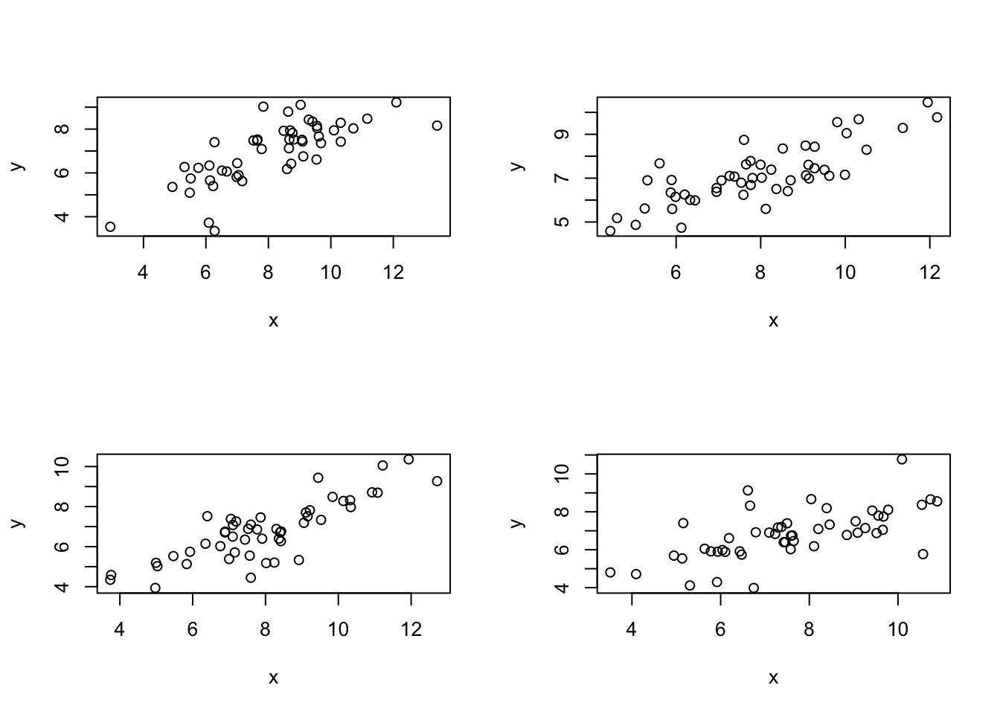

  b. Repeat problem 1 with a laplace distribution. 


```r
n_sims <- 1000
n_samps <- c(10, 50, 100, 500, 1000)

matrix_means <- matrix(data = NA, nrow = length(n_samps), ncol = 2)
matrix_var <- matrix(data = NA, nrow = length(n_samps), ncol = 2)
set.seed(1201)
for(i in 1:length(n_samps)){
  ests <- sim.lm.ests(n = n_samps[i], nsim = n_sims, a = 3, b = 0.5, rdisturb = rlaplace)
  matrix_means[i, ] <- colMeans(ests)
  matrix_var[i, ] <- apply(ests, 2, var)
}
matrix_means_LSE <- matrix_means
matrix_var_LSE <- matrix_var

matrix_means <- matrix(data = NA, nrow = length(n_samps), ncol = 2)
matrix_var <- matrix(data = NA, nrow = length(n_samps), ncol = 2)
set.seed(1201)
for(i in 1:length(n_samps)){
  ests <- sim.lm.ests(n = n_samps[i], nsim = n_sims, a = 3, b = 0.5, estfun = rq, rdisturb = rlaplace)
  matrix_means[i, ] <- colMeans(ests)
  matrix_var[i, ] <- apply(ests, 2, var)
}
matrix_means_LAE <- matrix_means
matrix_var_LAE <- matrix_var

par(mfrow = c(2,2))
plot(n_samps, matrix_means_LSE[,1], ylab = "a", main = "Mean (least-squares)")
plot(n_samps, matrix_means_LSE[,2], ylab = "b", main = "Mean (least-squares)")
plot(n_samps, matrix_means_LAE[,1], ylab = "a", main = "Mean (least-absolute)")
plot(n_samps, matrix_means_LAE[,2], ylab = "b", main = "Mean (least-absolute)")
```

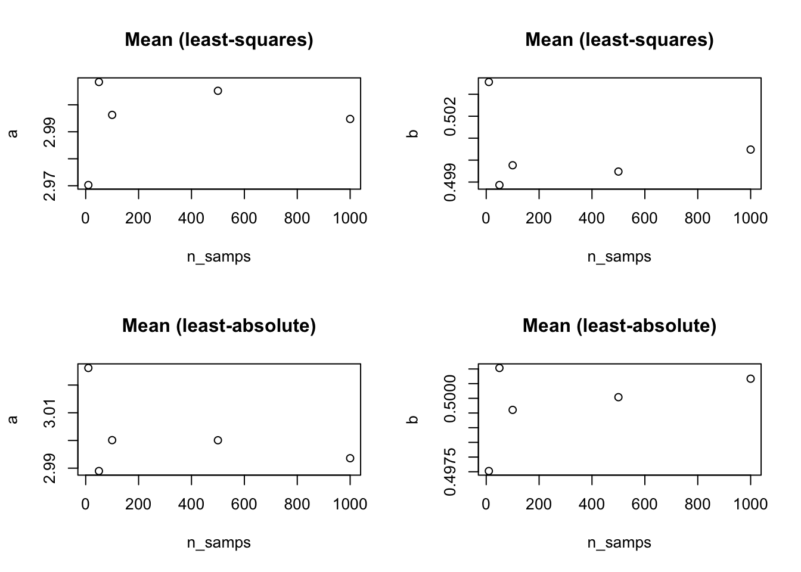

```r
par(mfrow = c(2,2))
plot(n_samps, matrix_var_LSE[,1], ylab = "a", main = "Variance (least-squares)")
plot(n_samps, matrix_var_LSE[,2], ylab = "b", main = "Variance (least-squares)")
plot(n_samps, matrix_var_LAE[,1], ylab = "a", main = "Variance (least-absolute)")
plot(n_samps, matrix_var_LAE[,2], ylab = "b", main = "Variance (least-absolute)")
```

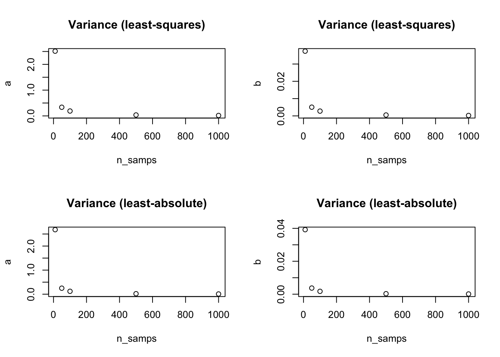

```r
par(mfrow = c(1,2))
plot(n_samps, matrix_var_LSE[,1] / matrix_var_LAE[,1], ylab = "a", main = "RE (least-squares / least-absolute)")
plot(n_samps, matrix_var_LSE[,2] / matrix_var_LAE[,2], ylab = "b", main = "RE (least-squares / least-absolute)")
```

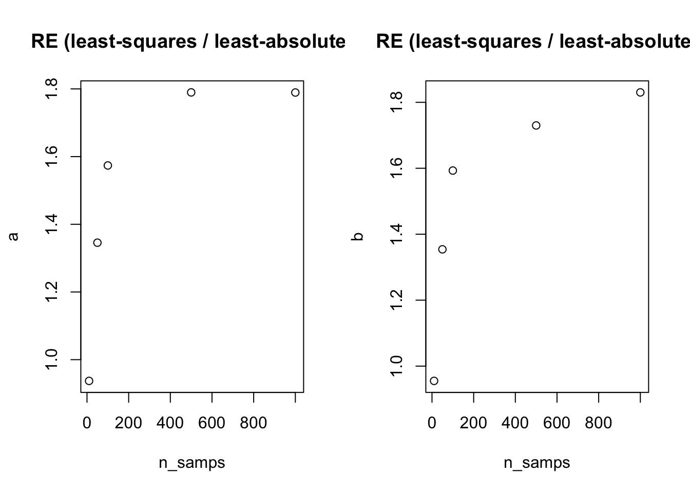

Both estimators are unbiased when using a heavy tailed distribution for the error term. However, the least-absolute estimator is more efficient than the the least-squares estimator, especially as sample size increases. 

3. Examining robustness to data contamination. 

  a. Simulate some datasets and view:


```r
par(mfrow = c(2,2))
plot(sim.lm(n = 100, a = 3, b = 0.5, rdisturb = rnorm.contam))
plot(sim.lm(n = 100, a = 3, b = 0.5, rdisturb = rnorm.contam))
plot(sim.lm(n = 100, a = 3, b = 0.5, rdisturb = rnorm.contam))
plot(sim.lm(n = 100, a = 3, b = 0.5, rdisturb = rnorm.contam))
```


  b. Repeat problem 1 with 1% contamination. 


```r
n_sims <- 1000
n_samps <- c(10, 50, 100, 500, 1000)

matrix_means <- matrix(data = NA, nrow = length(n_samps), ncol = 2)
matrix_var <- matrix(data = NA, nrow = length(n_samps), ncol = 2)
set.seed(1201)
for(i in 1:length(n_samps)){
  ests <- sim.lm.ests(n = n_samps[i], nsim = n_sims, a = 3, b = 0.5, rdisturb = rnorm.contam)
  matrix_means[i, ] <- colMeans(ests)
  matrix_var[i, ] <- apply(ests, 2, var)
}
matrix_means_LSE <- matrix_means
matrix_var_LSE <- matrix_var

matrix_means <- matrix(data = NA, nrow = length(n_samps), ncol = 2)
matrix_var <- matrix(data = NA, nrow = length(n_samps), ncol = 2)
set.seed(1201)
for(i in 1:length(n_samps)){
  ests <- sim.lm.ests(n = n_samps[i], nsim = n_sims, a = 3, b = 0.5, estfun = rq, rdisturb = rnorm.contam)
  matrix_means[i, ] <- colMeans(ests)
  matrix_var[i, ] <- apply(ests, 2, var)
}
matrix_means_LAE <- matrix_means
matrix_var_LAE <- matrix_var

par(mfrow = c(2,2))
plot(n_samps, matrix_means_LSE[,1], ylab = "a", main = "Mean (least-squares)")
plot(n_samps, matrix_means_LSE[,2], ylab = "b", main = "Mean (least-squares)")
plot(n_samps, matrix_means_LAE[,1], ylab = "a", main = "Mean (least-absolute)")
plot(n_samps, matrix_means_LAE[,2], ylab = "b", main = "Mean (least-absolute)")
```

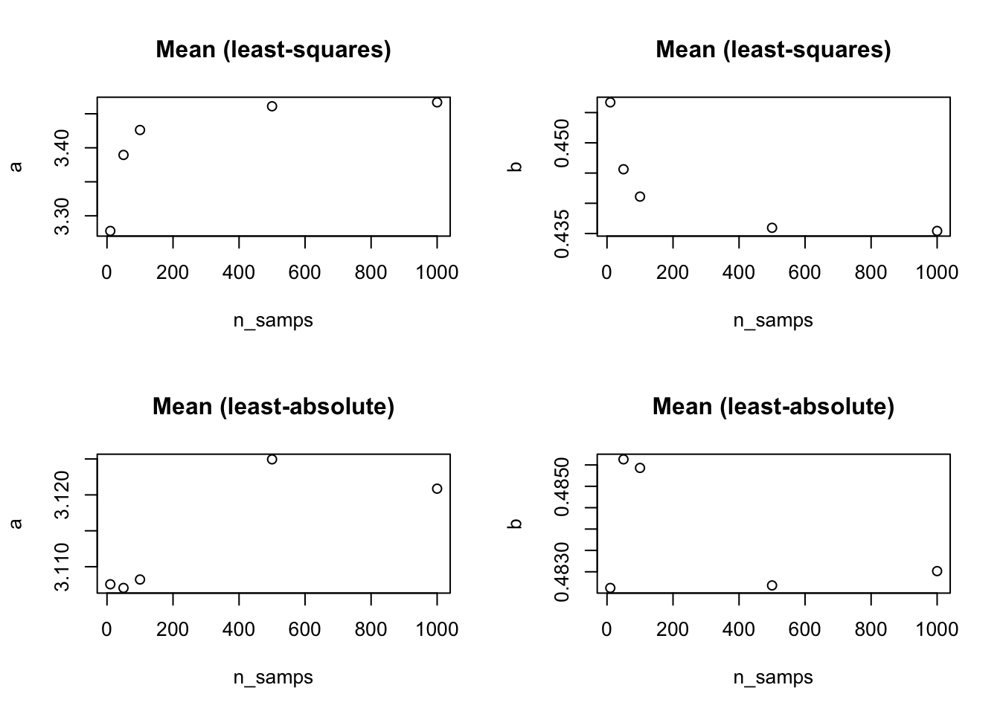

```r
par(mfrow = c(2,2))
plot(n_samps, matrix_var_LSE[,1], ylab = "a", main = "Variance (least-squares)")
plot(n_samps, matrix_var_LSE[,2], ylab = "b", main = "Variance (least-squares)")
plot(n_samps, matrix_var_LAE[,1], ylab = "a", main = "Variance (least-absolute)")
plot(n_samps, matrix_var_LAE[,2], ylab = "b", main = "Variance (least-absolute)")
```

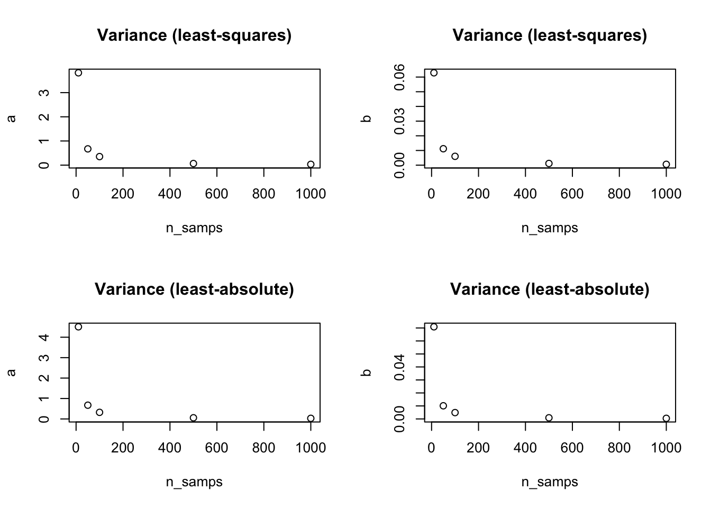

```r
par(mfrow = c(1,2))
plot(n_samps, matrix_var_LSE[,1] / matrix_var_LAE[,1], ylab = "a", main = "RE (least-squares / least-absolute)")
plot(n_samps, matrix_var_LSE[,2] / matrix_var_LAE[,2], ylab = "b", main = "RE (least-squares / least-absolute)")
```

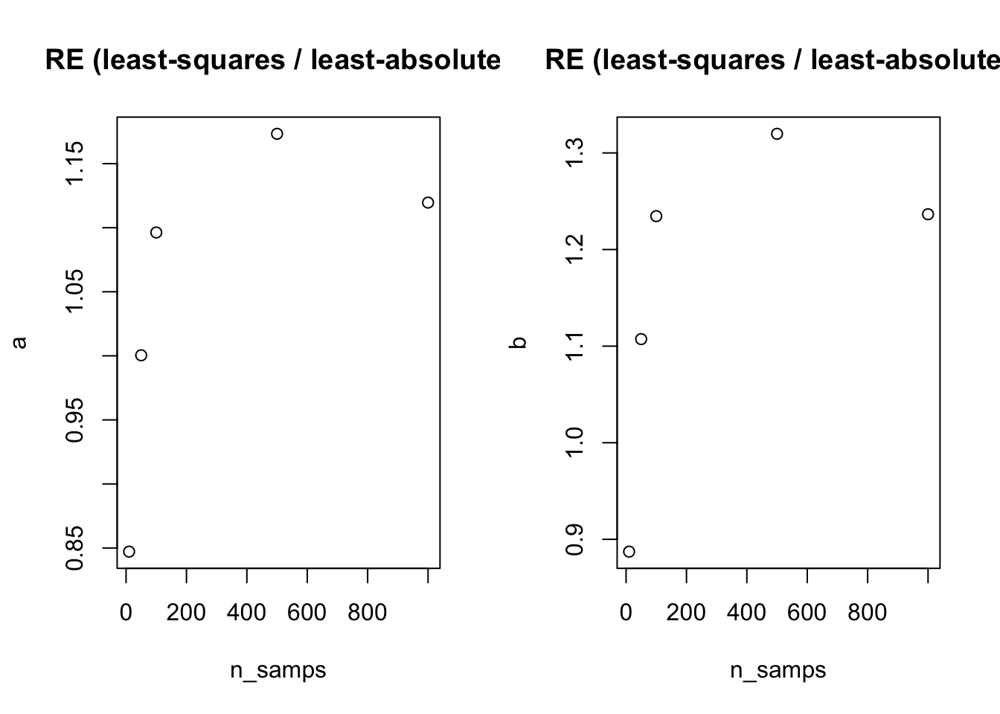

Looks like both estimators are biases (a is too high, b is too low); but the least-absolute estimator appears less biased. Even though the variance of both estimators declines with sample size, due to bias, neither of them are consistent. Their relative efficiecy follows a similar pattern to problem 2 - the least-absolute is more efficient, because it is less influence by outliers. 

4. Omitted variable bias. 

  a. If X and Z are positively correlated, then if our model ignores Z, our estimate of the slope will overestimate the true effect of X - because our model wrongly attributed the effect of Z to X. If X and Z are negatively correlated, then the opposite is true - we have underestimated the slope, because the effect of Z is negating the effect of X. Finally, if X and Z are independent, then our estimate of the slope will be the same. 

  b. Test your conjectures. 


```r
library(MASS)
sim.2var
```

```
## function (n, nsim, a, b1, b2 = 0, sigma.disturb = 1, correl = 0) 
## {
##     sig <- matrix(c(1, correl, correl, 1), nrow = 2)
##     ivs <- MASS::mvrnorm(n * nsim, mu = c(0, 0), sig)
##     x <- ivs[, 1]
##     z <- ivs[, 2]
##     disturb <- rnorm(n * nsim, 0, sigma.disturb)
##     y <- a + b1 * x + b2 * z + disturb
##     xmat <- matrix(x, nrow = nsim)
##     ymat <- matrix(y, nrow = nsim)
##     list(xmat, ymat)
## }
## <bytecode: 0x7fb73e19a3f8>
## <environment: namespace:stfspack>
```

```r
n <- 50
nsims <- 1000
beta <- .3
gamma <- .4

# Positive correlation
rho <- .5
dat <- sim.2var(n, nsims, 0, beta, gamma, 1, rho)  
ests <- numeric(nsims)
for(i in 1:nsims){
  ests[i] <- lm(dat[[2]][i,] ~ dat[[1]][i,])$coef[2] }
ests_rho_positive <- ests

# Negative correlation
rho <- -0.5
dat <- sim.2var(n, nsims, 0, beta, gamma, 1, rho)  
ests <- numeric(nsims)
for(i in 1:nsims){
  ests[i] <- lm(dat[[2]][i,] ~ dat[[1]][i,])$coef[2] }
ests_rho_negative <- ests

# No correlation
rho <- 0
dat <- sim.2var(n, nsims, 0, beta, gamma, 1, rho)  
ests <- numeric(nsims)
for(i in 1:nsims){
  ests[i] <- lm(dat[[2]][i,] ~ dat[[1]][i,])$coef[2] }
ests_rho_none <- ests
```


```r
par(mfrow = c(1,3))

hist(ests_rho_negative, main = "Negative correlation", xlab = "Estimates of b")
abline(v = beta, col = "red", lty = 2, lwd = 2)

hist(ests_rho_none, main = "No correlation", xlab = "Estimates of b")
abline(v = beta, col = "red", lty = 2, lwd = 2)

hist(ests_rho_positive, main = "Positive correlation", xlab = "Estimates of b")
abline(v = beta, col = "red", lty = 2, lwd = 2)
```

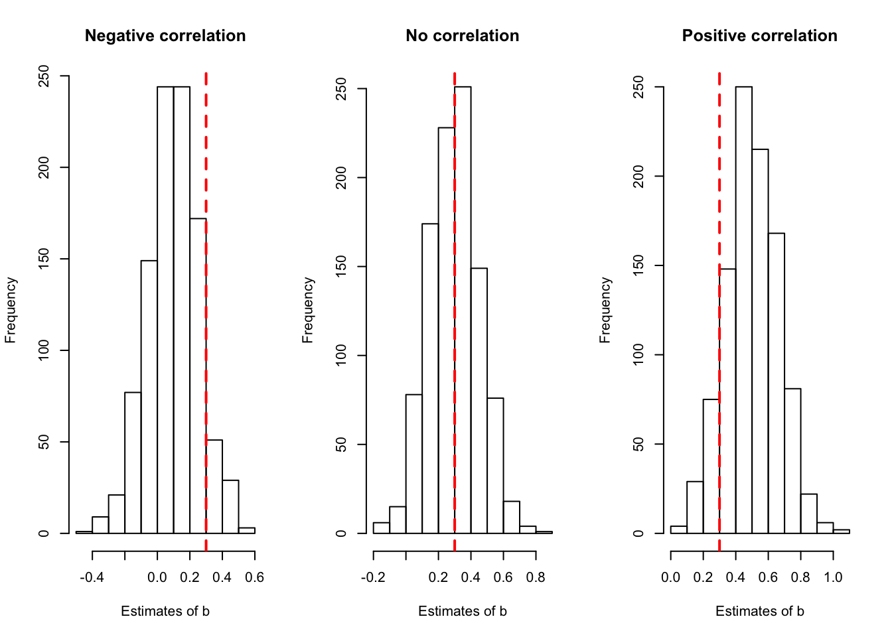

  c. If we are ignoring the effect of Z (a potential confound), then it is unreasonable to use our estimate of the slope to make predictions of Y based on X alone, if X and Z are correlated. 

