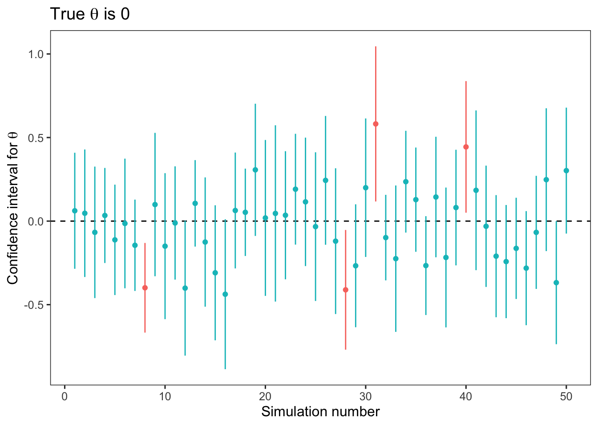
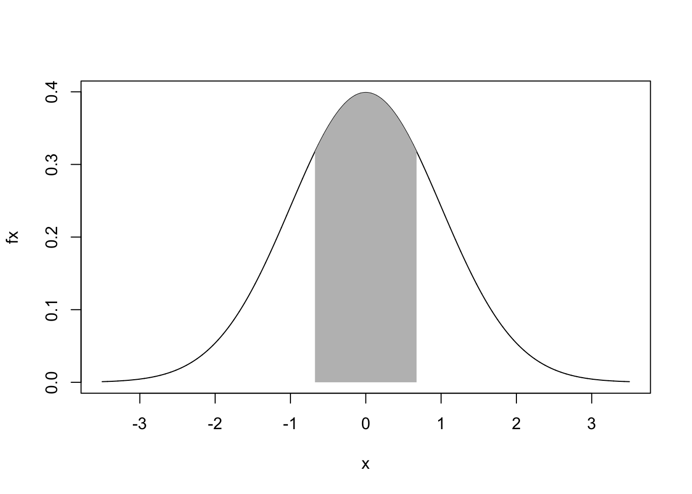

# Interval estimation and inference {#intervals}


A single estimate is not enough, we need uncertainty. This chapter is about estimating intervals to go with our point estimates, and the related procedures of hypothesis testing (i.e., statistical inference). 

## Standard error

The variance of an estimator, $\text{Var}(\hat{\theta}_n)$, describes the spread of the estimator's distribution. We define it in the same way that we defined the variance of a random variable:

$$
\begin{aligned}
\text{Var}(\hat{\theta}_n) =& ~ E[(\hat{\theta}_n(D) - E[\hat{\theta}_n(D)])^2] \\
=& ~ E[(\hat{\theta}_n(D)^2] - (E[\hat{\theta}_n(D)])^2 \\
\end{aligned}
$$
Compared to the expectation, or mean, of the estimator, the variance is in squared units. So we'd prefer to take the square root of the variance ($\sigma^2$), otherwise known as the standard deviation ($\sigma$). Rather than call the standard deviation of an estimator's distribution the standard deviation, we call it the standard error instead:

$$
\begin{aligned}
\text{SE}(\hat{\theta}_n) =& \sqrt{\text{Var}(\hat{\theta}_n)} \\
\end{aligned}
$$

This is confusing, but to paraphrase Edge:

> the term 'standard error' is used to describe the measure of spread of an *estimator's* sampling distribution, whereas the term 'standard deviation' is reserved to describe the spread in distribution of the *data*.

For example, when we describe a dataset using the mean, median, or mode - we are applying an estimator (a function) to the data to get a point estimate of the data. But in your introductory stats class, you probably did not refer to these functions as estimators - rather, they are often described as *summary statistics*. Then, to describe the uncertainty around the mean, we can calculate the standard error of the mean, which again, is just the standard deviation of the distribution of sample means. This distribution of sample means is known as a *sampling distribution*, but this term is not restricted to the mean - it applies to any estimator. Phew. Cogitate on this until it makes sense. 

### Exercise set 7-1

1. See Edge solution or handwritten notes.

  d. If we instead use the median, instead of the mean, as the estimator of $\theta$, $text{SE}(\hat{\theta}_n)$ is 0.25 (higher than the standard erro of the mean for 25 samples, 0.2). 
  

```r
# the value of mu does not affect the answer
# (adding a constant to a random variable does not affect its variance)
mu <- 0 
stdev <- 1
n <- 25 
n_sims <- 10000 
set.seed(101)
s.mat <- mat.samps(n = n, nsim = n_sims)
ests.median <- apply(s.mat, 1, median)
sd(ests.median)
```

```
## [1] 0.2478706
```

```r
# Confirming the answer to part c:
ests.mean <- apply(s.mat, 1, mean)
sd(ests.mean)
```

```
## [1] 0.1984093
```

2. See Edge solution for a cogent explanation.

  a. Under a normal distribution, the probability that the estimate (still a random variable) lies between plus and minus 1 SE of the mean is ~68% - we can use old-school look up tables or the `pnorm` function in R. 
  

```r
mu <- 0
w <- 1 # this is the standard error of the mean
# Pnorm gives the cumulative probability distribution, where q is the z-score
# One tailed probabilities
pnorm(q = 1, mean = mu, sd = w)
```

```
## [1] 0.8413447
```

```r
pnorm(q = -1, mean = mu, sd = w)
```

```
## [1] 0.1586553
```

```r
# To get the probability between the upper and lower w:
pnorm(q = 1, mean = mu, sd = w) - pnorm(q = -1, mean = mu, sd = w)
```

```
## [1] 0.6826895
```

  b. Under a normal distribution, the probability that the standard error lies between plus and minus 2 SE of the mean is ~95% - we can use old-school look up tables or the `pnorm` function in R. 


```r
mu <- 0
w <- 0.5 # this is the standard error of the mean
# Pnorm gives the cumulative probability distribution, where q is the z-score
# One tailed probabilities
pnorm(q = 1, mean = mu, sd = w) # note that this value of q is twice w (the SE)
```

```
## [1] 0.9772499
```

```r
pnorm(q = -1, mean = mu, sd = w)
```

```
## [1] 0.02275013
```

```r
# To get the probability between the upper and lower w:
pnorm(q = 1, mean = mu, sd = w) - pnorm(q = -1, mean = mu, sd = w)
```

```
## [1] 0.9544997
```

## Confidence intervals

Confidence interval for an estimand $\theta$:

$$
\begin{aligned}
\text{P}(V_1 < \theta < V_2) \geq 1 - \alpha  \\
\end{aligned}
$$

where $V_1$ and $V_2$ are random variables that represent the upper and lower bounds of the interval, respectively. Therefore, the interval is also a random variable. But, the estimand ($\theta$) is not - it is a fixed quantity. So in words, we can say that $1 - \alpha$ is the probability that the interval ranging from $V_1$ to $V_2$ covers $\theta$; often called a *coverage probability*. Another way to write the equation is:

$$
\begin{aligned}
\text{P}(V_1 < \theta \cap V_2 > \theta) \geq 1 - \alpha  \\
\end{aligned}
$$

To refer to a confidence interval already calculated from data, we use ($v_1, v_2$). In the plot below, I recreated Edge's Figure 7-1. I took 20 samples from a standard normal distribution (mean = 0, sd = 1), and then calculated the sample mean, standard deviation, and standard error of the mean. One of the most commonly used 1 - $\alpha$ confidence intervals is:

$$
\begin{aligned}
(\hat{\theta} - \omega z_{\alpha / 2}, \hat{\theta} + \omega z_{\alpha / 2}) \\
\end{aligned}
$$

where $\omega$ is the standard error, and $z_{\alpha / 2}$ represents the z-score, or the number of standard deviations for a standard normal distribution (i.e., a standardized distribution). The product of these two values represents the amount we add to the point estimate (i.e., the mean) to get the upper bound, and subtract from the point estimate to get the lower bound. 

To get the desired z-score, we have to work backwards from our desired $\alpha$ level. Here, we are using 0.1, so we take the inverse of the cumulative distribution function in R using `qnorm` - or you could do this using look-up tables. Either way, the z-score that returns a 90% probability is ~1.64 for a standard normal distribution. Here's the equation:

$$
\begin{aligned}
z_{\alpha / 2} =& \phi^{-1} (1 - \alpha / 2) \\
\phi^{-1} =& ~\text{inverse of the cumulative distribution function of a Normal(0,1) distribution}
\end{aligned}
$$


```r
mu <- 0 
stdev <- 1
n <- 20
n_sims <- 50
set.seed(99)
s.mat <- mat.samps(n = n, nsim = n_sims)
ests_mean <- apply(s.mat, 1, mean)
ests_sd <- apply(s.mat, 1, sd)

# 90% confidence intervals
my_z <- qnorm(0.95, mu, stdev)

d <- tibble(sim = 1:n_sims, 
            mean = ests_mean, 
            sd = ests_sd, 
            se = ests_sd / sqrt(n), 
            upper = mean + se*my_z, 
            lower = mean - se*my_z, 
            sig = ifelse(upper < 0 | lower > 0, "different", 
                         "not different"))

d %>% 
  ggplot(aes(x = sim, y = mean, color = sig)) + 
  geom_hline(yintercept = 0, linetype = "dashed") +
  geom_point() + 
  geom_errorbar(aes(ymin = lower, ymax = upper), width = 0) +
  labs(y = expression(paste("Confidence interval for ", theta, sep = "")), 
       x = "Simulation number", 
       title = expression(paste("True ", theta, " is 0", sep = ""))) + 
  theme(legend.position = "none")
```



In this set of simulations, the confidence intervals estimated from 46 of 50 (92%) of the simulations overlapped with the true value of $\theta$, 0. 

I am still struggling with how to articulate the meaning of an already calculated confidence interval that is consistent with the frequentist philosophy. Even after reading the explanation in Edge (and many other explanations) I do not, in my core, feel that I understand it. So you're not alone if you don't quite get it. But if you do, please, let's chat!

### Exercise set 7-2

1. 50% confidence interval; upper = 4, lower = 2. 

  a. What is $z_{\alpha / 2}$ for $\alpha = 0.5$?
  

```r
my_alpha <- 0.5
my_p <- 1 - my_alpha / 2
my_z <- qnorm(p = my_p, mean = 0, sd = 1)
my_z
```

```
## [1] 0.6744898
```

```r
# Plot a standard normal distribution
x <- seq(-3.5, 3.5, length.out = 10000)
fx <- dnorm(x)
plot(x, fx, type = "l")

# Shade in the appropriate area
x.zs <- seq(-my_z, my_z, length.out = 10000)
fx.zs <- dnorm(x.zs)
polygon(c(-my_z, x.zs, my_z), c(0, fx.zs, 0), col = "grey", border = FALSE)
```



The area of the shaded region is 0.5.

  b. In equation 7.3, the point estimate is halfway between the upper and lower bounds, and thus is 3. 
  
  c. The standard error is 1 / 0.674 = 1.48. 
  
  d. 95% CI is roughly (0, 6). 
  

```r
my_se <- 1 / my_z
z_95 <- qnorm(p = 0.975, 0, 1)
int_95 <- my_se * z_95
3 + int_95; 3 - int_95
```

```
## [1] 5.905847
```

```
## [1] 0.09415305
```
  
  e. How many SE's from 0 is $\theta$?
  

```r
3 / my_se
```

```
## [1] 2.023469
```

  f. We want the lower bound to sit on zero - this means the value that we subtract from our estimand is 3. The value that we subtract is the product of the SE and z-score. We know the SE - it is 1.48. So we calculate 3 / 1.48 = 2.03. This value represents the z-score for $z_{\alpha / 2}$. But what is $\alpha$, the probability level we need to be 2.03 SDs below the mean? This is where `pnorm` comes in:
  

```r
(1 - pnorm(q = 2.03)) * 2
```

```
## [1] 0.04235654
```

  g. Assume $\theta$ = 0. What is the probability of obtaining an estimate such that it is larger than the estimate considered in this example? To get a value of 3, if the true estimate is 0, we'd need a z-score of 2.03 again. This equates to a probability of 0.043 to retrieve something greater than 3, or less than -3. 
  

```r
mu <- 0
test_value <- 3
my_z <- test_value / my_se  
(1 - pnorm(q = my_z)) * 2
```

```
## [1] 0.04302479
```
  

