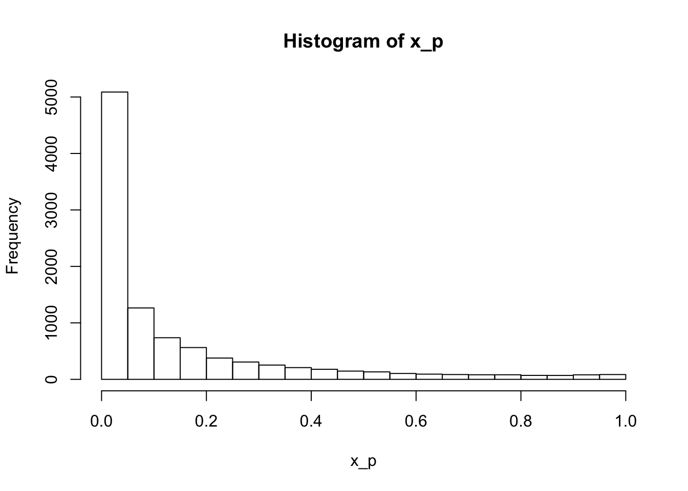

# Interval estimation and inference {#intervals}


A single estimate is not enough, we need uncertainty. This chapter is about estimating intervals to go with our point estimates, and the related procedures of hypothesis testing (i.e., statistical inference). 

## Standard error

The variance of an estimator, $\text{Var}(\hat{\theta}_n)$, describes the spread of the estimator's distribution. We define it in the same way that we defined the variance of a random variable:

$$
\begin{aligned}
\text{Var}(\hat{\theta}_n) =& ~ E[(\hat{\theta}_n(D) - E[\hat{\theta}_n(D)])^2] \\
=& ~ E[(\hat{\theta}_n(D)^2] - (E[\hat{\theta}_n(D)])^2 \\
\end{aligned}
$$
Compared to the expectation, or mean, of the estimator, the variance is in squared units. So we'd prefer to take the square root of the variance ($\sigma^2$), otherwise known as the standard deviation ($\sigma$). Rather than call the standard deviation of an estimator's distribution the standard deviation, we call it the standard error instead:

$$
\begin{aligned}
\text{SE}(\hat{\theta}_n) =& \sqrt{\text{Var}(\hat{\theta}_n)} \\
\end{aligned}
$$

This is confusing, but to paraphrase Edge:

> the term 'standard error' is used to describe the measure of spread of an *estimator's* sampling distribution, whereas the term 'standard deviation' is reserved to describe the spread in distribution of the *data*.

For example, when we describe a dataset using the mean, median, or mode - we are applying an estimator (a function) to the data to get a point estimate of the data. But in your introductory stats class, you probably did not refer to these functions as estimators - rather, they are often described as *summary statistics*. Then, to describe the uncertainty around the mean, we can calculate the standard error of the mean, which again, is just the standard deviation of the distribution of sample means. This distribution of sample means is known as a *sampling distribution*, but this term is not restricted to the mean - it applies to any estimator. Phew. Cogitate on this until it makes sense. 

### Exercise set 7-1

1. See Edge solution or handwritten notes.

  d. If we instead use the median, instead of the mean, as the estimator of $\theta$, $text{SE}(\hat{\theta}_n)$ is 0.25 (higher than the standard erro of the mean for 25 samples, 0.2). 
  

```r
# the value of mu does not affect the answer
# (adding a constant to a random variable does not affect its variance)
mu <- 0 
stdev <- 1
n <- 25 
n_sims <- 10000 
set.seed(101)
s.mat <- mat.samps(n = n, nsim = n_sims)
ests.median <- apply(s.mat, 1, median)
sd(ests.median)
```

```
## [1] 0.2478706
```

```r
# Confirming the answer to part c:
ests.mean <- apply(s.mat, 1, mean)
sd(ests.mean)
```

```
## [1] 0.1984093
```

2. See Edge solution for a cogent explanation.

  a. Under a normal distribution, the probability that the estimate (still a random variable) lies between plus and minus 1 SE of the mean is ~68% - we can use old-school look up tables or the `pnorm` function in R. 
  

```r
mu <- 0
w <- 1 # this is the standard error of the mean
# Pnorm gives the cumulative probability distribution, where q is the z-score
# One tailed probabilities
pnorm(q = 1, mean = mu, sd = w)
```

```
## [1] 0.8413447
```

```r
pnorm(q = -1, mean = mu, sd = w)
```

```
## [1] 0.1586553
```

```r
# To get the probability between the upper and lower w:
pnorm(q = 1, mean = mu, sd = w) - pnorm(q = -1, mean = mu, sd = w)
```

```
## [1] 0.6826895
```

  b. Under a normal distribution, the probability that the standard error lies between plus and minus 2 SE of the mean is ~95% - we can use old-school look up tables or the `pnorm` function in R. 


```r
mu <- 0
w <- 0.5 # this is the standard error of the mean
# Pnorm gives the cumulative probability distribution, where q is the z-score
# One tailed probabilities
pnorm(q = 1, mean = mu, sd = w) # note that this value of q is twice w (the SE)
```

```
## [1] 0.9772499
```

```r
pnorm(q = -1, mean = mu, sd = w)
```

```
## [1] 0.02275013
```

```r
# To get the probability between the upper and lower w:
pnorm(q = 1, mean = mu, sd = w) - pnorm(q = -1, mean = mu, sd = w)
```

```
## [1] 0.9544997
```

## Confidence intervals

Confidence interval for an estimand $\theta$:

$$
\begin{aligned}
\text{P}(V_1 < \theta < V_2) \geq 1 - \alpha  \\
\end{aligned}
$$

where $V_1$ and $V_2$ are random variables that represent the upper and lower bounds of the interval, respectively. Therefore, the interval is also a random variable. But, the estimand ($\theta$) is not - it is a fixed quantity. So in words, we can say that $1 - \alpha$ is the probability that the interval ranging from $V_1$ to $V_2$ covers $\theta$; often called a *coverage probability*. Another way to write the equation is:

$$
\begin{aligned}
\text{P}(V_1 < \theta \cap V_2 > \theta) \geq 1 - \alpha  \\
\end{aligned}
$$

To refer to a confidence interval already calculated from data, we use ($v_1, v_2$). In the plot below, I recreated Edge's Figure 7-1. I took 20 samples from a standard normal distribution (mean = 0, sd = 1), and then calculated the sample mean, standard deviation, and standard error of the mean. One of the most commonly used 1 - $\alpha$ confidence intervals is:

$$
\begin{aligned}
(\hat{\theta} - \omega z_{\alpha / 2}, \hat{\theta} + \omega z_{\alpha / 2}) \\
\end{aligned}
$$

where $\omega$ is the standard error, and $z_{\alpha / 2}$ represents the z-score, or the number of standard deviations for a standard normal distribution (i.e., a standardized distribution). The product of these two values represents the amount we add to the point estimate (i.e., the mean) to get the upper bound, and subtract from the point estimate to get the lower bound. 

To get the desired z-score, we have to work backwards from our desired $\alpha$ level. Here, we are using 0.1, so we take the inverse of the cumulative distribution function in R using `qnorm` - or you could do this using look-up tables. Either way, the z-score that returns a 90% probability is ~1.64 for a standard normal distribution. Here's the equation:

$$
\begin{aligned}
z_{\alpha / 2} =& \phi^{-1} (1 - \alpha / 2) \\
\phi^{-1} =& ~\text{inverse of the cumulative distribution function of a Normal(0,1) distribution}
\end{aligned}
$$


```r
mu <- 0 
stdev <- 1
n <- 20
n_sims <- 50
set.seed(99)
s.mat <- mat.samps(n = n, nsim = n_sims)
ests_mean <- apply(s.mat, 1, mean)
ests_sd <- apply(s.mat, 1, sd)

# 90% confidence intervals
my_z <- qnorm(0.95, mu, stdev)

d <- tibble(sim = 1:n_sims, 
            mean = ests_mean, 
            sd = ests_sd, 
            se = ests_sd / sqrt(n), 
            upper = mean + se*my_z, 
            lower = mean - se*my_z, 
            sig = ifelse(upper < 0 | lower > 0, "different", 
                         "not different"))

d %>% 
  ggplot(aes(x = sim, y = mean, color = sig)) + 
  geom_hline(yintercept = 0, linetype = "dashed") +
  geom_point() + 
  geom_errorbar(aes(ymin = lower, ymax = upper), width = 0) +
  labs(y = expression(paste("Confidence interval for ", theta, sep = "")), 
       x = "Simulation number", 
       title = expression(paste("True ", theta, " is 0", sep = ""))) + 
  theme(legend.position = "none")
```


In this set of simulations, the confidence intervals estimated from 46 of 50 (92%) of the simulations overlapped with the true value of $\theta$, 0. 

I am still struggling with how to articulate the meaning of an already calculated confidence interval that is consistent with the frequentist philosophy. Even after reading the explanation in Edge (and many other explanations) I do not, in my core, feel that I understand it. So you're not alone if you don't quite get it. But if you do, please, let's chat!

### Exercise set 7-2

1. 50% confidence interval; upper = 4, lower = 2. 

  a. What is $z_{\alpha / 2}$ for $\alpha = 0.5$?
  

```r
my_alpha <- 0.5
my_p <- 1 - my_alpha / 2
my_z <- qnorm(p = my_p, mean = 0, sd = 1)
my_z
```

```
## [1] 0.6744898
```

```r
# Plot a standard normal distribution
x <- seq(-3.5, 3.5, length.out = 10000)
fx <- dnorm(x)
plot(x, fx, type = "l")

# Shade in the appropriate area
x.zs <- seq(-my_z, my_z, length.out = 10000)
fx.zs <- dnorm(x.zs)
polygon(c(-my_z, x.zs, my_z), c(0, fx.zs, 0), col = "grey", border = FALSE)
```


The area of the shaded region is 0.5.

  b. In equation 7.3, the point estimate is halfway between the upper and lower bounds, and thus is 3. 
  
  c. The standard error is 1 / 0.674 = 1.48. 
  
  d. 95% CI is roughly (0, 6). 
  

```r
my_se <- 1 / my_z
z_95 <- qnorm(p = 0.975, 0, 1)
int_95 <- my_se * z_95
3 + int_95; 3 - int_95
```

```
## [1] 5.905847
```

```
## [1] 0.09415305
```
  
  e. How many SE's from 0 is $\theta$?
  

```r
3 / my_se
```

```
## [1] 2.023469
```

  f. We want the lower bound to sit on zero - this means the value that we subtract from our estimand is 3. The value that we subtract is the product of the SE and z-score. We know the SE - it is 1.48. So we calculate 3 / 1.48 = 2.03. This value represents the z-score for $z_{\alpha / 2}$. But what is $\alpha$, the probability level we need to be 2.03 SDs below the mean? This is where `pnorm` comes in:
  

```r
(1 - pnorm(q = 2.03)) * 2
```

```
## [1] 0.04235654
```

  g. Assume $\theta$ = 0. What is the probability of obtaining an estimate such that it is larger than the estimate considered in this example? To get a value of 3, if the true estimate is 0, we'd need a z-score of 2.03 again. This equates to a probability of 0.043 to retrieve something greater than 3, or less than -3. 
  

```r
mu <- 0
test_value <- 3
my_z <- test_value / my_se  
(1 - pnorm(q = my_z)) * 2
```

```
## [1] 0.04302479
```
  
## Frequentist inference I: null hypotheses, test statistics, and *p* values

Null hypothesis

Test statistic

Hypothesis test

### Exercise set 7-3

1. Three reasons why the outcome of the hypothesis test is indecisive about the truth of the theory (that smaller people will be attracted to hotter climates because smaller bodies shed heat more efficiently):

  - Arizona may not be representative of hotter climates (i.e., need different geographic locations)
  
  - women may be different from men, and thus the result does not apply to people generally
  
  - the test does not let us say anything about the mechanism (heat shedding), but only the pattern (size variation)
  
  - see Edge for a general explanation that touches on some of the above

2. Average nail length is 100 mm. SD is 2 mm. I measure 4 nails.

  a. SE = sd / sqrt(n); SE = 2 / sqrt(4) = 1
  b. 1.96 * SE; 95% CI for $\mu$ is (98, 102)
  c. Anything less than 98 or more than 102, following from previous answer. Or, more precisely:
  

```r
# left tail
qnorm(0.025, mean = 100, sd = 1)
```

```
## [1] 98.04004
```

```r
# right tail
qnorm(0.975, mean = 100, sd = 1)
```

```
## [1] 101.96
```
 
  d. Simulating data assuming the null hypothesis is true. 
  

```r
twotailed.p.normal <- function(x.bar, mu, stand.err){
  abs.diff <- abs(x.bar - mu)
  2 * pnorm(mu - abs.diff, mean = mu, sd = stand.err)
}

n <- 10000
x <- mat.samps(n = 4, nsim = n, rx = rnorm, mean = 100, sd = 2)
x_mean <- apply(x, MARGIN = 1, FUN = mean)
x_p <- sapply(x_mean, FUN = twotailed.p.normal, mu = 100, stand.err = 1)
hist(x_p)
```


```r
# Values less than 0.05
length(x_p[x_p < 0.05]) / n
```

```
## [1] 0.0516
```

```r
mean(x_p < 0.05)
```

```
## [1] 0.0516
```

```r
# Values less than 0.1
length(x_p[x_p < 0.1]) / n
```

```
## [1] 0.0988
```

  e. Simulating data assuming the null hypothesis is false (mean = 101):
  

```r
twotailed.p.normal <- function(x.bar, mu, stand.err){
  abs.diff <- abs(x.bar - mu)
  2 * pnorm(mu - abs.diff, mean = mu, sd = stand.err)
}

n <- 10000
x <- mat.samps(n = 4, nsim = n, rx = rnorm, mean = 101, sd = 2) # CHANGED
x_mean <- apply(x, MARGIN = 1, FUN = mean)
x_p <- sapply(x_mean, FUN = twotailed.p.normal, mu = 100, stand.err = 1)
hist(x_p)
```


```r
# Values less than 0.05
length(x_p[x_p < 0.05]) / n
```

```
## [1] 0.166
```

```r
mean(x_p < 0.05) # same result!
```

```
## [1] 0.166
```

```r
# Values less than 0.1
length(x_p[x_p < 0.1]) / n
```

```
## [1] 0.2596
```

  f. Simulating data assuming the null hypothesis is false (mean = 102).


```r
twotailed.p.normal <- function(x.bar, mu, stand.err){
  abs.diff <- abs(x.bar - mu)
  2 * pnorm(mu - abs.diff, mean = mu, sd = stand.err)
}

n <- 10000
x <- mat.samps(n = 4, nsim = n, rx = rnorm, mean = 102, sd = 2) # CHANGED
x_mean <- apply(x, MARGIN = 1, FUN = mean)
x_p <- sapply(x_mean, FUN = twotailed.p.normal, mu = 100, stand.err = 1)
hist(x_p)
```



```r
# Values less than 0.05
length(x_p[x_p < 0.05]) / n
```

```
## [1] 0.5088
```

```r
# Values less than 0.1
length(x_p[x_p < 0.1]) / n
```

```
## [1] 0.6352
```

  g. Simulating data assuming the null hypothesis is false (mean = 101, n = 16). This means the standard error is now 2 / sqrt(16) = 0.5


```r
twotailed.p.normal <- function(x.bar, mu, stand.err){
  abs.diff <- abs(x.bar - mu)
  2 * pnorm(mu - abs.diff, mean = mu, sd = stand.err)
}

n <- 10000
x <- mat.samps(n = 16, nsim = n, rx = rnorm, mean = 101, sd = 2) # CHANGED
x_mean <- apply(x, MARGIN = 1, FUN = mean)
x_p <- sapply(x_mean, FUN = twotailed.p.normal, mu = 100, stand.err = 0.5)
hist(x_p)
```


```r
# Values less than 0.05
length(x_p[x_p < 0.05]) / n
```

```
## [1] 0.5109
```

```r
# Values less than 0.1
length(x_p[x_p < 0.1]) / n
```

```
## [1] 0.6351
```

## Frequentist inference II: alternative hypotheses and the rejection framework

### Exercise set 7-4

All on paper. 

## Connecting hypothesis tests and confidence intervals

## NHST and the abuse of tests

### Exercise set 7-5

1. 


```r
ps <- many.outcome.sim(n = 20, nsim = 10000, n.dv = 7, correl = 0.7)
str(ps)
```

```
##  num [1:10000, 1:7] 0.4194 0.679 0.2968 0.986 0.0614 ...
```

```r
sigs <- ps < 0.05
colMeans(sigs)
```

```
## [1] 0.0516 0.0482 0.0500 0.0520 0.0490 0.0500 0.0502
```

```r
mean(rowMeans(sigs) > 0)
```

```
## [1] 0.1784
```

  - n = 20, n.dv = 7, correl = 0.7: 18% of simulations have > 1 significant result. 
  
  a. There is a significant effect about 5% of the time for each dependent variable. 18% of the simulations have at least one significant result.

  b. Changing dependent variables (n.dv) and correlation:
  

```r
ps <- many.outcome.sim(n = 20, nsim = 10000, n.dv = 7, correl = 0.7)
str(ps)
```

```
##  num [1:10000, 1:7] 0.869 0.787 0.701 0.216 0.661 ...
```

```r
sigs <- ps < 0.05
colMeans(sigs)
```

```
## [1] 0.0526 0.0526 0.0526 0.0520 0.0528 0.0492 0.0506
```

```r
mean(rowMeans(sigs) > 0)
```

```
## [1] 0.1865
```
  - n = 20, n.dv = 15, correl = 0.7: 26% of simulations have > 1 significant result. 

  - n = 20, n.dv = 7, correl = 0.35: 27% of simulations have > 1 significant result. 
  
    - n = 10, n.dv = 7, correl = 0.7: 18% of simulations have > 1 significant result. 

So in summary:

  - Increasing the # of dependent variables increases the probability of Type 1 error
  
  - Decreasing the correlation between variables increases the probability of Type 1 error
  
  - Changing the size of each group does not change the probability of Type 1 error


2. Serial testing


```r
ps <- serial.testing.sim(ns = c(20, 30, 40, 50), nsim = 10000)
ps <- serial.testing.sim(ns = seq(20, 200, by = 10), nsim = 10000)
sigs <- ps < 0.05
colMeans(sigs)
```

```
##  [1] 0.0496 0.0504 0.0487 0.0504 0.0518 0.0527 0.0525 0.0524 0.0525 0.0518
## [11] 0.0529 0.0501 0.0531 0.0536 0.0531 0.0525 0.0526 0.0531 0.0531
```

```r
mean(rowMeans(sigs) > 0)
```

```
## [1] 0.229
```

If we sample at 4 times (starting with 20, ending with 50 people), there is a 12% change that at least one of those time points is significant. If we sample 19 times (20 to 200), then there is a 22% change one of the time points is significant.

## Frequentist inference III: power

### Exercise set 7-6

1. Plotting a power function for n = 5, 25, 75 with alpha = 0.05. 


```r
d <- power.sim.1sz(n = 25, nsim = 5000, d = 0.2, lev = 0.05)

d <- seq(-2, 2, by = 0.02)
d_5 <- sapply(X = d, FUN = power.sim.1sz, n = 5, nsim = 1000, lev = 0.05)
d_25 <- sapply(X = d, FUN = power.sim.1sz, n = 25, nsim = 1000, lev = 0.05)
d_75 <- sapply(X = d, FUN = power.sim.1sz, n = 75, nsim = 1000, lev = 0.05)

plot(d, d_25, type = "l", xlab = "Effect size (d)", ylab = "Power")
lines(d, d_5, type = "l", col = "red")
lines(d, d_75, type = "l", col = "blue")
```


2. 

  a. As n increases, estimated d declines to the true value, and power increases. At larger effect sizes, the power function converges to the truth much more quickly with sample size. 


```r
d <- wincurse.sim.1sz(n = 1, nsim = 10000, d = 0.3, lev = 0.05)
```


```r
d
```

```
##      true d estimated d       power 
##    0.300000    1.470967    0.057900
```

d = 0.1, n = 250: estimated d = 0.16, power = 0.35
d = 0.1, n = 50: estimated d = 0.32, power = 0.11
d = 0.1, n = 25: estimated d = 0.39, power = 0.08
d = 0.1, n = 5: estimated d = 0.55, power = 0.05

d = 0.5, n = 500: estimated d = 0.50, power = 1.00
d = 0.5, n = 50: estimated d = 0.52, power = 0.94
d = 0.5, n = 25: estimated d = 0.60, power = 0.70
d = 0.5, n = 5: estimated d = 1.12, power = 0.19

  b. 

Plotting estimated effect size vs sample size. 

Plotting the size of the winner's curse effect


```r
n_vector <- seq(1, 100, by = 1)
true_d <- 0.3
est_ds <- numeric(length(n_vector))
pows <- numeric(length(n_vector))

for(i in 1:length(n_vector)){
  wc <- wincurse.sim.1sz(n = n_vector[i], nsim = 10000, d = true_d)
  est_ds[i] <- wc[2]
  pows[i] <- wc[3]
}
```


```r
plot(n_vector, est_ds, type = "l", xlab = "Sample size (n)", ylab = "Estimated d")
lines(n_vector, rep(true_d, length(n_vector)), lty = 2)
```


```r
curse_size <- est_ds - true_d
plot(pows, curse_size, type = "l", xlab = "Power", ylab = "Winner's curse effect")
```


## Putting it together: what happens when the sample size increases?

## Chapter summary

