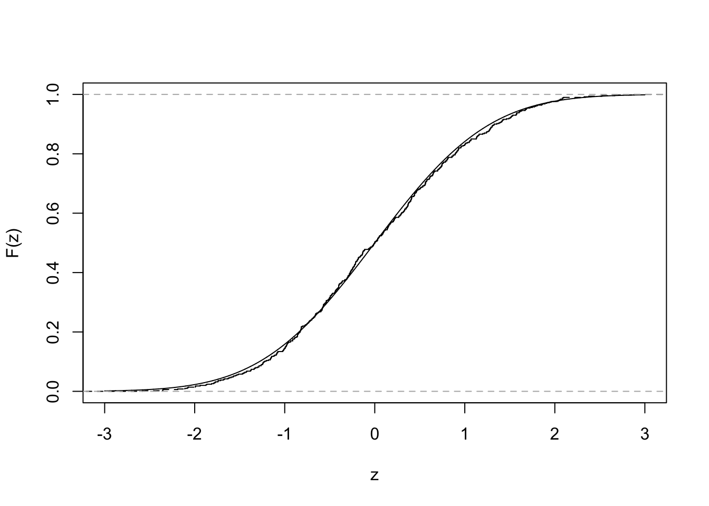
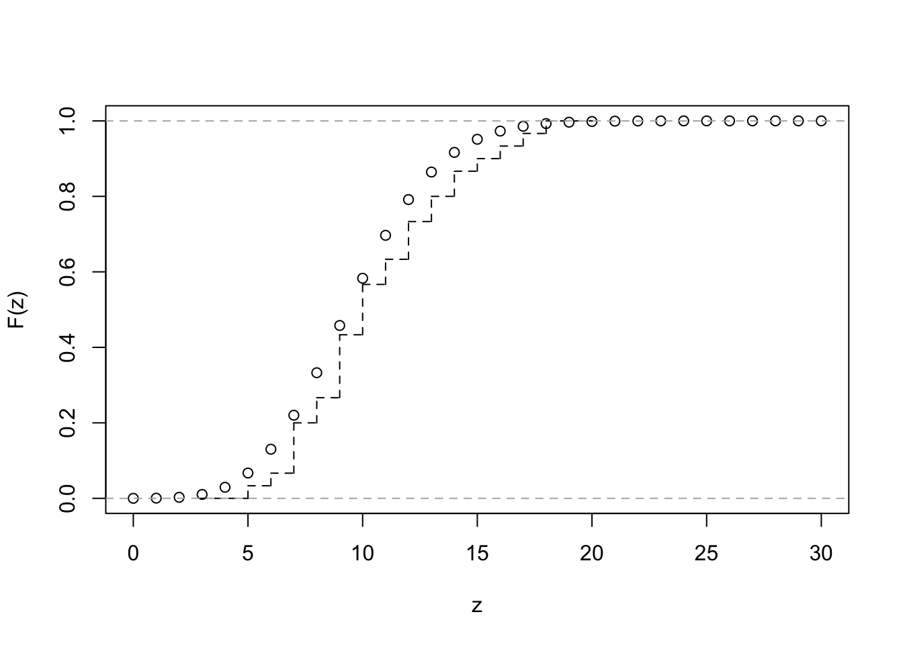
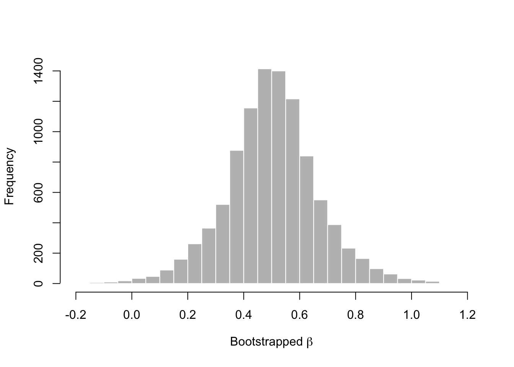
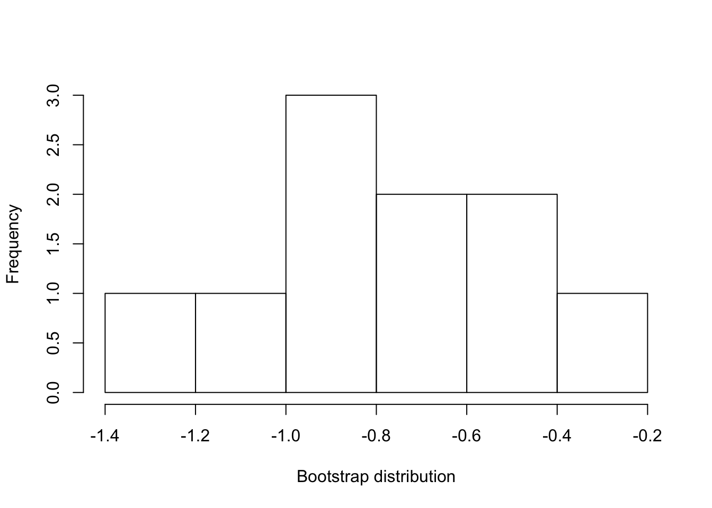
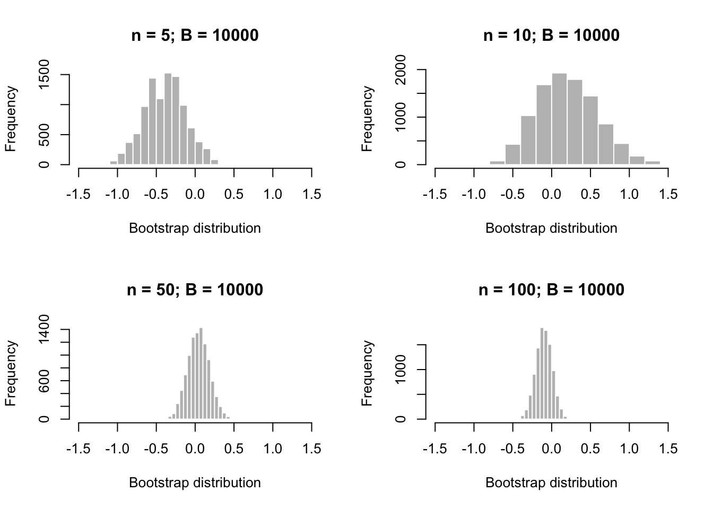
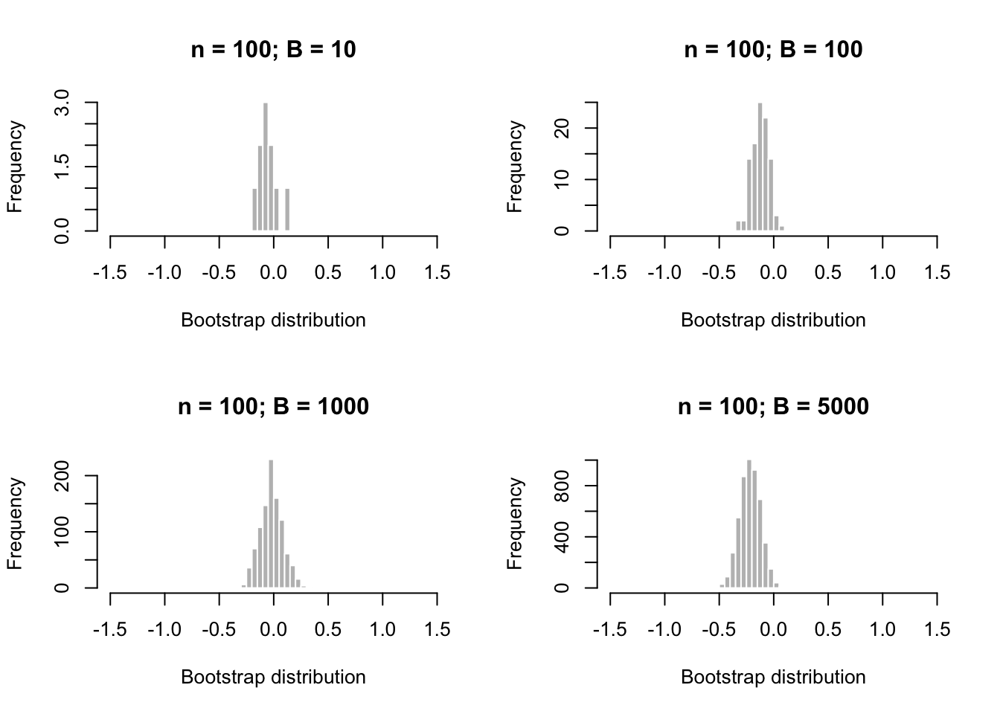
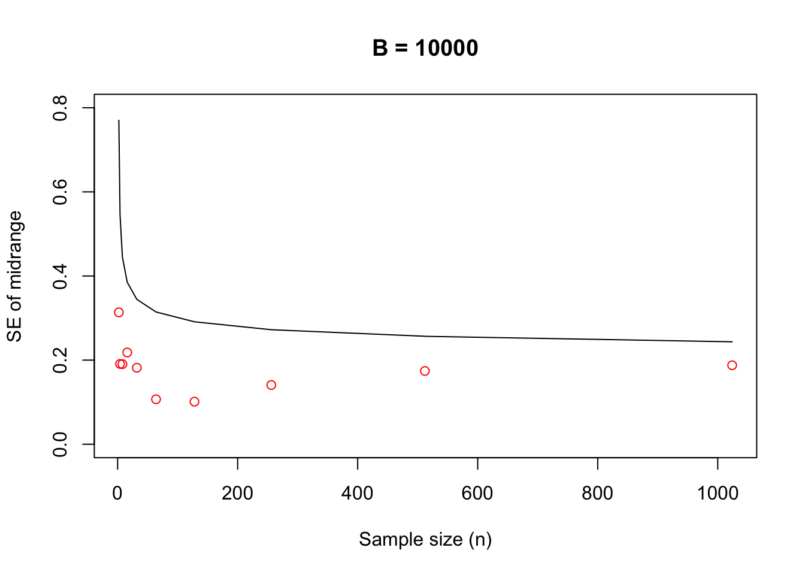
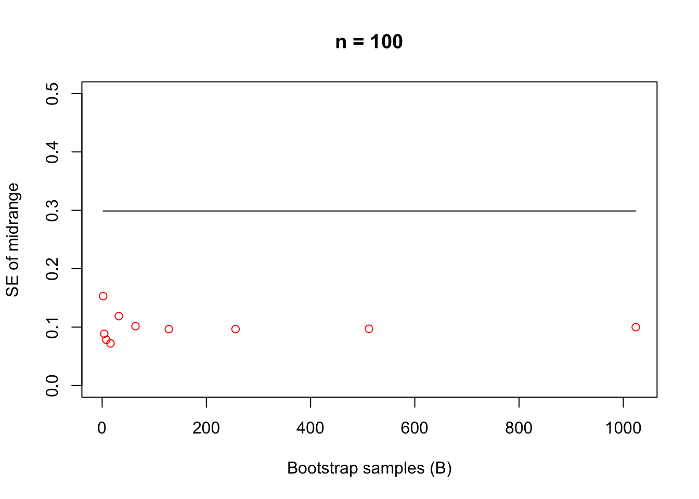
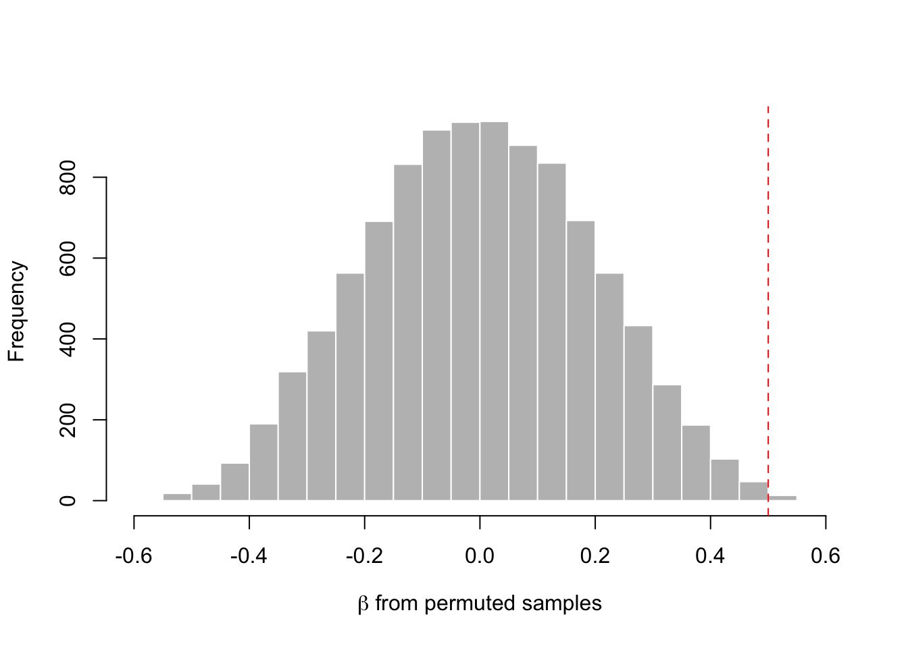
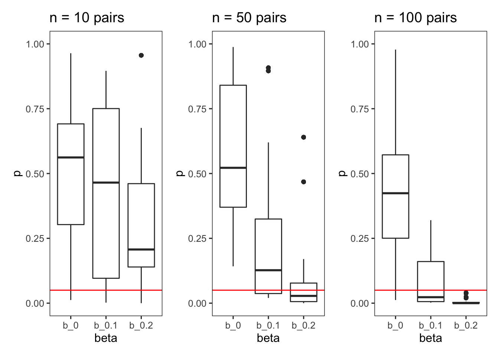

# Semiparametric estimation and inference {#semiparametric}


> Parametric: governed by parameters; e.g., normal distributions

> Nonparametric: not governed by parameters; used when we cannot assume that the distribution of a random variable follows a particular probability distribution

> Semiparametric: a model whose behavior is partially governed by parameters

> Empirical distribution function: summarizes all the information that the data provide about a random variable's distribution

The empirical distribution function $\hat{F}_n(z)$ gives the proportion of *observations in a sample* that are less than or equal to a constant $z$: 

$$
\begin{aligned}
\hat{F}_n(z) =& \frac{1}{n} \sum_{i = 1}^n I_{X_i \leq z}
\end{aligned}
$$

where $I$ is an indicator variable that states whether observation $X_i$ is less than or equal to $z$. 

### Exercise set 8-1

1. Comparing an ECDF with a CDF for the normal distribution

  a. As the sample size increases, the ECDF approximates the CDF of the normal distribution. 


```r
n <- 500
x.vals <- seq(-3, 3, length.out = 10000)
Fx <- pnorm(x.vals, 0, 1)
plot(x.vals, Fx, xlab = "z", ylab = "F(z)", type = "l")
x <- rnorm(n, 0, 1)
lines(ecdf(x), verticals = TRUE, do.points = FALSE, lty = 2)
```



  b. Comparing an ECDF with a CDF for the Poisson distribution


```r
set.seed(22)
n <- 30
lambda <- 10
x.vals <- seq(0, 30, by = 1)
Fx <- ppois(x.vals, lambda = lambda)
plot(x.vals, Fx, xlab = "z", ylab = "F(z)", type = "p")
x <- rpois(n, lambda = lambda)
lines(ecdf(x), verticals = TRUE, do.points = FALSE, lty = 2)
```



2. See handwritten notes. 

## Semiparametric point estimation using the method of moments

### Introduction to moments

> Methods of moments: a semiparametric approach to estimation  
> Method of maximum likelihood: a parametric approach to estimation

Suppose $X$ is a random variable. The $j$th **moment** of the distribution is: 

$$
\begin{aligned}
\mu_j =& E(X^j)
\end{aligned}
$$

where $\mu$ is used as the symbol for a moment. For example $\mu_1 = E(X)$. It is easy to express the first moment of $X$ as an expression using $X$ - but what about $\mu_2$?

$$
\begin{aligned}
\mu_2 =& E(X^2)
\end{aligned}
$$

Now we have expressed the second moment, $\mu_2$, as the expectation of a new random variable, $X^2$. At least this is how I interpret it. From my reading, I gather this is not so satisfying, because the second moment is then usually rearranged in the following way. 

First, we need to recall the definition of Var($X$):

$$ 
\begin{aligned}
\text{Var}(X) = \text{E}(X^2) - [\text{E}(X)]^2 \\
\end{aligned}
$$

So, if we rearrange we get:

$$ 
\begin{aligned}
\text{E}(X^2) = \text{Var}(X) + [\text{E}(X)]^2 \\
\end{aligned}
$$

We can continue on with 3rd, 4th, 5th, etc, moments. But expressing these in terms of $X$ is, I am guessing, a harder challenge. These additional moments describe further the probability distribution, but typically knowing the first and second moments is enough for practical purposes (our purposes). As an aside, the third moment gives us the *skewness*, and the fourth moment gives us the *kurtosis*, of the distribution. Finally, it is worth noting the notation for *a moment* - here I have used $\mu$, becuase it is often used in statistics notes (that I found online). This can be confusing, because we often use $\mu$ for the population mean. But we won't do that here, for clarity. 

So, let us say that $X$ follows a Normal($\theta$, $\sigma^2$) distribution. In this case, we know that E($X$) = $\theta$, and that Var($X$) = $\sigma^2$. So we can express the first and second moments as:

$$ 
\begin{aligned}
\mu_1 =& ~ \text{E}(X) \\
=& ~ \theta \\
\mu_2 =& ~ \text{E}(X^2) \\
=& \text{Var}(X) + [\text{E}(X)]^2 \\
=& ~ \sigma^2 + \theta^2 \\
\end{aligned}
$$

So we have expressed the moments in terms of the parameters of the distribution we are trying estimate. We can rearrange these, to express the *parameters* in terms of $X$ - which is exactly what we want to do, since we are trying to estimate $\theta$ and $\sigma^2$!

$$ 
\begin{aligned}
\theta =& ~ \text{E}(X) \\
\sigma^2 =& ~ \text{E}(X^2) - [\text{E}(X)]^2 \\
\end{aligned}
$$

To paraphrase Edge, we can estimate the moments of arbitrary distributions (i.e., distributions that are not described by parameters) by following these steps:

  1. Write the equations that give the moments of a random variable in terms of the parameters being estimated
  
  2. Solve the equations from (1) for the desired parameters, giving expressions for the parameters in terms of the moments
  
  3. Estimate the moments and plug the estimates into the expressions for the parameters from (2)

### Plug-in estimators

> Plug-in estimation: perhaps I'm oversimplifying here, but this sounds like awesome jargon for 'calculate your estimator from data'. In other words, if you want the population mean -  collect some data and calculate the mean. Then 'plug that in' to your population mean. 

We can express a plug-in estimator of the $k$th moment of $X$, E($X^j$) as the $k$th *sample moment*:

$$ 
\begin{aligned}
\overline{X^k} = \frac{1}{n} \sum_{i = 1}^n X_i^k
\end{aligned}
$$

So to recap: a *moment* describes the random variable $X$. A *sample moment* is an estimate of the moment using independent samples ($X_1, X_2, X_3$) drawn from $X$. 

### Exercise set 8-2

1. Supose $X_1, X_2, ..., X_n$ are I.I.D observations. 
 
  a. What is the plug-in estimator of the variance of $X$?

$$ 
\begin{aligned}
\sigma^2 =& ~ \text{E}(X^2) - [\text{E}(X)]^2 \\
\hat\sigma^2 =& ~ \frac{1}{n} \sum_{i = 1}^n X_i^2 - [\frac{1}{n} \sum_{i = 1}^n X_i]^2 \\
\end{aligned}
$$
  b. What is the plug-in estimator for the standard deviation of $X$?
  
$$ 
\begin{aligned}
\hat\sigma =& ~ \sqrt{\frac{1}{n} \sum_{i = 1}^n X_i^2 - [\frac{1}{n} \sum_{i = 1}^n X_i]^2} \\
\end{aligned}
$$

  c. What is the plug-in estimator of the covariance of $X$ and $Y$?

Here is the formula for the covariance, as a reminder:

$$
\begin{aligned}
\text{Cov}(X,Y) =& ~ \text{E}([X - \text{E}(X)][Y - \text{E}(Y)]) \\
                =& ~ \text{E}(XY) - \text{E}(X)\text{E}(Y)
\end{aligned}
$$
Let's use the 2nd equation: 

$$
\begin{aligned}
\text{Cov}(X,Y) =& ~ \frac{1}{n} \sum_{i = 1}^n X_iY_i - [\frac{1}{n} \sum_{i = 1}^n X_i][\frac{1}{n} \sum_{i = 1}^n Y_i] \\
\end{aligned}
$$

  d. What is the plug-in estimator of the correlation of $X$ and $Y$?

Here is the formula for the correlation, as a reminder:

$$
\begin{aligned}
\text{Cor}(X,Y) =& ~ \rho_{X,Y} \\
                =& ~ \frac{\text{Cov}(X,Y)}{\sqrt{\text{Var}(X)\text{Var}(Y)}} \\
                =& ~ \frac{\text{Cov}(X,Y)}{\sigma_X \sigma_Y}\\
\end{aligned}
$$

Plugging in, we get:

$$
\begin{aligned}
\rho_{X,Y}      =& ~ \frac {\frac{1}{n} \sum_{i = 1}^n X_iY_i - 
                                  [\frac{1}{n} \sum_{i = 1}^n X_i][\frac{1}{n} \sum_{i = 1}^n Y_i]}  
                           {\sqrt{
                                  \frac{1}{n} \sum_{i = 1}^n X_i^2 - 
                                  [\frac{1}{n} \sum_{i = 1}^n X_i]^2}]
                                  [\frac{1}{n} \sum_{i = 1}^n Y_i^2]
                                  } \\
\end{aligned}
$$

2. Though the plug-in estimator of the variance is consistent, it is biased downward. 

  a. Demonstrate the downward bias in R with simulations. 
  
This is what I did first:


```r
n_obs <- 5
n_sims <- 10000
set.seed(1010)
x <- mat.samps(n = n_obs, nsim = n_sims)
x_var <- apply(X = x, MARGIN = 1, FUN = var)
mean(x_var)
```

```
## [1] 1.004699
```

The result is very close to 1. This surprised me, given that I was expecting something below 1. So I ran Edge's code, and in it, he defines a function to calculate the variance himself. 


```r
var.pi <- function(vec){
  return(sum((vec-mean(vec))^2)/length(vec))
}
vars.pi <- apply(x, 1, var.pi)
mean(vars.pi)
```

```
## [1] 0.8037593
```

Why the difference? Turns out this is a great demonstration of something I had read some time ago, and then buried away because it frankly was not super relevant. Let's inspect the help function for `var`:


```r
?var
```

And in the details you'll see this note:

> The denominator n - 1 is used which gives an unbiased estimator of the (co)variance for i.i.d. observations. These functions return NA when there is only one observation (whereas S-PLUS has been returning NaN), and fail if x has length zero.

Thanks to this book, this statement make sense. Let's calculate the variance using *n* and *n-1* as the denominator:


```r
vec <- x[1,]
vec
```

```
## [1]  0.4974519  1.1826813  1.0876947 -1.3540474 -0.9988671
```

```r
# Default function to calculate the variance in R
var(vec)
```

```
## [1] 1.406506
```

```r
# Edge's function, with the denominator of n
var.pi(vec)
```

```
## [1] 1.125205
```

```r
# Beating a dead horse:
sum((vec-mean(vec))^2) / (length(vec)) 
```

```
## [1] 1.125205
```

```r
# But now we change the denominator from n, to n-1
# Unbiased estimator for the variance 
# Gives the same result as `var`
sum((vec-mean(vec))^2) / (length(vec) - 1) 
```

```
## [1] 1.406506
```

I have not read ahead, but I suspect Edge will discuss this discrepancy soon..

  b. Repeating the simulation, but with samples sizes from 2 to 10. 
  

```r
n_sims <- 10000
n_vec <- 2:10
variance_vec <- vector(length = length(n_vec))
for(i in 1:length(n_vec)){
  n_obs <- n_vec[i]
  x <- mat.samps(n = n_obs, nsim = n_sims)
  vars.pi <- apply(x, 1, var.pi)
  variance_vec[i] <- mean(vars.pi)
}
variance_vec 
```

```
## [1] 0.4879436 0.6578587 0.7378372 0.7852684 0.8369602 0.8502939 0.8715858
## [8] 0.8900192 0.9012010
```

```r
plot(n_vec, variance_vec, type = "b", 
     xlab = "Number of samples", 
     ylab = "Mean variance", 
     ylim = c(0, 1))
abline(h = 1, lty = 2 , col = "red")
```


The bias is largest with a sample size of 2, and the plug-in estimator gets closer to the true value with increasing sample size.

I did not think to convert these decimal outputs to fractions as indicated in Edge's solution, even having stumbled upon the unbiased estimator above. So this result is not yet intuitive:

$$ 
\begin{aligned}
\text{E}(\hat\sigma^2_n) =& ~ \frac{n - 1}{n} \sigma^2 \\
\end{aligned}
$$

This equation demonstrates the bias of the plug-in estimator for the variance. If we multiply it by $n/(n-1)$, we get the sample variance ($s^2$), an unbiased estimator:

$$ 
\begin{aligned}
s^2 =& ~ \frac{\sum_{i = 1}^n (X_i - \overline X_i)^2}{n - 1} \\
\end{aligned}
$$

  c. See Edge solution. It explains how we get the expectation of the plug-in estimator. 
  
3. Did not try.

### The method of moments

We apply the method of moments to the model for simple linear regresion: 

$$
\begin{aligned}
Y = \alpha + \beta X + \epsilon \\
\end{aligned}
$$

If we make the assumption that the expectation of the disturbance term is 0 for *all* values of $X$:

$$
\begin{aligned}
\text{E}(\epsilon | X = x) =& ~ 0 \\
\end{aligned}
$$

then the conditional expectation of $Y$, given any $x$, can be predicted using a line with a slope $\beta$ and intercept $\alpha$:

$$
\begin{aligned}
\text{E}(Y) = \alpha + \beta_{\mu_X} \\
\end{aligned}
$$

If this assumption is not true, then the relationship between X and Y is not linear! Now that we have made the linearity assumption (see Edge's Figure 8-4), we can proceed with the MOM estimators for $\alpha$ and $\beta$. 

We know that the covariance of $X$ and $Y$ is:

$$
\begin{aligned}
\text{Cov}(X,Y) = \beta \sigma_X^2 \\
\end{aligned}
$$

and that: 

$$
\begin{aligned}
\mu_X =& ~ \text{E}(X) \\
\sigma_X^2 =& ~ \text{Var}(X) \\
\text{Cov}(X,Y) =& ~ \text{E}(XY) - \text{E}(X)\text{E}(Y) \\
\text{Var}(X) =& ~ \text{E}(X^2) - [\text{E}(X)]^2 \\
\end{aligned}
$$

we can get expressions for the parameters $\alpha$ and $\beta$ in terms of the moments of $X$ and $Y$:

$$
\begin{aligned}
\alpha =& ~ \text{E}(Y) - \beta \text{E}(X) \\
\beta =& ~ \frac{\text{Cov}(X,Y)}{\sigma_X^2} \\
      =& \frac{\text{E}(XY) - \text{E}(X)\text{E}(Y)}{\text{E}(X^2) - [\text{E}(X)]^2} \\
\end{aligned}
$$

The expression for $\beta$ is entirely in terms of moments, as opposed to the expression for $\alpha$. So we'll plug in sample moments for the moments in the expression for $\beta$, multiply the numerator and denominator by $\frac{n}{n}$, and get: 

$$
\begin{aligned}
\tilde{\beta} =& \frac{\sum X_i Y_i - \frac{1}{n} (\sum X_i) (\sum Y_i)}
                      {\sum X_i^2 - \frac{1}{n} (\sum X_i)^2 }\\
\end{aligned}
$$

(try working through the algebra to get this expression yourself). 

Here's the expression for $\alpha$: 

$$
\begin{aligned}
\tilde{\alpha} =& ~ \frac{1}{n} \sum Y_i - \tilde{\beta} \frac{1}{n} \sum X_i \\
               =& ~ \frac{\sum Y_i - \tilde{\beta} \sum X_i} {n}
\end{aligned}
$$

These expressions are essentially identical to the expressions for $\alpha$ and $\beta$ that we derived for the coefficients of the least squares line in chapter 3. 

### Exercise set 8-3

1. See solution on paper. 

2. See solution in Edge. 

## Semiparametric interval estimation using the bootstrap 

With enough high quality data, the empirical distribution function is a reasonable approximation to the true cumulative distribution function. We can leverage this fact to estimate uncertainty intervals to accompany our plug-in estimators. 

> Bootstrap: a procedure that resamples a single dataset to create many simulated samples, which permits the calculation of standard errors and confidence intervals. 

  1. Take *B* 'bootstrap' samples, with each sample being a set of *n* observations drawn **with replacement** from the original observations. Label these samples $D_1^*$, $D_1^*$, ..., $D_B^*$. 
  
  2. For each of the simulated amples, calculate the statistic of interest $\hat \vartheta$ for each simulated dataset. That is, calculate $\hat \vartheta(D_1^*)$, $\hat \vartheta(D_2^*)$, ..., $\hat \vartheta(D_B^*)$. These values form the *bootstrap* distribution of $\hat \vartheta(D)$. 

We will apply this procedure to our dataset of paired *x, y* data to calculate the bootstrap distribution of $\tilde \beta$, the method of moments estimator of $\beta$. We need to assume that the $x, y$ pairs in the sample represent independent draws from a joint distribution. 

#### Assumptions

  - For all *i* and $j \neq i$, $X_i, Y_i$ are independent of $X_j, Y_j$. This is the *independence of units* assumption
  
  - For all *i*, $X_i, Y_i$ are drawn from the same joint distribution $F_{X,Y}(x,y)$. This is the *distribution* assumption. 

#### Bootstrapping the Anscombe dataset


```r
# Original fertilizer use and cereal yield data
d <- cbind(anscombe$x1, anscombe$y1) [order(anscombe$x1), ]
# One bootstrap sample 
set.seed(8675309)
db <- cbind(anscombe$x1, anscombe$y1) [sample(1:11, replace = TRUE), ]
d; db
```

```
##       [,1]  [,2]
##  [1,]    4  4.26
##  [2,]    5  5.68
##  [3,]    6  7.24
##  [4,]    7  4.82
##  [5,]    8  6.95
##  [6,]    9  8.81
##  [7,]   10  8.04
##  [8,]   11  8.33
##  [9,]   12 10.84
## [10,]   13  7.58
## [11,]   14  9.96
```

```
##       [,1]  [,2]
##  [1,]    8  6.95
##  [2,]   14  9.96
##  [3,]   12 10.84
##  [4,]   12 10.84
##  [5,]   13  7.58
##  [6,]    4  4.26
##  [7,]    5  5.68
##  [8,]    7  4.82
##  [9,]    7  4.82
## [10,]   11  8.33
## [11,]    7  4.82
```

The function `boot.samp` returns a bootstrap sample of either a vector or the rows of a matrix. The function `beta.mm` calculates the methods of moments estimate of $\beta$. 


```r
boot.samp
```

```
## function (x) 
## {
##     if (is.null(dim(x))) {
##         x <- matrix(x, ncol = 1)
##     }
##     n <- nrow(x)
##     boot.inds <- sample(1:n, replace = TRUE)
##     x[boot.inds, ]
## }
## <bytecode: 0x7fc7a912bab8>
## <environment: namespace:stfspack>
```

```r
beta.mm
```

```
## function (x, y) 
## {
##     n <- length(x)
##     (sum(x * y) - (1/n) * sum(x) * sum(y))/(sum(x^2) - (1/n) * 
##         sum(x)^2)
## }
## <bytecode: 0x7fc7a918ba10>
## <environment: namespace:stfspack>
```

We use a `for` loop to draw the bootstrap sample:


```r
set.seed(8675309)
B <- 10000
boot.dist <- numeric(B)
dat <- cbind(anscombe$x1, anscombe$y2)
for(i in 1:B){
  samp <- boot.samp(dat)
  boot.dist[i] <- beta.mm(samp[,1], samp[,2])
}
```

We can plot a histogram and calculate the standard error of the estimator, $\tilde \beta$ (recalling that the standard error of an estimate is its standard deviation). 


```r
# Plot histogram
hist(boot.dist, xlim = c(-0.2, 1.2), breaks = 30, 
     xlab = expression(paste("Bootstrapped ", beta)), 
     main = "", col = "gray", border = "white")
```



```r
# Estimate standard error of boostrapped beta
sd(boot.dist)
```

```
## [1] 0.165262
```

#### Approximating confidence intervals for $\tilde \beta$

We consider three options:

  1. If we assume the sampling distribution is normal, then we can use the bootstrap estimate to identify a confidence interval ($1 - \alpha$ interval).


```r
# Normal bootstrap interval
a <- 0.05
b_mm <- beta.mm(dat[,1], dat[,2])
b_sd <- sd(boot.dist)
z <- qnorm(p = 1 - (a / 2), mean = 0, sd = 1)
b_mm - b_sd*z; b_mm + b_sd*z
```

```
## [1] 0.1760924
```

```
## [1] 0.8239076
```

  2. Use the percentiles of the bootstrap distribution to bound a confidence interval ($1 - \alpha ~ percentile$ interval). 
  

```r
# 95% percentile interval
quantile(boot.dist, c(0.025, 0.975))
```

```
##      2.5%     97.5% 
## 0.1630270 0.8459399
```
  
  3. Calculate bootstrap pivotal intervals (see Box 8-1; skipped for now).
  
### Exercise set 8-4

1. Sensitivity of a bootstrapped mean to *n, B*. 

Try the `boot.dist.1d` function:

```r
n <- 5
B <- 10
sim <- rnorm(n = n, mean = 0, sd = 1)
boot.dist.1d(x = sim, B = B, FUN = mean)
```

```
##  [1] -0.22323507 -0.01956961  0.04809411 -0.21668665  0.20288450 -0.01956961
##  [7] -0.13718622 -0.26937485 -0.33757747 -0.10288316
```

Use the wrapper function:

```r
n <- 5
B <- 10
wrap.bm(n = n, B = B)
```



```
## $`boot m`
## [1] -0.7622767
## 
## $`boot se`
## [1] 0.2741837
```

Changing *n*:

```r
# Adjust wrapper function
wrap.bm2 <- function (n, B, mu = 0, sigma = 1, FUN = mean, ...){
    sim <- rnorm(n, mu, sigma)
    boots <- boot.dist.1d(sim, B, FUN = FUN, ...)
    hist(boots, main = paste("n = ", n, "; ", "B = ", B, sep = ""), 
         xlab = "Bootstrap distribution", 
         xlim = c(-1.5, 1.5), col = "gray", border = "white")
}
B <- 10000
n <- 5
par(mfrow = c(2, 2))
set.seed(3)
wrap.bm2(n = n, B = B)
n <- 10
wrap.bm2(n = n, B = B)
n <- 50
wrap.bm2(n = n, B = B)
n <- 100
wrap.bm2(n = n, B = B)
```



Changing *B*:

```r
n <- 100
B <- 10
par(mfrow = c(2, 2))
set.seed(101)
wrap.bm2(n = n, B = B)
B <- 100
wrap.bm2(n = n, B = B)
B <- 1000
wrap.bm2(n = n, B = B)
B <- 5000
wrap.bm2(n = n, B = B)
```



2. Sensitivity of a bootstrapped midrange to *n, B*. 

New functions:


```r
midrange <- function(x){
  (min(x) + max(x)) / 2
}

wrap.bm3 <- function (n, B, mu = 0, sigma = 1, FUN = mean, ...){
    sim <- rnorm(n, mu, sigma)
    boots <- boot.dist.1d(sim, B, FUN = FUN, ...)
    sd(boots)
}
```

Changing *n*:

```r
B <- 10000
my_seq <- seq(1:10)
n_vector <- 2^my_seq
se_vector <- numeric(length = length(my_seq))
se_pred_vector <- pi / (sqrt(24 * log(n_vector)))

for(i in 1:length(my_seq)){ 
  set.seed(101)
  se_vector[i] <- wrap.bm3(n = n_vector[i], B = B, FUN = midrange)
}

par(mfrow = c(1,1))
plot(n_vector, se_pred_vector, type = "l", main = paste("B = ", B, sep = ""), 
     ylim = c(0, 0.8), xlab = "Sample size (n)", ylab = "SE of midrange")
points(n_vector, se_vector, col = "red")
```



Changing *B*:

```r
n <- 100
my_seq <- seq(1:10)
B_vector <- 2^my_seq
se_vector <- numeric(length = length(my_seq))
se_pred_vector <- rep(pi / (sqrt(24 * log(n))), length(my_seq))

for(i in 1:length(my_seq)){ 
  set.seed(101)
  se_vector[i] <- wrap.bm3(n = n, B = B_vector[i], FUN = midrange)
}

par(mfrow = c(1,1))
plot(B_vector, se_pred_vector, type = "l", main = paste("n = ", n, sep = ""), 
     ylim = c(0, 0.5), xlab = "Bootstrap samples (B)", 
     ylab = "SE of midrange")
points(n_vector, se_vector, col = "red")
```



3. Skipped.

## Semiparametric hypothesis testing using permutation tests

Here we will test the hypothesis that the estimated slope from the Anscombe dataset differs from a null hypothesis, where $\beta = 0$. This results in a simplified equation, where there is no assocation between $X$ and $Y$:

$$
\begin{aligned}
Y = \alpha + \epsilon
\end{aligned}
$$

We will use a **permutation test** to test the null hypothesis. Let's go over the assumptions of our test. 

#### Assumptions

  - *Linearity*: $\text{E}(\epsilon | X = x) = ~ 0$

  - *Independence of units*: for all *i* and $j \neq i$, $X_i, Y_i$ are independent of $X_j, Y_j$
  
  - *Distribution*: for all *i*, $X_i, Y_i$ are drawn from the same joint distribution $F_{X,Y}(x,y)$
  
  - *Independence of X and disturbances*: for all $i$, $X_i$ and $\epsilon_i$ are independent

Notice that we made no assumptions aboute the distribution of the disturbance term, $\epsilon$. 

The procedure for a permutation test is:

1. Choose a test statistic and calculate it using the original data ($s_d$). 
2. Permute (i.e., shuffle) the data randomly and in such a way that if the null hypothesis were true, the hypothetical dataset is just as probable as the original data. 
3. Calculate the test statistic using the permuted data and save the value.
4. Repeat steps (2) and (3) many times. The resulting test statistics are called a 'permutation distribution'.
5. Compare the original statistic $s_d$ with the permutation distribution. 

Note that the permuted sample is somewhat like a sample that might be observed if the $X$ and $Y$ values were independent. 

Here's the original dataset, and a permuted one:

```r
# Original fertilizer use and cereal yield data
d <- cbind(anscombe$x1, anscombe$y1) [order(anscombe$x1), ]
# One permuted sample 
set.seed(8675309)
db <- cbind(anscombe$x1, anscombe$y1[sample(1:11, replace = FALSE)])[order(anscombe$x1), ]
d; db
```

```
##       [,1]  [,2]
##  [1,]    4  4.26
##  [2,]    5  5.68
##  [3,]    6  7.24
##  [4,]    7  4.82
##  [5,]    8  6.95
##  [6,]    9  8.81
##  [7,]   10  8.04
##  [8,]   11  8.33
##  [9,]   12 10.84
## [10,]   13  7.58
## [11,]   14  9.96
```

```
##       [,1]  [,2]
##  [1,]    4  8.81
##  [2,]    5  4.26
##  [3,]    6  9.96
##  [4,]    7  8.04
##  [5,]    8  8.33
##  [6,]    9 10.84
##  [7,]   10  6.95
##  [8,]   11  5.68
##  [9,]   12  7.58
## [10,]   13  7.24
## [11,]   14  4.82
```

If we do this a number of times, we can plot the histogram of permuted samples, along with a line to represent the original $\tilde \beta$: 


```r
set.seed(8675309)
nperms <- 10000
perm_dist <- numeric(nperms)
dat <- cbind(anscombe$x1, anscombe$y1) 
for(i in 1:nperms){
  samp <- perm.samp(dat)
  perm_dist[i] <- beta.mm(samp[,1], samp[,2])
}
b_orig <- beta.mm(anscombe$x1, anscombe$y1)
b_orig
```

```
## [1] 0.5000909
```

```r
# Plot histogram
hist(perm_dist, xlim = c(-0.6, 0.6), breaks = 30, 
     xlab = expression(paste(beta, " from permuted samples")), 
     main = "", col = "gray", border = "white")
abline(v = b_orig, col = "red", lty = 2)
```



We can compute a two-sided $p$ value testing the null hypothesis that $\beta = 0$ by calculating the proportion of the permuted samples for which the absolute value of $\tilde \beta_p$ is greater than the absolute value of $\tilde \beta$ from the original data:


```r
mean(abs(perm_dist) >= b_orig)
```

```
## [1] 0.0033
```

In summary we tested the hypothesis that:

  - $\beta = 0$  
  AND  
  - the $X$ and $Y$ data are linear
  - the permuted units are independent
  - all observations are drawn from a common distribution
  - the $X_i$ are independent of the disturbance $\epsilon_i$

Therefore, in principle, the low $p$ value indicates that one of the above are unlikely to be true. Usually, we focus on the null hypothesis, but it is important to remember the assumptions.

### Exercise set 8-5

1. 20 wheat fields, 10 received treatment application (substance Z). Design a permutation procedure to assess the claim that substance Z changes the wheat yield. 

> The null hypothesis is that there is no association between yield and the treatment. Alternatively, the treatment may have altered the yield. To test this, we can randomly permute the control / treatment labels for the 20 fields. Then we can calculate the mean yield for each treatment, and compare the permutation distribution to the mean yield for each treatment for the original dataset. 

> Edge has a thorough explanation, and in it he highlights that a low p-value may also result from a change in the variance due to substance Z. Thus, we are really testing the null hypothesis that substance Z does not affect the distribution of wheat yield. This might be worth simulating. 

2. 


```r
# 10 pairs
beta_vec <- c(0, 0.1, 0.2)
n_pairs <- 10 
n_datasets <- 20
p_mat <- matrix(nrow = 500, ncol = length(beta_vec))
for(i in 1:length(beta_vec)){
  p_mat[,i] <- sim.perm.B(n = n_pairs, nsim = n_datasets, a = 3, b = beta_vec[i])
}
colnames(p_mat) <- c("b_0", "b_0.1", "b_0.2")
df10 <- as_tibble(p_mat)

# 50 pairs
beta_vec <- c(0, 0.1, 0.2)
n_pairs <- 50
n_datasets <- 20
p_mat <- matrix(nrow = 500, ncol = length(beta_vec))
for(i in 1:length(beta_vec)){
  p_mat[,i] <- sim.perm.B(n = n_pairs, nsim = n_datasets, a = 3, b = beta_vec[i])
}
colnames(p_mat) <- c("b_0", "b_0.1", "b_0.2")
df50 <- as_tibble(p_mat)

# 100 pairs
beta_vec <- c(0, 0.1, 0.2)
n_pairs <- 100
n_datasets <- 20
p_mat <- matrix(nrow = 500, ncol = length(beta_vec))
for(i in 1:length(beta_vec)){
  p_mat[,i] <- sim.perm.B(n = n_pairs, nsim = n_datasets, a = 3, b = beta_vec[i])
}
colnames(p_mat) <- c("b_0", "b_0.1", "b_0.2")
df100 <- as_tibble(p_mat)

# Get proportion of significant tests
colMeans(df10 < 0.05)
```

```
##   b_0 b_0.1 b_0.2 
##  0.05  0.10  0.10
```

```r
colMeans(df50 < 0.05)
```

```
##   b_0 b_0.1 b_0.2 
##  0.00  0.30  0.55
```

```r
colMeans(df100 < 0.05)
```

```
##   b_0 b_0.1 b_0.2 
##   0.1   0.6   1.0
```

```r
# Plot
library(patchwork)
p10 <- df10 %>%
  gather(key = beta, value = p) %>%
  ggplot(aes(x = beta, p)) + 
  geom_boxplot() + 
  scale_y_continuous(limits = c(0, 1)) + 
  ggtitle("n = 10 pairs") + 
  geom_hline(yintercept = 0.05, color = "red")

p50 <- df50 %>%
  gather(key = beta, value = p) %>%
  ggplot(aes(x = beta, p)) + 
  geom_boxplot() + 
  scale_y_continuous(limits = c(0, 1)) + 
  ggtitle("n = 50 pairs") + 
  geom_hline(yintercept = 0.05, color = "red")

p100 <- df100 %>%
  gather(key = beta, value = p) %>%
  ggplot(aes(x = beta, p)) + 
  geom_boxplot() + 
  scale_y_continuous(limits = c(0, 1)) + 
  ggtitle("n = 100 pairs") + 
  geom_hline(yintercept = 0.05, color = "red")

p10 + p50 + p100
```




## Chapter summary
