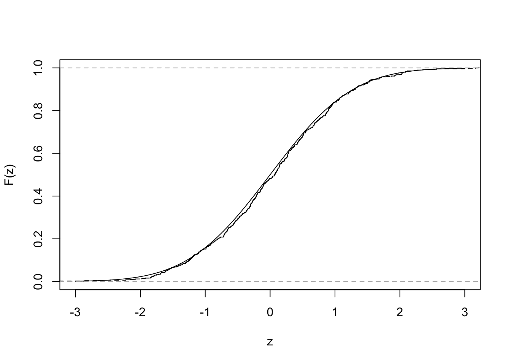

# Semiparametric estimation and inference {#semiparametric}


> Parametric: governed by parameters; e.g., normal distributions

> Nonparametric: not governed by parameters; used when we cannot assume that the distribution of a random variable follows a particular probability distribution

> Semiparametric: a model whose behavior is partially governed by parameters

> Empirical distribution function: summarizes all the information that the data provide about a random variable's distribution

The empirical distribution function $\hat{F}_n(z)$ gives the proportion of *observations in a sample* that are less than or equal to a constant $z$: 

$$
\begin{aligned}
\hat{F}_n(z) =& \frac{1}{n} \sum_{i = 1}^n I_{X_i \leq z}
\end{aligned}
$$

where $I$ is an indicator variable that states whether observation $X_i$ is less than or equal to $z$. 

### Exercise set 8-1

1. Comparing an ECDF with a CDF for the normal distribution

  a. As the sample size increases, the ECDF approximates the CDF of the normal distribution. 


```r
n <- 500
x.vals <- seq(-3, 3, length.out = 10000)
Fx <- pnorm(x.vals, 0, 1)
plot(x.vals, Fx, xlab = "z", ylab = "F(z)", type = "l")
x <- rnorm(n, 0, 1)
lines(ecdf(x), verticals = TRUE, do.points = FALSE, lty = 2)
```



  b. Comparing an ECDF with a CDF for the Poisson distribution


```r
set.seed(22)
n <- 30
lambda <- 10
x.vals <- seq(0, 30, by = 1)
Fx <- ppois(x.vals, lambda = lambda)
plot(x.vals, Fx, xlab = "z", ylab = "F(z)", type = "p")
x <- rpois(n, lambda = lambda)
lines(ecdf(x), verticals = TRUE, do.points = FALSE, lty = 2)
```


2. See handwritten notes. 

## Semiparametric point estimation using the method of moments

### Introduction to moments

> Methods of moments: a semiparametric approach to estimation  
> Method of maximum likelihood: a parametric approach to estimation

Suppose $X$ is a random variable. The $j$th **moment** of the distribution is: 

$$
\begin{aligned}
\mu_j =& E(X^j)
\end{aligned}
$$

where $\mu$ is used as the symbol for a moment. For example $\mu_1 = E(X)$. It is easy to express the first moment of $X$ as an expression using $X$ - but what about $\mu_2$?

$$
\begin{aligned}
\mu_2 =& E(X^2)
\end{aligned}
$$

Now we have expressed the second moment, $\mu_2$, as the expectation of a new random variable, $X^2$. At least this is how I interpret it. From my reading, I gather this is not so satisfying, because the second moment is then usually rearranged in the following way. 

First, we need to recall the definition of Var($X$):

$$ 
\begin{aligned}
\text{Var}(X) = \text{E}(X^2) - [\text{E}(X)]^2 \\
\end{aligned}
$$

So, if we rearrange we get:

$$ 
\begin{aligned}
\text{E}(X^2) = \text{Var}(X) + [\text{E}(X)]^2 \\
\end{aligned}
$$

We can continue on with 3rd, 4th, 5th, etc, moments. But expressing these in terms of $X$ is, I am guessing, a harder challenge. These additional moments describe further the probability distribution, but typically knowing the first and second moments is enough for practical purposes (our purposes). As an aside, the third moment gives us the *skewness*, and the fourth moment gives us the *kurtosis*, of the distribution. Finally, it is worth noting the notation for *a moment* - here I have used $\mu$, becuase it is often used in statistics notes (that I found online). This can be confusing, because we often use $\mu$ for the population mean. But we won't do that here, for clarity. 

So, let us say that $X$ follows a Normal($\theta$, $\sigma^2$) distribution. In this case, we know that E($X$) = $\theta$, and that Var($X$) = $\sigma^2$. So we can express the first and second moments as:

$$ 
\begin{aligned}
\mu_1 =& ~ \text{E}(X) \\
=& ~ \theta \\
\mu_2 =& ~ \text{E}(X^2) \\
=& \text{Var}(X) + [\text{E}(X)]^2 \\
=& ~ \sigma^2 + \theta^2 \\
\end{aligned}
$$

So we have expressed the moments in terms of the parameters of the distribution we are trying estimate. We can rearrange these, to express the *parameters* in terms of $X$ - which is exactly what we want to do, since we are trying to estimate $\theta$ and $\sigma^2$!

$$ 
\begin{aligned}
\theta =& ~ \text{E}(X) \\
\sigma^2 =& ~ \text{E}(X^2) - [\text{E}(X)]^2 \\
\end{aligned}
$$

To paraphrase Edge, we can estimate the moments of arbitrary distributions (i.e., distributions that are not described by parameters) by following these steps:

  1. Write the equations that give the moments of a random variable in terms of the parameters being estimated
  
  2. Solve the equations from (1) for the desired parameters, giving expressions for the parameters in terms of the moments
  
  3. Estimate the moments and plug the estimates into the expressions for the parameters from (2)

### Plug-in estimators

> Plug-in estimation: perhaps I'm oversimplifying here, but this sounds like awesome jargon for 'calculate your estimator from data'. In other words, if you want the population mean -  collect some data and calculate the mean. Then 'plug that in' to your population mean. 

We can express a plug-in estimator of the $k$th moment of $X$, E($X^j$) as the $k$th *sample moment*:

$$ 
\begin{aligned}
\overline{X^k} = \frac{1}{n} \sum_{i = 1}^n X_i^k
\end{aligned}
$$

So to recap: a *moment* describes the random variable $X$. A *sample moment* is an estimate of the moment using independent samples ($X_1, X_2, X_3$) drawn from $X$. 

### Exercise set 8-2

1. Supose $X_1, X_2, ..., X_n$ are I.I.D observations. 
 
  a. What is the plug-in estimator of the variance of $X$?

$$ 
\begin{aligned}
\sigma^2 =& ~ \text{E}(X^2) - [\text{E}(X)]^2 \\
\hat\sigma^2 =& ~ \frac{1}{n} \sum_{i = 1}^n X_i^2 - [\frac{1}{n} \sum_{i = 1}^n X_i]^2 \\
\end{aligned}
$$
  b. What is the plug-in estimator for the standard deviation of $X$?
  
$$ 
\begin{aligned}
\hat\sigma =& ~ \sqrt{\frac{1}{n} \sum_{i = 1}^n X_i^2 - [\frac{1}{n} \sum_{i = 1}^n X_i]^2} \\
\end{aligned}
$$

  c. What is the plug-in estimator of the covariance of $X$ and $Y$?

Here is the formula for the covariance, as a reminder:

$$
\begin{aligned}
\text{Cov}(X,Y) =& ~ \text{E}([X - \text{E}(X)][Y - \text{E}(Y)]) \\
                =& ~ \text{E}(XY) - \text{E}(X)\text{E}(Y)
\end{aligned}
$$
Let's use the 2nd equation: 

$$
\begin{aligned}
\text{Cov}(X,Y) =& ~ \frac{1}{n} \sum_{i = 1}^n X_iY_i - [\frac{1}{n} \sum_{i = 1}^n X_i][\frac{1}{n} \sum_{i = 1}^n Y_i] \\
\end{aligned}
$$

  d. What is the plug-in estimator of the correlation of $X$ and $Y$?

Here is the formula for the correlation, as a reminder:

$$
\begin{aligned}
\text{Cor}(X,Y) =& ~ \rho_{X,Y} \\
                =& ~ \frac{\text{Cov}(X,Y)}{\sqrt{\text{Var}(X)\text{Var}(Y)}} \\
                =& ~ \frac{\text{Cov}(X,Y)}{\sigma_X \sigma_Y}\\
\end{aligned}
$$

Plugging in, we get:

$$
\begin{aligned}
\rho_{X,Y}      =& ~ \frac {\frac{1}{n} \sum_{i = 1}^n X_iY_i - 
                                  [\frac{1}{n} \sum_{i = 1}^n X_i][\frac{1}{n} \sum_{i = 1}^n Y_i]}  
                           {\sqrt{
                                  \frac{1}{n} \sum_{i = 1}^n X_i^2 - 
                                  [\frac{1}{n} \sum_{i = 1}^n X_i]^2}]
                                  [\frac{1}{n} \sum_{i = 1}^n Y_i^2]
                                  } \\
\end{aligned}
$$

2. Though the plug-in estimator of the variance is consistent, it is biased downward. 

  a. Demonstrate the downward bias in R with simulations. 
  
This is what I did first:


```r
n_obs <- 5
n_sims <- 10000
set.seed(1010)
x <- mat.samps(n = n_obs, nsim = n_sims)
x_var <- apply(X = x, MARGIN = 1, FUN = var)
mean(x_var)
```

```
## [1] 1.004699
```

The result is very close to 1. This surprised me, given that I was expecting something below 1. So I ran Edge's code, and in it, he defines a function to calculate the variance himself. 


```r
var.pi <- function(vec){
  return(sum((vec-mean(vec))^2)/length(vec))
}
vars.pi <- apply(x, 1, var.pi)
mean(vars.pi)
```

```
## [1] 0.8037593
```

Why the difference? Turns out this is a great demonstration of something I had read some time ago, and then buried away because it frankly was not super relevant. Let's inspect the help function for `var`:


```r
?var
```

And in the details you'll see this note:

> The denominator n - 1 is used which gives an unbiased estimator of the (co)variance for i.i.d. observations. These functions return NA when there is only one observation (whereas S-PLUS has been returning NaN), and fail if x has length zero.

Thanks to this book, this statement make sense. Let's calculate the variance using *n* and *n-1* as the denominator:


```r
vec <- x[1,]
vec
```

```
## [1]  0.4974519  1.1826813  1.0876947 -1.3540474 -0.9988671
```

```r
# Default function to calculate the variance in R
var(vec)
```

```
## [1] 1.406506
```

```r
# Edge's function, with the denominator of n
var.pi(vec)
```

```
## [1] 1.125205
```

```r
# Beating a dead horse:
sum((vec-mean(vec))^2) / (length(vec)) 
```

```
## [1] 1.125205
```

```r
# But now we change the denominator from n, to n-1
# Unbiased estimator for the variance 
# Gives the same result as `var`
sum((vec-mean(vec))^2) / (length(vec) - 1) 
```

```
## [1] 1.406506
```

I have not read ahead, but I suspect Edge will discuss this discrepancy soon..

  b. Repeating the simulation, but with samples sizes from 2 to 10. 
  

```r
n_sims <- 10000
n_vec <- 2:10
variance_vec <- vector(length = length(n_vec))
for(i in 1:length(n_vec)){
  n_obs <- n_vec[i]
  x <- mat.samps(n = n_obs, nsim = n_sims)
  vars.pi <- apply(x, 1, var.pi)
  variance_vec[i] <- mean(vars.pi)
}
variance_vec 
```

```
## [1] 0.4879436 0.6578587 0.7378372 0.7852684 0.8369602 0.8502939 0.8715858
## [8] 0.8900192 0.9012010
```

```r
plot(n_vec, variance_vec, type = "b", 
     xlab = "Number of samples", 
     ylab = "Mean variance", 
     ylim = c(0, 1))
abline(h = 1, lty = 2 , col = "red")
```


The bias is largest with a sample size of 2, and the plug-in estimator gets closer to the true value with increasing sample size.

I did not think to convert these decimal outputs to fractions as indicated in Edge's solution, even having stumbled upon the unbiased estimator above. So this result is not yet intuitive:

$$ 
\begin{aligned}
\text{E}(\hat\sigma^2_n) =& ~ \frac{n - 1}{n} \sigma^2 \\
\end{aligned}
$$

This equation demonstrates the bias of the plug-in estimator for the variance. If we multiply it by $n/(n-1)$, we get the sample variance ($s^2$), an unbiased estimator:

$$ 
\begin{aligned}
s^2 =& ~ \frac{\sum_{i = 1}^n (X_i - \overline X_i)^2}{n - 1} \\
\end{aligned}
$$

  c. See Edge solution. It explains how we get the expectation of the plug-in estimator. 
  
3. Did not try.

### The method of moments


### Exercise set 8-3

## Semiparametric interval estimation using the bootstrap 

### Exercise set 8-4

## Semiparametric hypothesis testing using permutation tests

### Exercise set 8-5

## Chapter summary
