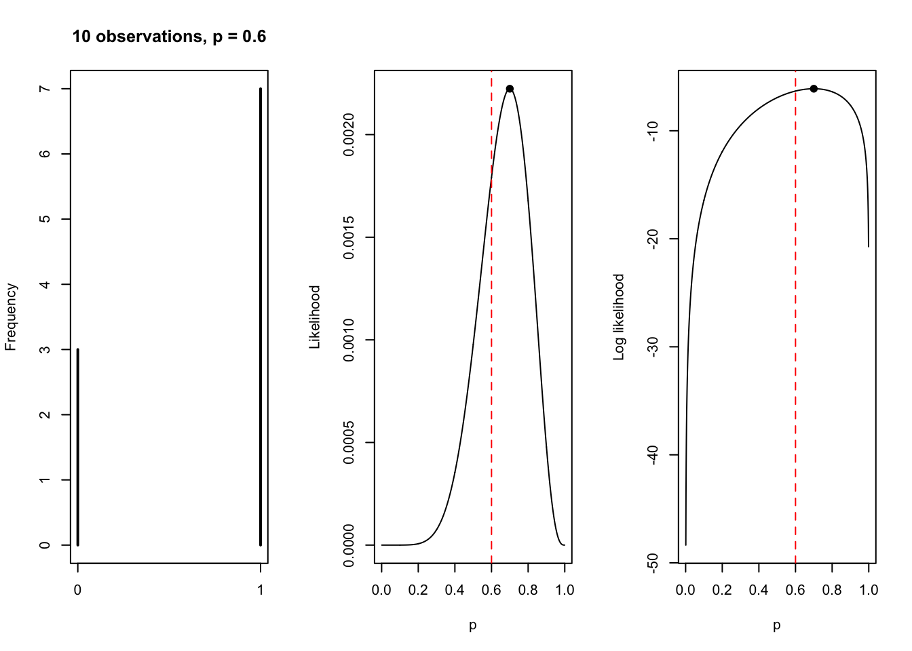

# Parametric estimation and inference {#parametric}


If all of the random variables in our model can be described by a finite set of parameters, we are using *parametric* estimation and inference. In paremetric estimation, the most important mathematical concept is the likelihood function, or **likelihood**. 

> The likelihood allows us to compare values of a parameter in terms of their (the values') ability to explain the observed data. In other words, if the true value of the parameter is y, how likely is the observed dataset?

Suppose the observations, which we call $d$, are instances drawn from a random variable $D$, which is governed by a probability distribution function. *We do not know what this probability distribution is!* We have to think about the data - are they continuous or discrete; are they bounded at 0 or elsewhere; is the variance uniform or not? Based on the answers to these questions, we then assume a probability distribution function, $f_D$. 

We can use $f_D$ to evaluate the probability of the data, $d$, at every potential value of the parameter $\theta$ we are trying to estimate, and we call this the likelihood $L(\theta)$:

$$
\begin{aligned}
L(\theta) = f_D(d | \theta)
\end{aligned}
$$

It is tempting to think of the likelihood as a probability distribution. But it is not, because the function does not sum or integrate to 1 with respect to $\theta$ (which is a requirement for a probability distribution function). This is partly why we are defining it (the likelihood) as separate idea: the likelihood is a function of the parameters, and we use it to ask questions about the plausibility of the data (which are fixed), assuming different values of the parameters. If $L(\theta_1|d) > L(\theta_2|d)$, then the data we have observed are more likely to have occurred if $\theta = \theta_1$ than $\theta = \theta_2$. We interpret this result as: $\theta_1$ is a more plausible value for $\theta$ than $\theta_2$. 

Ok, so how do we actually calculate the likelihood? Suppose the data are $n$ independent observations, $x_1, x_2, ..., x_n$ each with the density function $f_X(x)$, which depends on parameter $\theta$. This means that these observations are independent and identically distributed, and the joint density function (of the *data* and the *likelihood*) is given by:

$$
\begin{aligned}
f_{X_1, X_2, ..., X_n}(x_1, x_2, ..., x_n) =& ~ f_X(x_1) * f_X(x_2) * ... * f_X(x_n) \\
=& ~ \prod_{i = 1}^n f_X(x_i)
\end{aligned}
$$

where the symbol $\prod$ denotes multiplication in the same way that the symbol $\sum$ denotes addition. Instead of multiplying, we'd prefer to work with sums for numerical reasons. Because the log of a product is the sum of the logarithms of the terms being multiplied, 

$$
\begin{aligned}
\text{ln}(yz) = \text{ln}(y) + \text{ln}(z)
\end{aligned}
$$

we can express the joint density function as a sum instead:

$$
\begin{aligned}
\text{ln}[f_X(x_1) * f_X(x_2) * ... * f_X(x_n)] =& ~ \sum_{i = 1}^n \text{ln}[f_X(x_i)]
\end{aligned}
$$

and define it as follows:

$$
\begin{aligned}
l(\theta) = \text{ln}[L(\theta)]
\end{aligned}
$$

The likelihood provides a framework for estimation and inference. 

### Exercise set 9-1 

1. Is this statement true / false? 

*The value of $\theta$ that maximizes $L(\theta)$ is the most probable value of $\theta$ given the observed data.*

False - frequentists consider $\theta$ to be fixed, and thus has no probability distribution. See Edge explanation. Change to:

*The value of $\theta$ that maximizes $L(\theta)$ is the one that maximizes the probability of obtaining the observed data.*

2. Write all of the following in the simplest form:

  a. The pdf of $X$, a Normal($\mu, \sigma^2$) random variable:
  
$$
\begin{aligned}
f_X(x) = \frac{1}{\sigma \sqrt{2 \pi}}e^{-\frac{(x - \mu)^2}{2 \sigma^2}}
\end{aligned}
$$

  b. The log-likelihood of $\mu$ given an observation of $x$, which is assumed to be an instance of $X$:
  
$$
\begin{aligned}
l(\mu) =& ~ \text{ln}(\frac{1}{\sigma \sqrt{2 \pi}}e^{-\frac{(x - \mu)^2}{2 \sigma^2}}) \\
       =& ~ \text{ln}(\frac{1}{\sigma \sqrt{2 \pi}}) + \text{ln}(e^{-\frac{(x - \mu)^2}{2 \sigma^2}}) \\
       =& ~ \text{ln}(\frac{1}{\sigma \sqrt{2 \pi}}) - \frac{(x - \mu)^2}{2 \sigma^2} \\
\end{aligned}
$$

  c. The joint density of $X_1$ and $X_2$, two independent Normal($\mu, \sigma^2$) random variables. 
  
$$
\begin{aligned}
f_{X_1, X_2}(x_1, x_2) =& ~ \frac{1}{\sigma \sqrt{2 \pi}}e^{-\frac{(x_1 - \mu)^2}{2 \sigma^2}} *
                         \frac{1}{\sigma \sqrt{2 \pi}}e^{-\frac{(x_2 - \mu)^2}{2 \sigma^2}} \\
                        & \text{consider each of these terms as a, b, and c:} \\
                       =& ~ (ab)*(ac) \\
                       =& ~ a^2(bc) \\
                        & \text{therefore we can write} \\
                       =& ~ \frac{1}{\sigma^2 2 \pi} e^{-\frac{(x_1 - \mu)^2}{2 \sigma^2}} * 
                            e^{-\frac{(x_2 - \mu)^2}{2 \sigma^2}} \\
                        & \text{we know that } a^m * a^n = a^{m + n} \text{, so} \\
                       =& ~ \frac{1}{\sigma^2 2 \pi} e^{-\frac{(x_1 - \mu)^2 - (x_2 - \mu)^2}{2 \sigma^2}} \\
                        & \text{however, this differs from Edge's answer:} \\
                       =& ~ \frac{1}{\sigma^2 2 \pi} e^{-\frac{(x_1 - \mu)^2 + (x_2 - \mu)^2}{2 \sigma^2}} \\                      
\end{aligned}
$$  

TBD why my answer is different, but I'll roll with Edge's solution for now.

  d. The log-likelihood of $\mu$ given an observation of $x_1$ and $x_2$, which are assumed to be instances of $X_1$ and $X_2$:
  
$$
\begin{aligned}
l(\mu) =& ~ \text{ln}(\frac{1}{\sigma^2 2 \pi} e^{-\frac{(x_1 - \mu)^2 + (x_2 - \mu)^2}{2 \sigma^2}}) \\
       =& ~ \text{ln}(\frac{1}{\sigma^2 2 \pi}) + \text{ln}( e^{-\frac{(x_1 - \mu)^2 + (x_2 - \mu)^2}{2 \sigma^2}}) \\
       =& ~ \text{ln}(\frac{1}{\sigma^2 2 \pi}) -\frac{(x_1 - \mu)^2}{2 \sigma^2} -\frac{(x_2 - \mu)^2}{2 \sigma^2}\\
       & \text{though I don't know how to get to Edge's answer, apart from starting with our answer in 1b:} \\
       =& ~ 2~\text{ln}(\frac{1}{\sigma \sqrt {2 \pi}}) -\frac{(x_1 - \mu)^2}{2 \sigma^2} -\frac{(x_2 - \mu)^2}{2 \sigma^2}\\
\end{aligned}
$$  

  d. The log-likelihood of $\mu$ given observations of $x_1, x_2, ..., x_n$, which are assumed to be instances of $n$ independent random variables with a Normal($\mu, \sigma^2$) distribution:
  
$$
\begin{aligned}
l(\mu) =& ~ n~\text{ln}(\frac{1}{\sigma \sqrt {2 \pi}}) - \sum_{i = 1}^n \frac{(x_i - \mu)^2}{2 \sigma^2} \\
\end{aligned}
$$  
  
## Parametric estimation using maximum likelihood

> The **maximum-likelihood estimate** of a parameter is the value of the parameter that maximizes the probability of observing the data

The maximum-likelihood estimate of the parameter $\theta$ is $\hat \theta$:

$$
\begin{aligned}
\hat \theta =& ~ \text{argmax} ~ L(\theta) \\
             & \text{or} \\
\hat \theta =& ~ \text{argmax} ~ l(\theta)
\end{aligned}
$$  

  - 'argmax' means 'argument of the maximum'
  - in this case, it is the value that maximizes the likelihood $L(\theta)$ or log-likelihood $l(\theta)$ 
  - usually, we use the log-likelihood to find $\hat \theta$
  
To identify $\hat \theta$:

  1. Write down the likelihood function $L(\theta)$
  2. Take the log of likelihood function to get $l(\theta)$, and simplify
  3. Maximize $l(\theta)$ in terms of $\theta$. The value of $\theta$ that maximizes $l(\theta)$ is the maximum-likelihood estimator $\hat \theta$
  
Edge goes through each of these steps to find the MLE of the parameter $\lambda$ of the exponential distribution, but I won't repeat it here - mostly because I will probably never complete these steps in practice (if I tried to do this at all, I'd probably try to solve for the MLE numerically). 

The single most important assumption is that the data are actually being generated by the likelihood function we specified. If we are right, then the MLE has some desirable properties:

  - consistency: $\hat \theta$ converges to the true value of $\theta$ as the sample size increases
  - asymptotically normally distributed: as the $n$ approaches infinity, the distribution of the MLE approaches a normal distribution
  - asymptotic efficiency: in the large samples, there are no consistent estimators with lower mean squared error than MLE
  - functional invariance: this means you can estimate a value (using a defined function) based on $\hat \theta$, and it too will be a maximum-likelihood estimator for that derived value
  
Three (repeated) caveats, for emphasis: 

  1. The MLE is *NOT* the value of the parameter that is most probable given the data. It is the parameter value that makes *the data* most probable
  2. The appeal of the MLE is efficiency, but this efficiency is defined with respect to the mean squared error, which may not be the appropriate loss function to the problem at hand
  3. The MLE is only meaningful if the model plausibly generated the data

### Exercise set 9-2

1.

  a. The likelihood function for a Bernoulli distributed dataset is:

$$
\begin{aligned}
L(p) =& ~ \prod_{i = 1}^n p^{x_i} (1-p)^{1 - x_i}
\end{aligned}
$$  

  b. The log-likelihood is:

$$
\begin{aligned}
l(p) =& ~ \text{ln}[L(p)] \\
     =& ~ \text{ln}[\prod_{i = 1}^n p^{x_i} (1-p)^{1 - x_i}] \\
     =& ~ \sum_{i = 1}^n \text{ln}[p^{x_i} (1-p)^{1 - x_i}] \\
     =& ~ \sum_{i = 1}^n \text{ln}[p^{x_i}] + \text{ln}[(1-p)^{1 - x_i}] \\
     =& ~ \sum_{i = 1}^n x_i \text{ln}(p) + (1 - x_i)\text{ln}(1-p) \\
\end{aligned}
$$  
  c. 


```r
n <- 10
trials <- 1
p <- 0.6
set.seed(121)
x <- rbinom(n = n, size = trials, prob = p)

# Function to calculate likelihood for a vector of observations
Ln_bern <- function(p, x){
  k <- sum(x)
  n <- length(x)
  Ln <- numeric(length(p))
  for(i in 1:length(p)){
    Ln[i] <- prod(p[i]^k * (1 - p[i])^(n -k))
  }
  return(Ln)
}

# Sequence of p
p_vec <- seq(0.001, 0.999, by = 0.001)
# Likelihood of the data
Ln <- Ln_bern(p = p_vec, x = x)
max_p <- p_vec[which.max(Ln)]
max_Ln <- Ln[which.max(Ln)]
# Log-likelihood of the data
ln <- log(Ln)
max_ln <- ln[which.max(ln)]

# Plot
par(mfrow = c(1,3))
plot(table(x), xlab = "", ylab = "Frequency", main = "10 observations, p = 0.6")
plot(p_vec, Ln, type = "l", xlab = "p", ylab = "Likelihood")
abline(v = 0.6, col = "red", lty = "dashed")
points(x = max_p, y = max_Ln, pch = 19)
plot(p_vec, ln, type = "l", xlab = "p", ylab = "Log likelihood")
abline(v = 0.6, col = "red", lty = "dashed")
points(x = max_p, y = max_ln, pch = 19)
```



```r
max_p
```

```
## [1] 0.7
```

```r
summary(x)
```

```
##    Min. 1st Qu.  Median    Mean 3rd Qu.    Max. 
##    0.00    0.25    1.00    0.70    1.00    1.00
```

  d. The MLE is 0.7, which is the same as the proportion of observations equal to 1. 

2. Suppose that $X_1, X_2, ..., X_n$ are distributed as Normal($\theta, \sigma^2$). 
  a. What is the MLE of $\theta$?

First, we get the expression for the log-likelihood of $\theta$: 

$$
\begin{aligned}
l(\theta) =& ~ n~\text{ln}(\frac{1}{\sigma \sqrt {2 \pi}}) - \sum_{i = 1}^n \frac{(x_i - \theta)^2}{2 \sigma^2} \\
          =& ~ n~\text{ln}(\frac{1}{\sigma \sqrt {2 \pi}}) - 
          \frac{1}{2 \sigma^2} 
          \sum_{i = 1}^n (x_i - \theta)^2 \\
          =& ~ n~\text{ln}(\frac{1}{\sigma \sqrt {2 \pi}}) - 
          \frac{1}{2 \sigma^2} 
          \sum_{i = 1}^n (x_i^2 - 2x_i \theta + \theta^2) \\
\end{aligned}
$$  

Then we take the derivative and show that the MLE is the sample mean, $\bar x$; see Edge solution for the remaining details.

  b. See Edge solution.
  
  
### Exercise set 9-3

1. Solution on paper. 

2. 

## Parametric interval estimation: the direct approach and Fisher information

### Exercise set 9-4

## Parametric hypothesis testing using the Wald test

### Exercise set 9-5

## Parametric hypothesis testing using the likelihood-ratio test

### Exercise set 9-6
