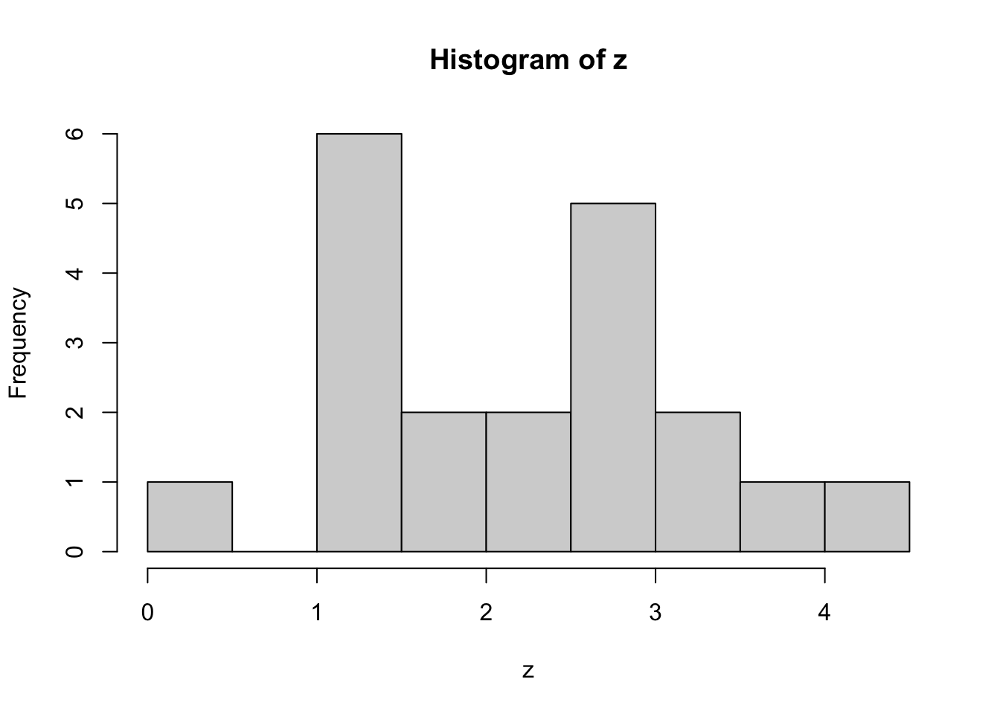

# Bayesian estimation and inference {#bayesian}

Parameters

  - Frequentist view: parameters are fixed
  - Bayesian view: parameter are random

> Posterior distribution: the probability distribution of the parameter(s) being estimated, given the data observed

> Prior distribution: the probability distribution function used to 'describe' the parameter(s) before any data are observed

If we have a prior, we can calculate the posterior $f(\theta | D = d)$ as follows:

$$
\begin{aligned}
f(\theta | D = d) =& ~ \frac{f_D(d|\theta) ~ f_{\theta}(\theta)} {f_D(d)} \\
\end{aligned}
$$
where the likelihood $f_D(d|\theta)$ is multiplied by the prior $f_{\theta}(\theta)$ in the numerator, which is divided by the probability of the data $f_D(d)$. The probability of the data is the probability of observing the data given the parameter, averaged across all parameter values weighted by the probability (or density) of each parameter value:

$$
\begin{aligned}
f_D(d) =& ~ \int_{-\infty}^{\infty} f_D(d|\theta) f_{\theta}(\theta) d\theta\\
\end{aligned}
$$


## How to choose a prior distribution?

## The unscaled posterior, conjugacy, and sampling from the posterior

### Exercise set 10-1

1. 


```r
n <- 20
true.mean <- 2
known.sd <- 1
prior.mean <- 0
prior.sd <- 1
set.seed(8675309)
z <- rnorm(n,true.mean,known.sd)
mean(z)
```

```
## [1] 2.149314
```

```r
hist(z)
```



a. 


```r
post.conj.norm.norm <- function(z, known.sd, prior.mean,
prior.sd){
  xbar <- mean(z)
  post.expec <- (prior.mean / prior.sd^2 + xbar*length(z) /
        known.sd^2)/(1 /   prior.sd^2 + length(z) / known.sd^2)
  post.var <- 1 / (1 /   prior.sd^2 + length(z) / known.sd^2)
  list("posterior.expectation" = post.expec,
"posterior.variance" = post.var)
}

post.conj.norm.norm(z, known.sd, prior.mean, prior.sd)
```

```
## $posterior.expectation
## [1] 2.046966
## 
## $posterior.variance
## [1] 0.04761905
```

c. 


```r
library(MCMCpack)
mn.mod <- MCnormalnormal(z, sigma2 = 1, mu0 = prior.mean, tau20 = prior.sd^2, mc = 10000)
summary(mn.mod)
```

```
## 
## Iterations = 1:10000
## Thinning interval = 1 
## Number of chains = 1 
## Sample size per chain = 10000 
## 
## 1. Empirical mean and standard deviation for each variable,
##    plus standard error of the mean:
## 
##           Mean             SD       Naive SE Time-series SE 
##       2.046645       0.219418       0.002194       0.002308 
## 
## 2. Quantiles for each variable:
## 
##  2.5%   25%   50%   75% 97.5% 
## 1.614 1.897 2.045 2.194 2.476
```

## Bayesian point estimation using Bayes estimators

### Exercise set 10-2

## Bayesian interval estimation using credible intervals

### Exercise set 10-3

## Bayesian 'hypothesis testing' using Bayes factors

### Exercise set 10-4

## Conclusion: Bayesian vs. frequentist methods

## Chapter summary
