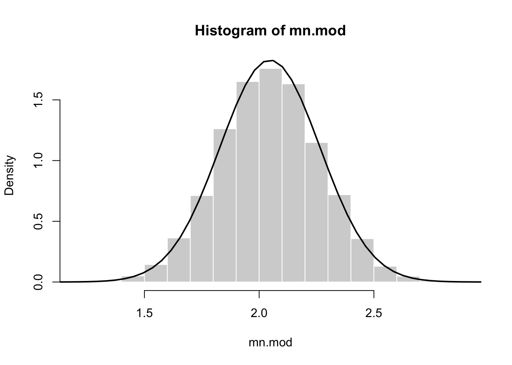
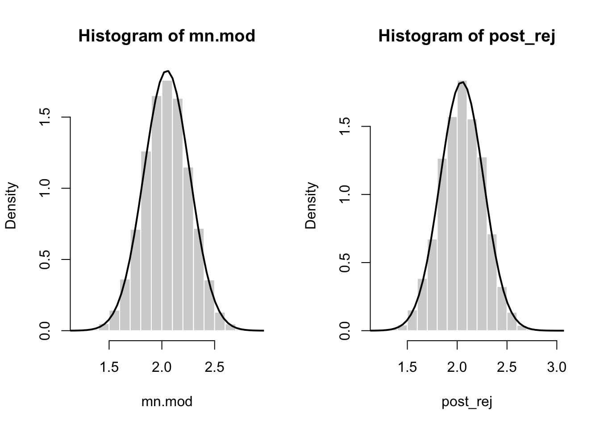

# Bayesian estimation and inference {#bayesian}

Parameters

  - Frequentist view: parameters are fixed
  - Bayesian view: parameter are random

> Posterior distribution: the probability distribution of the parameter(s) being estimated, given the data observed

> Prior distribution: the probability distribution function used to 'describe' the parameter(s) before any data are observed

If we have a prior, we can calculate the posterior $f(\theta | D = d)$ as follows:

$$
\begin{aligned}
f(\theta | D = d) =& ~ \frac{f_D(d|\theta) ~ f_{\theta}(\theta)} {f_D(d)} \\
\end{aligned}
$$
where the likelihood $f_D(d|\theta)$ is multiplied by the prior $f_{\theta}(\theta)$ in the numerator, which is divided by the probability of the data $f_D(d)$. The probability of the data is the probability of observing the data given the parameter, averaged across all parameter values weighted by the probability (or density) of each parameter value:

$$
\begin{aligned}
f_D(d) =& ~ \int_{-\infty}^{\infty} f_D(d|\theta) f_{\theta}(\theta) d\theta\\
\end{aligned}
$$

## How to choose a prior distribution?

## The unscaled posterior, conjugacy, and sampling from the posterior

### Rejection sampling algorithm

(1) Sample an observation $\theta^*$ from the prior distribution. 

(2) Compute $m$, the quotient of the unscaled posterior divided by the prior at $\theta^*$:

$$
\begin{aligned}
m =& ~ \frac{f_D(d|\theta^*) ~ f_{\theta}(\theta^*)} {f_{\theta}(\theta^*)} \\
  =& ~ f_D(d|\theta^*) \\ 
  =& ~ L(\theta^* | d)
\end{aligned}
$$

(3) Independently, sample a random variable X from a continuous distribution.

(4) If X m, then “accept” $\theta^*$ as an observation from the posterior distribution and save its value. Otherwise “reject” $\theta^*$ and discard it.

(5) Repeat steps 1–4 until the desired number of simulated observations from the posterior distribution are gathered.

### Exercise set 10-1

1. 


```r
n <- 20
true.mean <- 2
known.sd <- 1
prior.mean <- 0
prior.sd <- 1
set.seed(8675309)
z <- rnorm(n,true.mean,known.sd)
mean(z)
```

```
## [1] 2.149314
```

```r
hist(z)
```


a. Edge's function uses equations 10.4 and 10.5 to calculate the mean and variance of the posterior distribution, which we know is normal due to conjugacy (Normal prior $\times$ Normal likelihood = Normal posterior):


```r
post.conj.norm.norm <- function(z, known.sd, prior.mean, prior.sd){
  xbar <- mean(z)
  post.expec <- (prior.mean / prior.sd^2 + xbar*length(z) /
        known.sd^2)/(1 /   prior.sd^2 + length(z) / known.sd^2)
  post.var <- 1 / (1 /   prior.sd^2 + length(z) / known.sd^2)
  list("posterior.expectation" = post.expec,
"posterior.variance" = post.var)
}

post_conjugate <- post.conj.norm.norm(z, known.sd, prior.mean, prior.sd)
```

b. Using MCMC


```r
library(MCMCpack)
mn.mod <- MCnormalnormal(z, sigma2 = 1, mu0 = prior.mean, tau20 = prior.sd^2, mc = 10000)
summary(mn.mod) 
```

```
## 
## Iterations = 1:10000
## Thinning interval = 1 
## Number of chains = 1 
## Sample size per chain = 10000 
## 
## 1. Empirical mean and standard deviation for each variable,
##    plus standard error of the mean:
## 
##           Mean             SD       Naive SE Time-series SE 
##       2.046645       0.219418       0.002194       0.002308 
## 
## 2. Quantiles for each variable:
## 
##  2.5%   25%   50%   75% 97.5% 
## 1.614 1.897 2.045 2.194 2.476
```

Let's plot the MCMC results in a histogram, and overlaid with a normal distribution from the conjugate expression. 


```r
hist(mn.mod, freq = FALSE, border = "white")
x <- seq(0, 4, length=100)
hx <- dnorm(x, mean = post_conjugate$posterior.expectation, sd = sqrt(post_conjugate$posterior.variance))
lines(x, hx, lwd = 2)
```



2. 

a. The ratio of the unscaled posterior to the prior is the likelihood.

b. See Edge. 

c. We can adjust step 2 in the above algorithm by dividing the likelihood of $\theta^*$ by the maximum likelihood:

(2) Compute $m$, the quotient of the unscaled posterior divided by the prior at $\theta^*$:

$$
\begin{aligned}
m =& ~ \frac{L(\theta^* | d)} {\text{argmax} ~ L(\theta | d)} \\
\end{aligned}
$$
d. Edge's R function for rejection sampling


```r
#Get 1 sample under rejection sampling from normal with known sd.
#z is a vector of data.
get.1.samp.norm <- function(z, known.sd = 1, prior.mean = 0, prior.sd = 1){
  accepted <- FALSE
  max.like <- exp(sum(log(dnorm(z, mean = mean(z), sd = known.sd)))) 
  while(accepted == FALSE){
    cand <- rnorm(1, prior.mean, prior.sd)
    like <- exp(sum(log(dnorm(z, mean = cand, sd = known.sd)))) 
    crit <- like / max.like
    xunif <- runif(1,0,1)
    if(xunif <= crit){accepted <- TRUE}
  }
  cand
}

# Wrapper for get.1.samp.norm() that gets rejection sample from posterior of desired size.
reject.samp.norm <- function(z, known.sd = 1, prior.mean = 0, prior.sd = 1, nsamps = 10000){
  samps <- numeric(nsamps)
  for(i in seq_along(samps)){
    samps[i] <- get.1.samp.norm(z, known.sd, prior.mean, prior.sd) }
  samps }
```


```r
#Get 1 sample under rejection sampling from normal with known sd, using unscaled likelihood
#z is a vector of data.
get.1.samp.norm.unscaled <- function(z, known.sd = 1, prior.mean = 0, prior.sd = 1){
  accepted <- FALSE
  max.like <- exp(sum(log(dnorm(z, mean = mean(z), sd = known.sd)))) 
  while(accepted == FALSE){
    cand <- rnorm(1, prior.mean, prior.sd)
    like <- exp(sum(log(dnorm(z, mean = cand, sd = known.sd)))) 
    crit <- like #/ max.like
    xunif <- runif(1,0,1)
    if(xunif <= crit){accepted <- TRUE}
  }
  cand
}

# Wrapper for get.1.samp.norm() that gets rejection sample from posterior of desired size.
reject.samp.norm.unscaled <- function(z, known.sd = 1, prior.mean = 0, prior.sd = 1, nsamps = 10000){
  samps <- numeric(nsamps)
  for(i in seq_along(samps)){
    samps[i] <- get.1.samp.norm.unscaled(z, known.sd, prior.mean, prior.sd) }
  samps }
```


```r
post_rej <- reject.samp.norm(z = z, known.sd = known.sd, 
                             prior.mean = prior.mean, prior.sd = prior.sd, nsamps = 10000)
# post_rej_unscaled <- reject.samp.norm.unscaled(z = z, known.sd = known.sd, 
#                              prior.mean = prior.mean, prior.sd = prior.sd, nsamps = 10000) # takes much longer
```


```r
par(mfrow = c(1,2))
hist(mn.mod, freq = FALSE, border = "white")
x <- seq(0, 4, length=100)
pd_conjugate <- dnorm(x, mean = post_conjugate$posterior.expectation, sd = sqrt(post_conjugate$posterior.variance))
lines(x, pd_conjugate, lwd = 2)

hist(post_rej, freq = FALSE, border = "white")
lines(x, pd_conjugate, lwd = 2)
```



## Bayesian point estimation using Bayes estimators

### Exercise set 10-2

## Bayesian interval estimation using credible intervals

### Exercise set 10-3

## Bayesian 'hypothesis testing' using Bayes factors

### Exercise set 10-4

## Conclusion: Bayesian vs. frequentist methods

## Chapter summary
