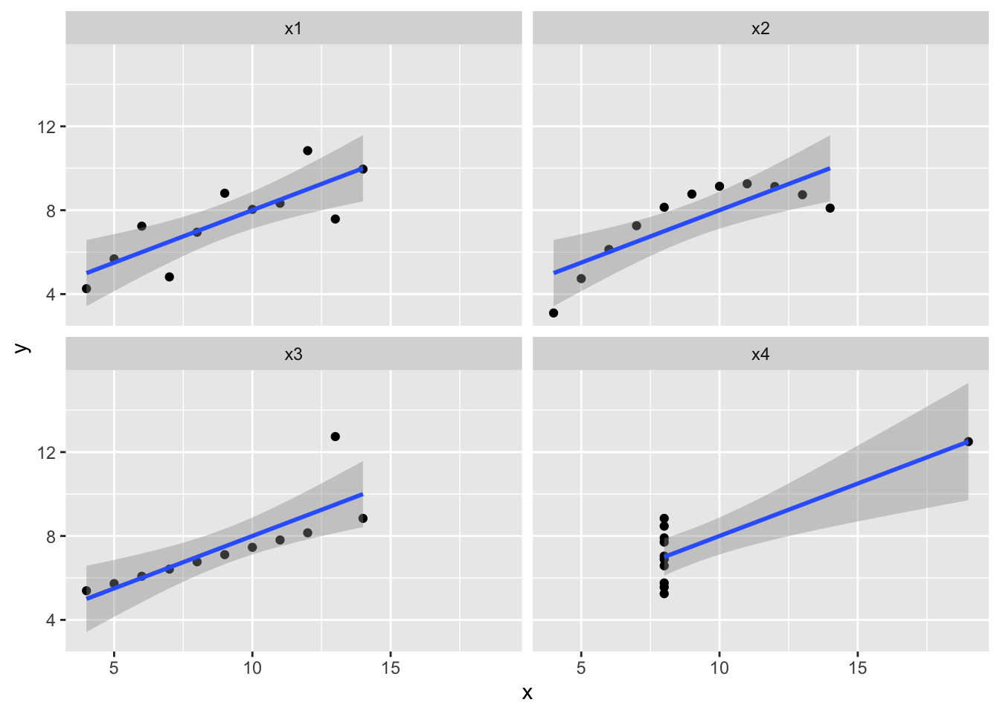
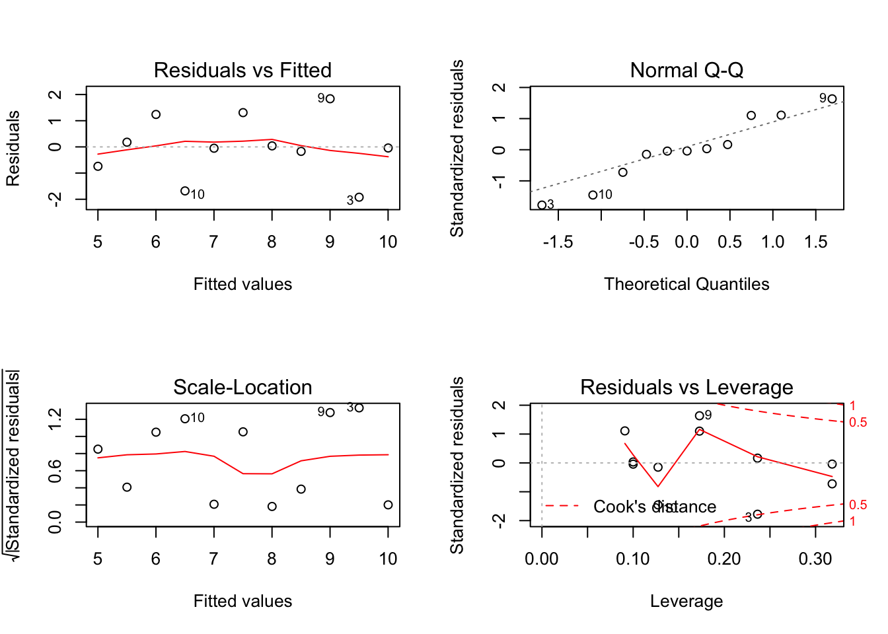
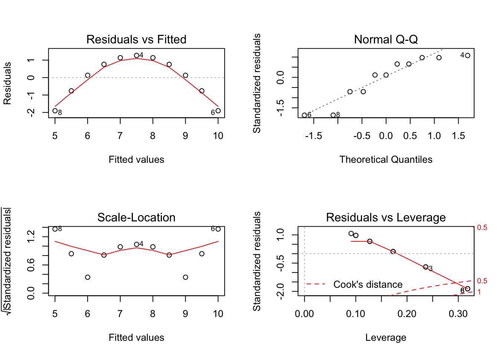
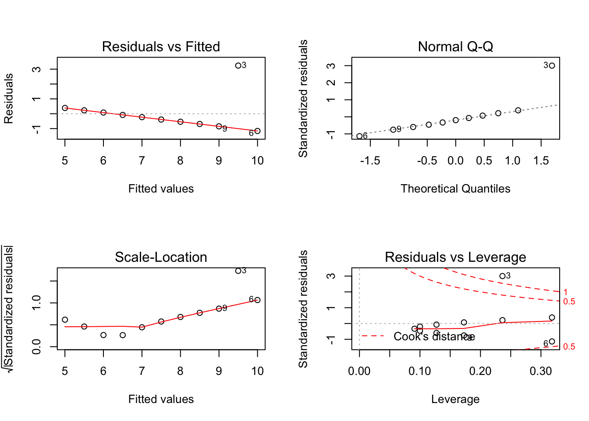
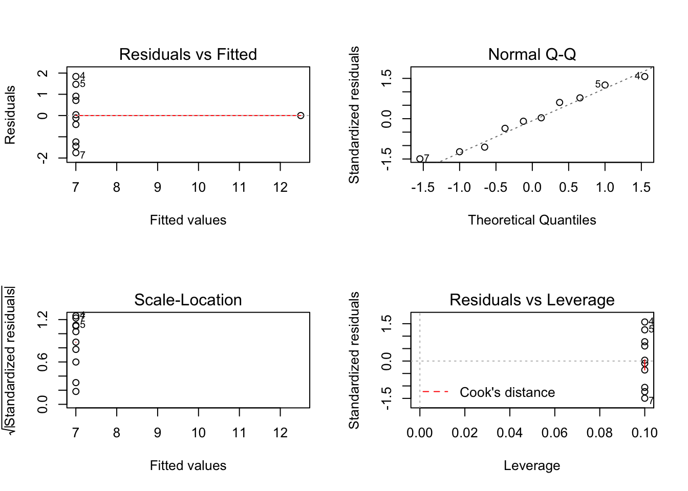
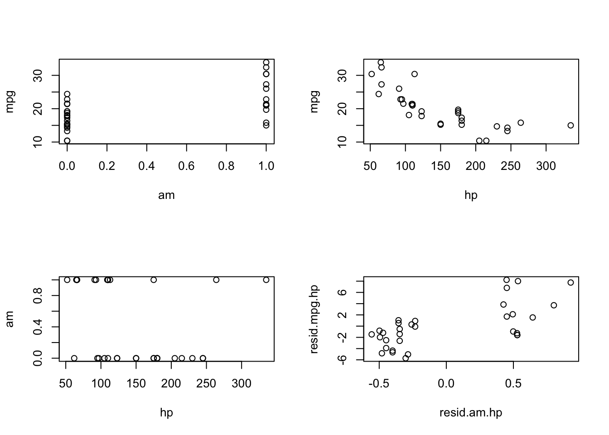

# Postlude: models and data {#postlude}

## Post.1 Evaluating assumptions

Fitting the models: 


```r
anscombe
```

```
##    x1 x2 x3 x4    y1   y2    y3    y4
## 1  10 10 10  8  8.04 9.14  7.46  6.58
## 2   8  8  8  8  6.95 8.14  6.77  5.76
## 3  13 13 13  8  7.58 8.74 12.74  7.71
## 4   9  9  9  8  8.81 8.77  7.11  8.84
## 5  11 11 11  8  8.33 9.26  7.81  8.47
## 6  14 14 14  8  9.96 8.10  8.84  7.04
## 7   6  6  6  8  7.24 6.13  6.08  5.25
## 8   4  4  4 19  4.26 3.10  5.39 12.50
## 9  12 12 12  8 10.84 9.13  8.15  5.56
## 10  7  7  7  8  4.82 7.26  6.42  7.91
## 11  5  5  5  8  5.68 4.74  5.73  6.89
```

```r
mod1 <- lm(anscombe$y1 ~ anscombe$x1)
mod2 <- lm(anscombe$y2 ~ anscombe$x2)
mod3 <- lm(anscombe$y3 ~ anscombe$x3)
mod4 <- lm(anscombe$y4 ~ anscombe$x4)

summary(mod1)
```

```
## 
## Call:
## lm(formula = anscombe$y1 ~ anscombe$x1)
## 
## Residuals:
##      Min       1Q   Median       3Q      Max 
## -1.92127 -0.45577 -0.04136  0.70941  1.83882 
## 
## Coefficients:
##             Estimate Std. Error t value Pr(>|t|)   
## (Intercept)   3.0001     1.1247   2.667  0.02573 * 
## anscombe$x1   0.5001     0.1179   4.241  0.00217 **
## ---
## Signif. codes:  0 '***' 0.001 '**' 0.01 '*' 0.05 '.' 0.1 ' ' 1
## 
## Residual standard error: 1.237 on 9 degrees of freedom
## Multiple R-squared:  0.6665,	Adjusted R-squared:  0.6295 
## F-statistic: 17.99 on 1 and 9 DF,  p-value: 0.00217
```

```r
summary(mod2)
```

```
## 
## Call:
## lm(formula = anscombe$y2 ~ anscombe$x2)
## 
## Residuals:
##     Min      1Q  Median      3Q     Max 
## -1.9009 -0.7609  0.1291  0.9491  1.2691 
## 
## Coefficients:
##             Estimate Std. Error t value Pr(>|t|)   
## (Intercept)    3.001      1.125   2.667  0.02576 * 
## anscombe$x2    0.500      0.118   4.239  0.00218 **
## ---
## Signif. codes:  0 '***' 0.001 '**' 0.01 '*' 0.05 '.' 0.1 ' ' 1
## 
## Residual standard error: 1.237 on 9 degrees of freedom
## Multiple R-squared:  0.6662,	Adjusted R-squared:  0.6292 
## F-statistic: 17.97 on 1 and 9 DF,  p-value: 0.002179
```

```r
summary(mod3)
```

```
## 
## Call:
## lm(formula = anscombe$y3 ~ anscombe$x3)
## 
## Residuals:
##     Min      1Q  Median      3Q     Max 
## -1.1586 -0.6146 -0.2303  0.1540  3.2411 
## 
## Coefficients:
##             Estimate Std. Error t value Pr(>|t|)   
## (Intercept)   3.0025     1.1245   2.670  0.02562 * 
## anscombe$x3   0.4997     0.1179   4.239  0.00218 **
## ---
## Signif. codes:  0 '***' 0.001 '**' 0.01 '*' 0.05 '.' 0.1 ' ' 1
## 
## Residual standard error: 1.236 on 9 degrees of freedom
## Multiple R-squared:  0.6663,	Adjusted R-squared:  0.6292 
## F-statistic: 17.97 on 1 and 9 DF,  p-value: 0.002176
```

```r
summary(mod4)
```

```
## 
## Call:
## lm(formula = anscombe$y4 ~ anscombe$x4)
## 
## Residuals:
##    Min     1Q Median     3Q    Max 
## -1.751 -0.831  0.000  0.809  1.839 
## 
## Coefficients:
##             Estimate Std. Error t value Pr(>|t|)   
## (Intercept)   3.0017     1.1239   2.671  0.02559 * 
## anscombe$x4   0.4999     0.1178   4.243  0.00216 **
## ---
## Signif. codes:  0 '***' 0.001 '**' 0.01 '*' 0.05 '.' 0.1 ' ' 1
## 
## Residual standard error: 1.236 on 9 degrees of freedom
## Multiple R-squared:  0.6667,	Adjusted R-squared:  0.6297 
## F-statistic:    18 on 1 and 9 DF,  p-value: 0.002165
```

Plotting the quartet:


```r
x <- anscombe %>% 
  select(x1:x4) %>%
  gather(key = datx, value = x, x1:x4)
y <- anscombe %>% 
  select(y1:y4) %>%
  gather(key = daty, value = y, y1:y4)
d <- cbind(x, y)

d %>% 
  ggplot(aes(x = x, y = y)) + 
  geom_point() +
  geom_smooth(method = "lm") +
  facet_wrap(~ datx)
```



### Exercise set Postlude-1

1. Plotting the assumptions from the `lm` models:


```r
par(mfrow = c(2,2))
plot(mod1)
```



```r
plot(mod2)
```



```r
plot(mod3)
```



```r
plot(mod4)
```



### Exercise set Postlude-2

1. Applying `gvlma` to the `lm` models:


```r
library(gvlma)
gvlma(mod1)
```

```
## 
## Call:
## lm(formula = anscombe$y1 ~ anscombe$x1)
## 
## Coefficients:
## (Intercept)  anscombe$x1  
##      3.0001       0.5001  
## 
## 
## ASSESSMENT OF THE LINEAR MODEL ASSUMPTIONS
## USING THE GLOBAL TEST ON 4 DEGREES-OF-FREEDOM:
## Level of Significance =  0.05 
## 
## Call:
##  gvlma(x = mod1) 
## 
##                      Value p-value                Decision
## Global Stat        1.24763  0.8702 Assumptions acceptable.
## Skewness           0.02736  0.8686 Assumptions acceptable.
## Kurtosis           0.26208  0.6087 Assumptions acceptable.
## Link Function      0.68565  0.4076 Assumptions acceptable.
## Heteroscedasticity 0.27255  0.6016 Assumptions acceptable.
```

```r
gvlma(mod2)
```

```
## 
## Call:
## lm(formula = anscombe$y2 ~ anscombe$x2)
## 
## Coefficients:
## (Intercept)  anscombe$x2  
##       3.001        0.500  
## 
## 
## ASSESSMENT OF THE LINEAR MODEL ASSUMPTIONS
## USING THE GLOBAL TEST ON 4 DEGREES-OF-FREEDOM:
## Level of Significance =  0.05 
## 
## Call:
##  gvlma(x = mod2) 
## 
##                       Value   p-value                   Decision
## Global Stat        12.17209 0.0161164 Assumptions NOT satisfied!
## Skewness            0.58916 0.4427453    Assumptions acceptable.
## Kurtosis            0.51843 0.4715134    Assumptions acceptable.
## Link Function      10.99998 0.0009111 Assumptions NOT satisfied!
## Heteroscedasticity  0.06453 0.7994766    Assumptions acceptable.
```

```r
gvlma(mod3)
```

```
## 
## Call:
## lm(formula = anscombe$y3 ~ anscombe$x3)
## 
## Coefficients:
## (Intercept)  anscombe$x3  
##      3.0025       0.4997  
## 
## 
## ASSESSMENT OF THE LINEAR MODEL ASSUMPTIONS
## USING THE GLOBAL TEST ON 4 DEGREES-OF-FREEDOM:
## Level of Significance =  0.05 
## 
## Call:
##  gvlma(x = mod3) 
## 
##                      Value  p-value                   Decision
## Global Stat        16.9134 0.002009 Assumptions NOT satisfied!
## Skewness            7.6349 0.005725 Assumptions NOT satisfied!
## Kurtosis            5.8431 0.015638 Assumptions NOT satisfied!
## Link Function       0.6055 0.436470    Assumptions acceptable.
## Heteroscedasticity  2.8297 0.092533    Assumptions acceptable.
```

```r
gvlma(mod4)
```

```
## 
## Call:
## lm(formula = anscombe$y4 ~ anscombe$x4)
## 
## Coefficients:
## (Intercept)  anscombe$x4  
##      3.0017       0.4999  
## 
## 
## ASSESSMENT OF THE LINEAR MODEL ASSUMPTIONS
## USING THE GLOBAL TEST ON 4 DEGREES-OF-FREEDOM:
## Level of Significance =  0.05 
## 
## Call:
##  gvlma(x = mod4) 
## 
##                         Value p-value                Decision
## Global Stat         5.919e-01  0.9640 Assumptions acceptable.
## Skewness            1.724e-04  0.9895 Assumptions acceptable.
## Kurtosis            5.242e-01  0.4691 Assumptions acceptable.
## Link Function      -2.037e-16  1.0000 Assumptions acceptable.
## Heteroscedasticity  6.750e-02  0.7950 Assumptions acceptable.
```

## Post.2 Some extensions of simple linear regression

### Multiple regression

### Exercise set Postlude-3

1. 

a. First, a multiple regression of mpg vs transmission (0 = automatic; 1 = manual)


```r
m1 <- lm(mpg ~ am + hp, data = mtcars)
```

b. Next, we extract the residuals after fitting two models:

  - transmission ~ horsepower
  - mpg ~ horsepower
  
And then fit a model of the residuals:


```r
resid.am.hp <- lm(am ~ hp, data = mtcars)$residuals
resid.mpg.hp <- lm(mpg ~ hp, data = mtcars)$residuals
m2 <- lm(resid.mpg.hp ~ resid.am.hp)
```

Now compare the coefficient for transmission type:


```r
summary(m1)$coefficients
```

```
##               Estimate  Std. Error   t value     Pr(>|t|)
## (Intercept) 26.5849137 1.425094292 18.654845 1.073954e-17
## am           5.2770853 1.079540576  4.888270 3.460318e-05
## hp          -0.0588878 0.007856745 -7.495191 2.920375e-08
```

```r
summary(m2)$coefficients
```

```
##                  Estimate Std. Error       t value     Pr(>|t|)
## (Intercept) -3.925231e-17  0.5056342 -7.762986e-17 1.000000e+00
## resid.am.hp  5.277085e+00  1.0613957  4.971836e+00 2.522476e-05
```

Plot the variables:


```r
par(mfrow = c(2,2))
plot(mpg ~ am, data = mtcars)
plot(mpg ~ hp, data = mtcars)
plot(am ~ hp, data = mtcars)
plot(resid.mpg.hp ~ resid.am.hp)
```



c. To get the estimated slope of horsepower using only simple linear regression:


```r
resid.hp.am <- lm(hp ~ am, data = mtcars)$residuals
resid.mpg.am <- lm(mpg ~ am, data = mtcars)$residuals
m3 <- lm(resid.mpg.am ~ resid.hp.am)
```

Now compare the coefficient for transmission type:


```r
summary(m1)$coefficients
```

```
##               Estimate  Std. Error   t value     Pr(>|t|)
## (Intercept) 26.5849137 1.425094292 18.654845 1.073954e-17
## am           5.2770853 1.079540576  4.888270 3.460318e-05
## hp          -0.0588878 0.007856745 -7.495191 2.920375e-08
```

```r
summary(m3)$coefficients
```

```
##                  Estimate  Std. Error       t value     Pr(>|t|)
## (Intercept) -1.985302e-16 0.505634181 -3.926359e-16 1.000000e+00
## resid.hp.am -5.888780e-02 0.007724689 -7.623324e+00 1.676672e-08
```

d. 


```r
mean(mtcars$mpg) - (mean(mtcars$am) * 5.277) - (mean(mtcars$hp) * -0.0588)
```

```
## [1] 26.57207
```

2. Comparing `lm` with other tests

a. T-test

```r
t.test(mtcars$mpg ~ mtcars$am, var.equal = TRUE)
```

```
## 
## 	Two Sample t-test
## 
## data:  mtcars$mpg by mtcars$am
## t = -4.1061, df = 30, p-value = 0.000285
## alternative hypothesis: true difference in means is not equal to 0
## 95 percent confidence interval:
##  -10.84837  -3.64151
## sample estimates:
## mean in group 0 mean in group 1 
##        17.14737        24.39231
```

```r
mod <- lm(mtcars$mpg ~ mtcars$am)
summary(mod)
```

```
## 
## Call:
## lm(formula = mtcars$mpg ~ mtcars$am)
## 
## Residuals:
##     Min      1Q  Median      3Q     Max 
## -9.3923 -3.0923 -0.2974  3.2439  9.5077 
## 
## Coefficients:
##             Estimate Std. Error t value Pr(>|t|)    
## (Intercept)   17.147      1.125  15.247 1.13e-15 ***
## mtcars$am      7.245      1.764   4.106 0.000285 ***
## ---
## Signif. codes:  0 '***' 0.001 '**' 0.01 '*' 0.05 '.' 0.1 ' ' 1
## 
## Residual standard error: 4.902 on 30 degrees of freedom
## Multiple R-squared:  0.3598,	Adjusted R-squared:  0.3385 
## F-statistic: 16.86 on 1 and 30 DF,  p-value: 0.000285
```

b. Correlation

```r
cor.test(anscombe$x1, anscombe$y1)
```

```
## 
## 	Pearson's product-moment correlation
## 
## data:  anscombe$x1 and anscombe$y1
## t = 4.2415, df = 9, p-value = 0.00217
## alternative hypothesis: true correlation is not equal to 0
## 95 percent confidence interval:
##  0.4243912 0.9506933
## sample estimates:
##       cor 
## 0.8164205
```

```r
mod1 <- lm(anscombe$y1 ~ anscombe$x1)
summary(mod1)
```

```
## 
## Call:
## lm(formula = anscombe$y1 ~ anscombe$x1)
## 
## Residuals:
##      Min       1Q   Median       3Q      Max 
## -1.92127 -0.45577 -0.04136  0.70941  1.83882 
## 
## Coefficients:
##             Estimate Std. Error t value Pr(>|t|)   
## (Intercept)   3.0001     1.1247   2.667  0.02573 * 
## anscombe$x1   0.5001     0.1179   4.241  0.00217 **
## ---
## Signif. codes:  0 '***' 0.001 '**' 0.01 '*' 0.05 '.' 0.1 ' ' 1
## 
## Residual standard error: 1.237 on 9 degrees of freedom
## Multiple R-squared:  0.6665,	Adjusted R-squared:  0.6295 
## F-statistic: 17.99 on 1 and 9 DF,  p-value: 0.00217
```

c. ANOVA

```r
anova.fit <- aov(weight ~ group, data = PlantGrowth)
summary(anova.fit)
```

```
##             Df Sum Sq Mean Sq F value Pr(>F)  
## group        2  3.766  1.8832   4.846 0.0159 *
## Residuals   27 10.492  0.3886                 
## ---
## Signif. codes:  0 '***' 0.001 '**' 0.01 '*' 0.05 '.' 0.1 ' ' 1
```

```r
lm.fit <- lm(weight ~ group, data = PlantGrowth)
summary(lm.fit)
```

```
## 
## Call:
## lm(formula = weight ~ group, data = PlantGrowth)
## 
## Residuals:
##     Min      1Q  Median      3Q     Max 
## -1.0710 -0.4180 -0.0060  0.2627  1.3690 
## 
## Coefficients:
##             Estimate Std. Error t value Pr(>|t|)    
## (Intercept)   5.0320     0.1971  25.527   <2e-16 ***
## grouptrt1    -0.3710     0.2788  -1.331   0.1944    
## grouptrt2     0.4940     0.2788   1.772   0.0877 .  
## ---
## Signif. codes:  0 '***' 0.001 '**' 0.01 '*' 0.05 '.' 0.1 ' ' 1
## 
## Residual standard error: 0.6234 on 27 degrees of freedom
## Multiple R-squared:  0.2641,	Adjusted R-squared:  0.2096 
## F-statistic: 4.846 on 2 and 27 DF,  p-value: 0.01591
```

### Generalized linear models

### Exercise set Postlude-4

### Mixed models

### Exercise set Postlude-5

## Post.3 Conclusion

