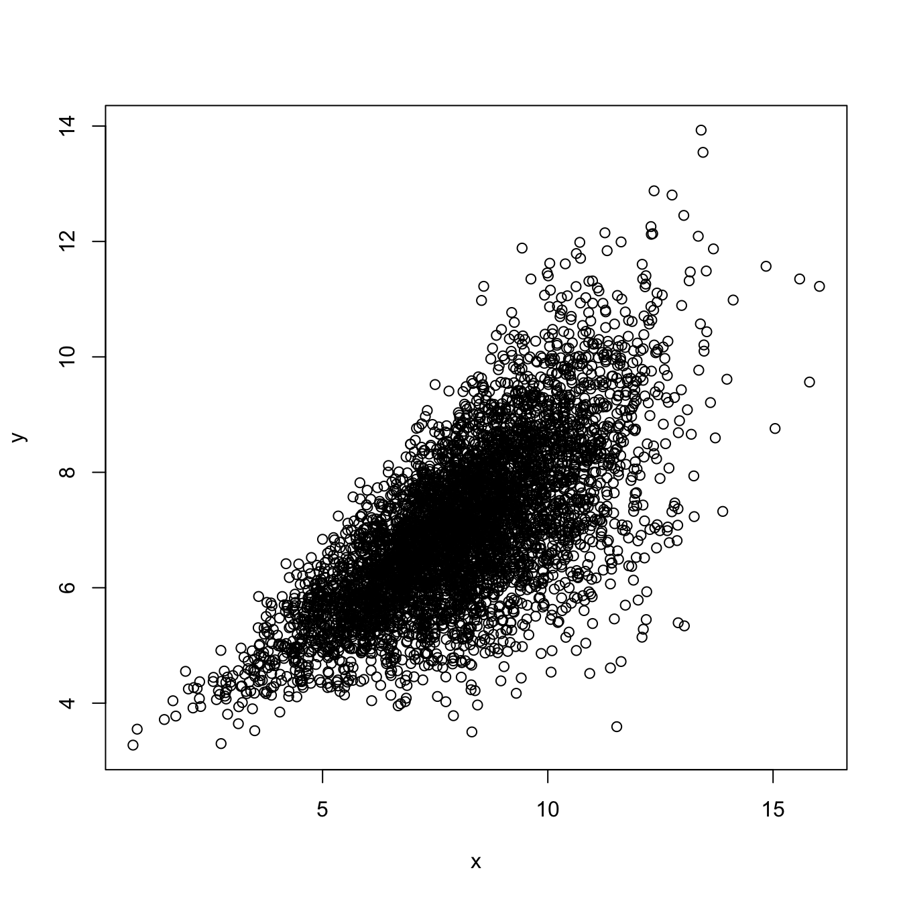
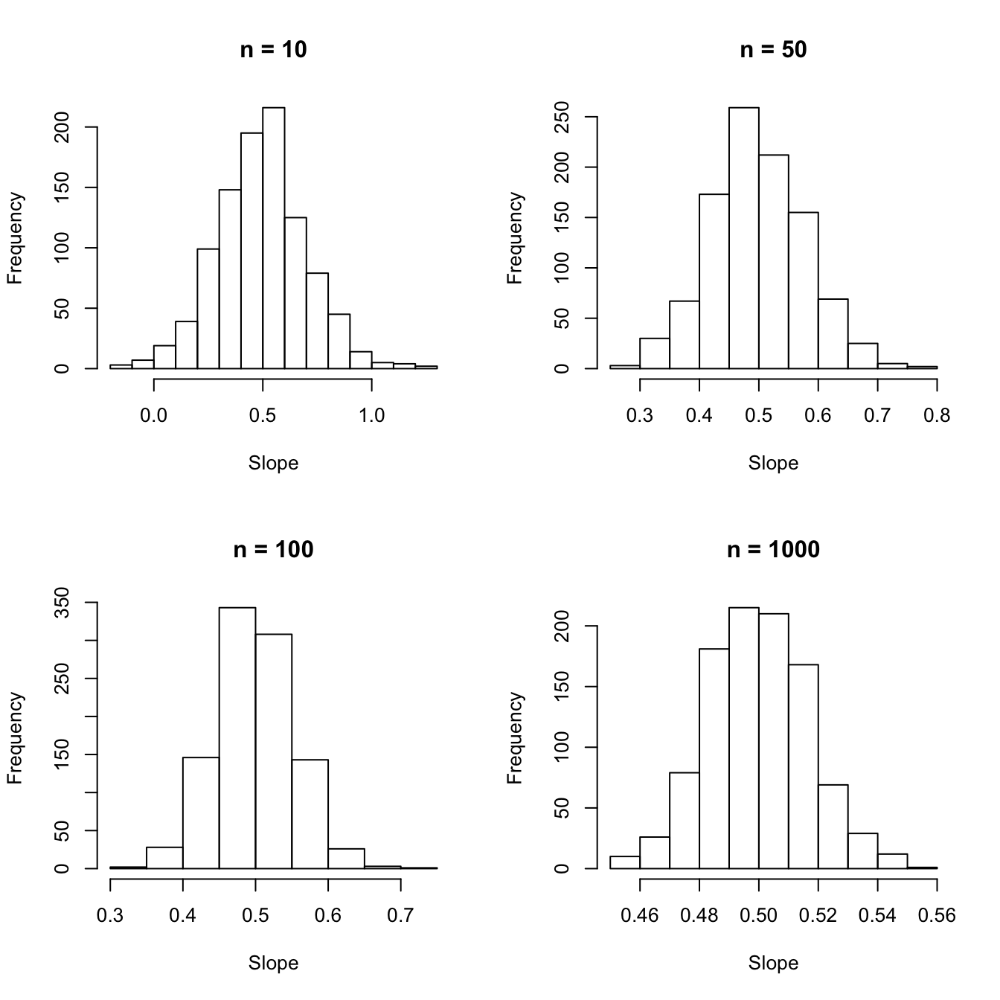
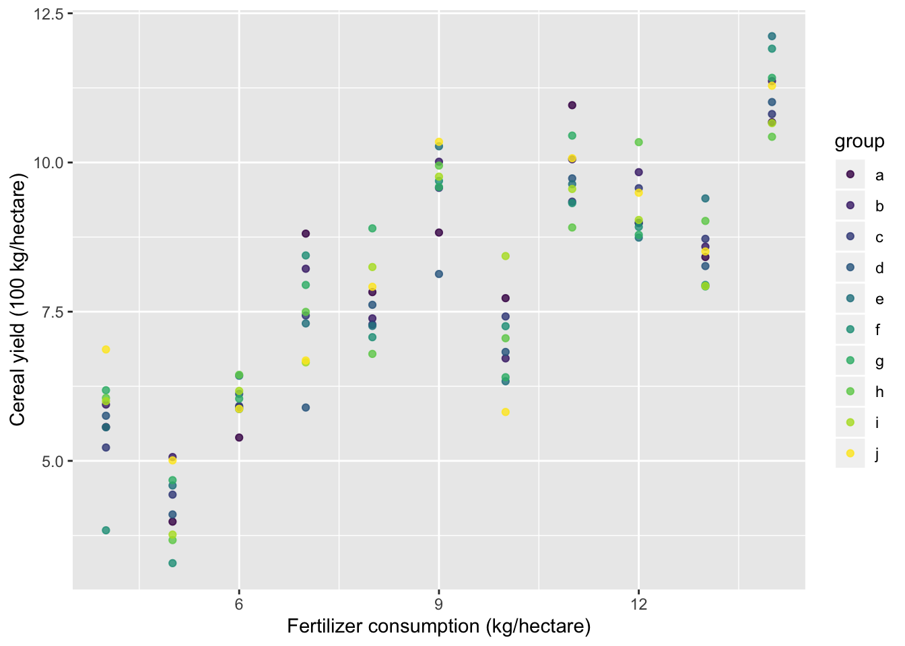

# Postlude: models and data {#postlude}

## Post.1 Evaluating assumptions

Fitting the models: 


```r
mod1 <- lm(anscombe$y1 ~ anscombe$x1)
mod2 <- lm(anscombe$y2 ~ anscombe$x2)
mod3 <- lm(anscombe$y3 ~ anscombe$x3)
mod4 <- lm(anscombe$y4 ~ anscombe$x4)
summary(mod1)
summary(mod2)
summary(mod3)
summary(mod4)
```

Plotting the quartet:


```r
x <- anscombe %>% 
  select(x1:x4) %>%
  gather(key = datx, value = x, x1:x4)
y <- anscombe %>% 
  select(y1:y4) %>%
  gather(key = daty, value = y, y1:y4)
d <- cbind(x, y)

d %>% 
  ggplot(aes(x = x, y = y)) + 
  geom_point() +
  geom_smooth(method = "lm") +
  facet_wrap(~ datx)
```


### Exercise set Postlude-1

1. Plotting the assumptions from the `lm` models:


```r
par(mfrow = c(2,2))
plot(mod1)
```


```r
plot(mod2)
```


```r
plot(mod3)
```


```r
plot(mod4)
```


### Exercise set Postlude-2

1. Applying `gvlma` to the `lm` models:


```r
library(gvlma)
gvlma(mod1)
```

```
## 
## Call:
## lm(formula = anscombe$y1 ~ anscombe$x1)
## 
## Coefficients:
## (Intercept)  anscombe$x1  
##      3.0001       0.5001  
## 
## 
## ASSESSMENT OF THE LINEAR MODEL ASSUMPTIONS
## USING THE GLOBAL TEST ON 4 DEGREES-OF-FREEDOM:
## Level of Significance =  0.05 
## 
## Call:
##  gvlma(x = mod1) 
## 
##                      Value p-value                Decision
## Global Stat        1.24763  0.8702 Assumptions acceptable.
## Skewness           0.02736  0.8686 Assumptions acceptable.
## Kurtosis           0.26208  0.6087 Assumptions acceptable.
## Link Function      0.68565  0.4076 Assumptions acceptable.
## Heteroscedasticity 0.27255  0.6016 Assumptions acceptable.
```

```r
gvlma(mod2)
```

```
## 
## Call:
## lm(formula = anscombe$y2 ~ anscombe$x2)
## 
## Coefficients:
## (Intercept)  anscombe$x2  
##       3.001        0.500  
## 
## 
## ASSESSMENT OF THE LINEAR MODEL ASSUMPTIONS
## USING THE GLOBAL TEST ON 4 DEGREES-OF-FREEDOM:
## Level of Significance =  0.05 
## 
## Call:
##  gvlma(x = mod2) 
## 
##                       Value   p-value                   Decision
## Global Stat        12.17209 0.0161164 Assumptions NOT satisfied!
## Skewness            0.58916 0.4427453    Assumptions acceptable.
## Kurtosis            0.51843 0.4715134    Assumptions acceptable.
## Link Function      10.99998 0.0009111 Assumptions NOT satisfied!
## Heteroscedasticity  0.06453 0.7994766    Assumptions acceptable.
```

```r
gvlma(mod3)
```

```
## 
## Call:
## lm(formula = anscombe$y3 ~ anscombe$x3)
## 
## Coefficients:
## (Intercept)  anscombe$x3  
##      3.0025       0.4997  
## 
## 
## ASSESSMENT OF THE LINEAR MODEL ASSUMPTIONS
## USING THE GLOBAL TEST ON 4 DEGREES-OF-FREEDOM:
## Level of Significance =  0.05 
## 
## Call:
##  gvlma(x = mod3) 
## 
##                      Value  p-value                   Decision
## Global Stat        16.9134 0.002009 Assumptions NOT satisfied!
## Skewness            7.6349 0.005725 Assumptions NOT satisfied!
## Kurtosis            5.8431 0.015638 Assumptions NOT satisfied!
## Link Function       0.6055 0.436470    Assumptions acceptable.
## Heteroscedasticity  2.8297 0.092533    Assumptions acceptable.
```

```r
gvlma(mod4)
```

```
## 
## Call:
## lm(formula = anscombe$y4 ~ anscombe$x4)
## 
## Coefficients:
## (Intercept)  anscombe$x4  
##      3.0017       0.4999  
## 
## 
## ASSESSMENT OF THE LINEAR MODEL ASSUMPTIONS
## USING THE GLOBAL TEST ON 4 DEGREES-OF-FREEDOM:
## Level of Significance =  0.05 
## 
## Call:
##  gvlma(x = mod4) 
## 
##                         Value p-value                Decision
## Global Stat         5.919e-01  0.9640 Assumptions acceptable.
## Skewness            1.724e-04  0.9895 Assumptions acceptable.
## Kurtosis            5.242e-01  0.4691 Assumptions acceptable.
## Link Function      -2.037e-16  1.0000 Assumptions acceptable.
## Heteroscedasticity  6.750e-02  0.7950 Assumptions acceptable.
```

## Post.2 Some extensions of simple linear regression

### Multiple regression

### Exercise set Postlude-3

1. 

a. First, a multiple regression of mpg vs transmission (0 = automatic; 1 = manual)


```r
m1 <- lm(mpg ~ am + hp, data = mtcars)
```

b. Next, we extract the residuals after fitting two models:

  - transmission ~ horsepower
  - mpg ~ horsepower
  
And then fit a model of the residuals:


```r
resid.am.hp <- lm(am ~ hp, data = mtcars)$residuals
resid.mpg.hp <- lm(mpg ~ hp, data = mtcars)$residuals
m2 <- lm(resid.mpg.hp ~ resid.am.hp)
```

Now compare the coefficient for transmission type:


```r
summary(m1)$coefficients
```

```
##               Estimate  Std. Error   t value     Pr(>|t|)
## (Intercept) 26.5849137 1.425094292 18.654845 1.073954e-17
## am           5.2770853 1.079540576  4.888270 3.460318e-05
## hp          -0.0588878 0.007856745 -7.495191 2.920375e-08
```

```r
summary(m2)$coefficients
```

```
##                  Estimate Std. Error       t value     Pr(>|t|)
## (Intercept) -3.925231e-17  0.5056342 -7.762986e-17 1.000000e+00
## resid.am.hp  5.277085e+00  1.0613957  4.971836e+00 2.522476e-05
```

Plot the variables:


```r
par(mfrow = c(2,2))
plot(mpg ~ am, data = mtcars)
plot(mpg ~ hp, data = mtcars)
plot(am ~ hp, data = mtcars)
plot(resid.mpg.hp ~ resid.am.hp)
```


c. To get the estimated slope of horsepower using only simple linear regression:


```r
resid.hp.am <- lm(hp ~ am, data = mtcars)$residuals
resid.mpg.am <- lm(mpg ~ am, data = mtcars)$residuals
m3 <- lm(resid.mpg.am ~ resid.hp.am)
```

Now compare the coefficient for transmission type:


```r
summary(m1)$coefficients
```

```
##               Estimate  Std. Error   t value     Pr(>|t|)
## (Intercept) 26.5849137 1.425094292 18.654845 1.073954e-17
## am           5.2770853 1.079540576  4.888270 3.460318e-05
## hp          -0.0588878 0.007856745 -7.495191 2.920375e-08
```

```r
summary(m3)$coefficients
```

```
##                  Estimate  Std. Error       t value     Pr(>|t|)
## (Intercept) -1.985302e-16 0.505634181 -3.926359e-16 1.000000e+00
## resid.hp.am -5.888780e-02 0.007724689 -7.623324e+00 1.676672e-08
```

d. 


```r
mean(mtcars$mpg) - (mean(mtcars$am) * 5.277) - (mean(mtcars$hp) * -0.0588)
```

```
## [1] 26.57207
```

2. Comparing `lm` with other tests

a. T-test

```r
t.test(mtcars$mpg ~ mtcars$am, var.equal = TRUE)
```

```
## 
## 	Two Sample t-test
## 
## data:  mtcars$mpg by mtcars$am
## t = -4.1061, df = 30, p-value = 0.000285
## alternative hypothesis: true difference in means is not equal to 0
## 95 percent confidence interval:
##  -10.84837  -3.64151
## sample estimates:
## mean in group 0 mean in group 1 
##        17.14737        24.39231
```

```r
mod <- lm(mtcars$mpg ~ mtcars$am)
summary(mod)
```

```
## 
## Call:
## lm(formula = mtcars$mpg ~ mtcars$am)
## 
## Residuals:
##     Min      1Q  Median      3Q     Max 
## -9.3923 -3.0923 -0.2974  3.2439  9.5077 
## 
## Coefficients:
##             Estimate Std. Error t value Pr(>|t|)    
## (Intercept)   17.147      1.125  15.247 1.13e-15 ***
## mtcars$am      7.245      1.764   4.106 0.000285 ***
## ---
## Signif. codes:  0 '***' 0.001 '**' 0.01 '*' 0.05 '.' 0.1 ' ' 1
## 
## Residual standard error: 4.902 on 30 degrees of freedom
## Multiple R-squared:  0.3598,	Adjusted R-squared:  0.3385 
## F-statistic: 16.86 on 1 and 30 DF,  p-value: 0.000285
```

b. Correlation

```r
cor.test(anscombe$x1, anscombe$y1)
```

```
## 
## 	Pearson's product-moment correlation
## 
## data:  anscombe$x1 and anscombe$y1
## t = 4.2415, df = 9, p-value = 0.00217
## alternative hypothesis: true correlation is not equal to 0
## 95 percent confidence interval:
##  0.4243912 0.9506933
## sample estimates:
##       cor 
## 0.8164205
```

```r
mod1 <- lm(anscombe$y1 ~ anscombe$x1)
summary(mod1)
```

```
## 
## Call:
## lm(formula = anscombe$y1 ~ anscombe$x1)
## 
## Residuals:
##      Min       1Q   Median       3Q      Max 
## -1.92127 -0.45577 -0.04136  0.70941  1.83882 
## 
## Coefficients:
##             Estimate Std. Error t value Pr(>|t|)   
## (Intercept)   3.0001     1.1247   2.667  0.02573 * 
## anscombe$x1   0.5001     0.1179   4.241  0.00217 **
## ---
## Signif. codes:  0 '***' 0.001 '**' 0.01 '*' 0.05 '.' 0.1 ' ' 1
## 
## Residual standard error: 1.237 on 9 degrees of freedom
## Multiple R-squared:  0.6665,	Adjusted R-squared:  0.6295 
## F-statistic: 17.99 on 1 and 9 DF,  p-value: 0.00217
```

c. ANOVA

```r
anova.fit <- aov(weight ~ group, data = PlantGrowth)
summary(anova.fit)
```

```
##             Df Sum Sq Mean Sq F value Pr(>F)  
## group        2  3.766  1.8832   4.846 0.0159 *
## Residuals   27 10.492  0.3886                 
## ---
## Signif. codes:  0 '***' 0.001 '**' 0.01 '*' 0.05 '.' 0.1 ' ' 1
```

```r
lm.fit <- lm(weight ~ group, data = PlantGrowth)
summary(lm.fit)
```

```
## 
## Call:
## lm(formula = weight ~ group, data = PlantGrowth)
## 
## Residuals:
##     Min      1Q  Median      3Q     Max 
## -1.0710 -0.4180 -0.0060  0.2627  1.3690 
## 
## Coefficients:
##             Estimate Std. Error t value Pr(>|t|)    
## (Intercept)   5.0320     0.1971  25.527   <2e-16 ***
## grouptrt1    -0.3710     0.2788  -1.331   0.1944    
## grouptrt2     0.4940     0.2788   1.772   0.0877 .  
## ---
## Signif. codes:  0 '***' 0.001 '**' 0.01 '*' 0.05 '.' 0.1 ' ' 1
## 
## Residual standard error: 0.6234 on 27 degrees of freedom
## Multiple R-squared:  0.2641,	Adjusted R-squared:  0.2096 
## F-statistic: 4.846 on 2 and 27 DF,  p-value: 0.01591
```

### Generalized linear models

### Exercise set Postlude-4

1. 


```r
library(car)
probit.fit <- glm(volunteer ~ extraversion + neuroticism + sex, 
                  data = Cowles, family = binomial("probit"))
summary(probit.fit)
```

```
## 
## Call:
## glm(formula = volunteer ~ extraversion + neuroticism + sex, family = binomial("probit"), 
##     data = Cowles)
## 
## Deviance Residuals: 
##     Min       1Q   Median       3Q      Max  
## -1.3947  -1.0468  -0.9091   1.2611   1.6901  
## 
## Coefficients:
##               Estimate Std. Error z value Pr(>|z|)    
## (Intercept)  -0.692584   0.153670  -4.507 6.58e-06 ***
## extraversion  0.040934   0.008790   4.657 3.21e-06 ***
## neuroticism   0.004104   0.007044   0.583   0.5601    
## sexmale      -0.145677   0.068957  -2.113   0.0346 *  
## ---
## Signif. codes:  0 '***' 0.001 '**' 0.01 '*' 0.05 '.' 0.1 ' ' 1
## 
## (Dispersion parameter for binomial family taken to be 1)
## 
##     Null deviance: 1933.5  on 1420  degrees of freedom
## Residual deviance: 1906.1  on 1417  degrees of freedom
## AIC: 1914.1
## 
## Number of Fisher Scoring iterations: 4
```

2. 


```r
plot(sim.lm(5000, 3, 1/2, het.coef = 0.25))
```



```r
par(mfrow = c(2,2))

ests <- sim.lm.ests(n = 10, nsim = 1000, a = 3, b = 1/2, het.coef = 0.25)
colMeans(ests)
```

```
## [1] 3.048717 0.492909
```

```r
apply(ests, 2, var)
```

```
## [1] 2.33058271 0.04227503
```

```r
hist(ests[,2], main = "n = 10", xlab = "Slope")

ests <- sim.lm.ests(n = 50, nsim = 1000, a = 3, b = 1/2, het.coef = 0.25)
colMeans(ests)
```

```
## [1] 3.0191249 0.4969704
```

```r
apply(ests, 2, var)
```

```
## [1] 0.337768664 0.006242319
```

```r
hist(ests[,2], main = "n = 50", xlab = "Slope")

ests <- sim.lm.ests(n = 100, nsim = 1000, a = 3, b = 1/2, het.coef = 0.25)
colMeans(ests)
```

```
## [1] 3.0044014 0.4995332
```

```r
apply(ests, 2, var)
```

```
## [1] 0.156064713 0.002956491
```

```r
hist(ests[,2], main = "n = 100", xlab = "Slope")

ests <- sim.lm.ests(n = 1000, nsim = 1000, a = 3, b = 1/2, het.coef = 0.25)
colMeans(ests)
```

```
## [1] 3.0013893 0.4997909
```

```r
apply(ests, 2, var)
```

```
## [1] 0.0159777401 0.0002886682
```

```r
hist(ests[,2], main = "n = 1000", xlab = "Slope")
```



### Mixed models


```r
set.seed(8675309)
alpha <- 3
beta <- 0.5
eps.sd <- sqrt(0.5)
re.sd <- 1
yrs <- 10
x <- rep(anscombe$x1, 10)
rand.ints <- rnorm(length(anscombe$x1), 0, re.sd)
y <- alpha + beta*x + rep(rand.ints, 10) + rnorm(length(x), 0, eps.sd)
d <- tibble(x = x, y = y, j = rep(1:10, each = 11)) %>% 
  mutate(group = letters[j])
```


```r
d %>% 
  ggplot(aes(x, y, color = group)) +
  geom_point(alpha = 0.8) + 
  scale_color_viridis_d() + 
  labs(x = "Fertilizer consumption (kg/hectare)", 
       y = "Cereal yield (100 kg/hectare)")
```



Here's the linear model:


```r
m1 <- lm(y ~ x, data = d)
summary(m1)
```

```
## 
## Call:
## lm(formula = y ~ x, data = d)
## 
## Residuals:
##      Min       1Q   Median       3Q      Max 
## -2.56402 -0.84873  0.05249  0.81626  2.49028 
## 
## Coefficients:
##             Estimate Std. Error t value Pr(>|t|)    
## (Intercept)  3.11366    0.34591   9.001 8.63e-15 ***
## x            0.52696    0.03626  14.532  < 2e-16 ***
## ---
## Signif. codes:  0 '***' 0.001 '**' 0.01 '*' 0.05 '.' 0.1 ' ' 1
## 
## Residual standard error: 1.203 on 108 degrees of freedom
## Multiple R-squared:  0.6616,	Adjusted R-squared:  0.6585 
## F-statistic: 211.2 on 1 and 108 DF,  p-value: < 2.2e-16
```

Here's a mixed-effects model fit using `lmer`:


```r
library(lme4)
mm1 <- lmer(y ~ x + (1 | group), data = d, REML = TRUE)
summary(mm1)
```

```
## Linear mixed model fit by REML ['lmerMod']
## Formula: y ~ x + (1 | group)
##    Data: d
## 
## REML criterion at convergence: 358
## 
## Scaled residuals: 
##      Min       1Q   Median       3Q      Max 
## -2.13200 -0.70572  0.04365  0.67872  2.07068 
## 
## Random effects:
##  Groups   Name        Variance Std.Dev.
##  group    (Intercept) 0.000    0.000   
##  Residual             1.446    1.203   
## Number of obs: 110, groups:  group, 10
## 
## Fixed effects:
##             Estimate Std. Error t value
## (Intercept)  3.11366    0.34591   9.001
## x            0.52696    0.03626  14.532
## 
## Correlation of Fixed Effects:
##   (Intr)
## x -0.943
```


```r
library(nlme)
mm2 <- lme(y ~ x, random = ~ 1 | group, data = d)
summary(mm2)
```

```
## Linear mixed-effects model fit by REML
##  Data: d 
##        AIC      BIC    logLik
##   366.0498 376.7783 -179.0249
## 
## Random effects:
##  Formula: ~1 | group
##          (Intercept) Residual
## StdDev: 3.182308e-05 1.202637
## 
## Fixed effects: y ~ x 
##                 Value Std.Error DF   t-value p-value
## (Intercept) 3.1136600 0.3459065 99  9.001449       0
## x           0.5269571 0.0362609 99 14.532394       0
##  Correlation: 
##   (Intr)
## x -0.943
## 
## Standardized Within-Group Residuals:
##         Min          Q1         Med          Q3         Max 
## -2.13200120 -0.70572491  0.04364566  0.67872464  2.07068222 
## 
## Number of Observations: 110
## Number of Groups: 10
```

### Exercise set Postlude-5

## Post.3 Conclusion

